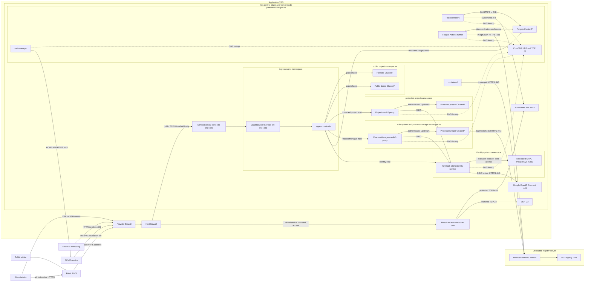
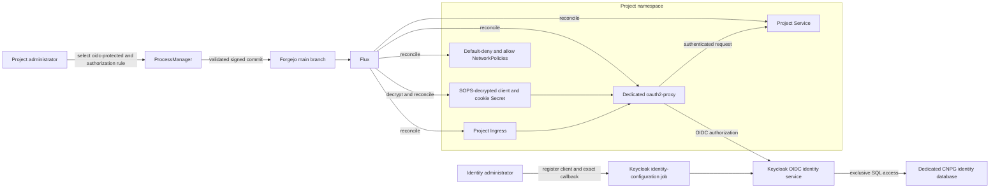

# ProcessManager Architecture

**Status:** Accepted baseline  
**Last updated:** 2026-09-19  
**Scope:** ProcessManager, its deployment path, administrative authentication, and its Kubernetes boundary

## 1. Purpose

ProcessManager is the administrative control plane for deploying and observing personal projects. It does not directly create or modify application workloads through the Kubernetes API. A successful mutation is a signed Git commit pushed directly to the `main` branch of the deployment repository. Flux then reconciles that commit into the cluster.

This document is the source of truth for architecture decisions. Changes to an accepted decision must update this document in the same commit as the implementation change.

## 2. Decisions

| Area | Decision |
|---|---|
| Deployment source of truth | The `main` branch of a self-hosted Forgejo deployment repository on the VPS |
| ProcessManager writes | Validated application configuration committed and pushed to `main` |
| Cluster reconciliation | Flux watches `main` and applies the desired state |
| Kubernetes topology | One k3s server that is both control-plane and worker; embedded etcd; no HA claim |
| Infrastructure dependency | The production platform has no dependency on the existing local cluster, workstation, or home network |
| Personal-account authentication | Google OpenID Connect brokered through Keycloak; any Google account may create a fresh unprivileged platform identity; no ordinary-user local password flow |
| Administrative authentication | Google OpenID Connect plus a role-conditional Keycloak TOTP step-up for routine administration |
| Recovery authentication | One restricted local Keycloak recovery administrator using a local password plus TOTP |
| Identity authority | One Keycloak replica in `identity-system`, backed by a dedicated single-instance CNPG PostgreSQL cluster; recoverable but not highly available |
| Account data boundary | Only Keycloak accesses the identity database; projects consume Keycloak OIDC claims and never query account tables or trust Google tokens directly |
| Identity acceptance envelope | 100,000 broker-linked identities, 5 platform login completions/s, 50 refreshes/s, 5,000 concurrent sessions, and p95 Keycloak-controlled latency below 500 ms |
| ProcessManager cluster access | Read-only observation; no application-resource mutation |
| Application packaging | One reusable Helm chart and one Flux `HelmRelease` per project |
| Image artifact storage | A dedicated OCI registry server outside the application VPS |
| Continuous integration | One in-cluster Forgejo Actions runner using rootless BuildKit, concurrency one, trusted repositories only |
| Secrets | SOPS-encrypted manifests; ProcessManager only references secret names |
| Infrastructure provisioning | OpenTofu for external infrastructure; Ansible for machine configuration |
| Rollback | Revert a Git commit; never repair desired state with an imperative `kubectl` mutation |

## 3. Why k3s on an application VPS

k3s is Kubernetes, not an alternative orchestration API. It provides the standard APIs required by ProcessManager and Flux with less operational and memory overhead than a multi-node kubeadm stack.

The target starts with two independently replaceable servers:

- an application VPS running k3s, Forgejo, Flux, ProcessManager, ingress, and the projects;
- a registry server storing OCI images outside the application VPS failure domain.

This separation ensures that rebuilding the application VPS does not remove the images needed for restoration. ProcessManager remains portable because it uses standard Kubernetes, Git, and OCI Distribution interfaces. Additional application nodes or registry storage can be introduced later without changing the release contract.

The existing local architecture is reference material only. Its topology, CPU architecture, manifests, and operational limitations do not constrain the target. No production request or deployment path may traverse the local environment.

k3s will be installed on the application VPS with bundled Traefik disabled and the lightweight k3s ServiceLB enabled. Flux installs ingress-nginx as two distinct runtime components: an ingress-nginx Controller workload and a Kubernetes `Service` of type `LoadBalancer` in front of it. ServiceLB exposes that Service on VPS host ports 80 and 443; the Service forwards traffic to the Controller pods; the Controller watches Kubernetes `Ingress` resources and routes requests to application Services. cert-manager remains a separate Flux-managed controller. The provider and host firewalls permit only the required public ports. Public traffic never enters through the Kubernetes API.

Administrative access is separate. SSH is restricted by the provider firewall, and Kubernetes API port 6443 is reachable only through an administrator allowlist, VPN, or SSH tunnel. It is never a public application entrance.

The registry server is not a Kubernetes node. It runs only the registry and its supporting backup/monitoring process. Its public interface exposes OCI registry HTTPS with authenticated pushes and pulls; administrative access is separately restricted.

### 3.1 Server baseline

The application VPS and registry server are separate hosts and should use different failure domains where practical. Both remain non-HA in the first deployment, so their state must be reproducible and their backups must be stored outside both servers.

Application VPS planning baseline:

- 4 vCPU;
- 16 GB RAM;
- 100 GB persistent SSD storage, with separate capacity alerts for node, CNPG, and other persistent-volume data;
- a public IPv4 or IPv6 address compatible with the selected DNS provider;
- provider firewall support or an equivalent host firewall;
- an `amd64` architecture supported by every production container image.

Registry server planning baseline:

- 1–2 vCPU;
- 1–2 GB RAM for a lightweight OCI distribution registry;
- persistent storage sized from image retention measurements;
- HTTPS, authenticated push and pull, retention, garbage collection, and off-server backup;
- no application workloads or Kubernetes control-plane responsibilities.

The cluster remains intentionally lean:

- no high-availability control plane;
- one replica for internal administrative services unless availability evidence justifies another;
- explicit CPU and memory requests and limits for every workload;
- no default service mesh;
- no full logging or metrics stack until a measured need exists;
- optional components must be removable without breaking the public portfolio;
- storage growth, inode use, and memory pressure must be observable before adding more services.

Self-hosting the identity provider and its PostgreSQL database requires the 16 GB baseline when CI builds share the node. If that baseline cannot run the measured workload with operating-system and recovery headroom, resize the VPS before replacing k3s. Rootless Podman, systemd Quadlet, and Caddy remain the preferred non-Kubernetes fallback; another lightweight Kubernetes distribution is not expected to remove enough supporting-service overhead.

## 4. System Context

```mermaid
flowchart LR
    User[Public visitor] --> DNS[Public DNS]
    Admin[Administrator] --> DNS
    GoogleIdP[Google OpenID Connect]

    subgraph APP[Application VPS]
        Firewall[VPS provider and host firewall]
        AdminPath[Restricted VPN or SSH tunnel]

        subgraph Cluster[k3s]
            API[Kubernetes API]
            Etcd[Embedded etcd]
            ServiceLB[k3s ServiceLB]
            IngressService[ingress-nginx LoadBalancer Service]
            IngressController[ingress-nginx Controller Pod]
            Certs[cert-manager Controller]
            PublicApps[Public project Services]
            ProtectedApps[OIDC-protected project Services]
            AdminProxy[ProcessManager oauth2-proxy]
            ProjectProxy[Per-project oauth2-proxy]
            Identity[Keycloak OIDC identity service]
            IdentityDB[CNPG PostgreSQL - identity only]
            PM[ProcessManager]
            Forgejo[Forgejo]
            CI[Forgejo Actions runner]
            Flux[Flux controllers]
            Runtime[Container runtime]

            ServiceLB --> IngressService
            IngressService --> IngressController
            IngressController -->|route public hosts| PublicApps
            IngressController -->|route protected project hosts| ProjectProxy
            IngressController -->|route ProcessManager host| AdminProxy
            IngressController -->|route identity host| Identity
            ProjectProxy -->|authenticated request| ProtectedApps
            AdminProxy -->|authenticated request| PM
            ProjectProxy -->|OIDC| Identity
            AdminProxy -->|OIDC| Identity
            Identity -->|exclusive database access| IdentityDB
            Identity -->|brokered OIDC HTTPS| GoogleIdP
            PM -->|signed project and access-policy commit| Forgejo
            Forgejo -->|main branch| Flux
            Flux -->|reconcile app, proxy, and ingress| API
            PM -->|read-only observation| API
            PM -->|record digest in HelmRelease| Forgejo
            API --> Runtime
            API --> Etcd
            API -->|watch Ingress resources| IngressController
            Certs -->|manage Certificate and Secret resources| API
        end

        Firewall -->|TCP 80 and 443| ServiceLB
        AdminPath -->|restricted TCP 6443| API
    end

    subgraph IMG[Dedicated Image Store Server - outside k3s]
        Registry[OCI registry]
        ImageData[Persistent image storage]
        Registry --> ImageData
    end

    DNS --> Firewall
    Admin --> AdminPath
    User <-->|browser authentication| GoogleIdP
    CI -->|push image| Registry
    Registry -->|return immutable digest| CI
    PM -->|verify manifest metadata| Registry
    Runtime -->|pull image by digest| Registry
    Forgejo -->|encrypted repository backup| Backup[Off-server backup storage]
    ImageData -->|encrypted registry backup| Backup
    Etcd -->|encrypted scheduled snapshots| Backup
    IdentityDB -->|encrypted database backup| Backup
```



### 4.1 Kubernetes runtime specification

#### Node and control-plane topology

Production is one k3s server on the application VPS. The same node runs the Kubernetes API server, scheduler, controller manager, embedded etcd, kubelet, containerd, CoreDNS, ServiceLB, and application pods. It is intentionally a single failure and maintenance domain: a node or control-plane outage makes every in-cluster service unavailable. The design must not claim workload, control-plane, or zone high availability.

k3s is installed with:

- a version pinned by Ansible rather than an unbounded install-channel version;
- bundled Traefik disabled;
- embedded etcd initialized on first installation;
- ServiceLB, CoreDNS, kube-proxy, the default network-policy controller, and the local-path provisioner enabled;
- administrator kubeconfig readable only by the administrative OS account;
- secrets encryption at rest enabled;
- TLS subject alternative names limited to the administrative API endpoint;
- no public Kubernetes dashboard.

The node has the labels `node-role.kubernetes.io/control-plane=true`, `platform.processmanager.dev/workload=true`, and `kubernetes.io/arch=amd64`. Application chart scheduling uses the workload label and architecture, not a generated node name.

#### Namespaces and tenancy

Platform components use dedicated namespaces:

| Namespace | Contents | Mutation owner |
|---|---|---|
| `kube-system` | k3s system components, CoreDNS, ServiceLB, local-path provisioner | k3s and Ansible |
| `flux-system` | Flux controllers and source credentials | Flux bootstrap |
| `ingress-nginx` | ingress-nginx controller and LoadBalancer Service | Flux |
| `cert-manager` | cert-manager controllers and ACME issuers | Flux |
| `cnpg-system` | CloudNativePG operator | Flux |
| `identity-system` | Keycloak and its dedicated CNPG database cluster | Flux and CNPG |
| `auth-system` | ProcessManager oauth2-proxy | Flux |
| `forgejo` | Forgejo and its persistent storage | Flux |
| `process-manager` | ProcessManager | Flux |
| `ci-system` | Forgejo Actions runner and rootless image builder | Flux |
| one namespace per project | Project workload and, when protected, its dedicated oauth2-proxy | Flux from that project's directory |

Namespaces are isolation and ownership boundaries, not hostile multi-tenancy. A project release may create resources only in its own namespace. ProcessManager's Git writer validates this invariant before committing. Flux service accounts are scoped to the namespaces they reconcile wherever the controller supports that restriction.

Application namespaces enforce the Kubernetes Pod Security Standards `restricted` profile. Platform namespaces use `restricted` by default and receive a documented `baseline` or narrowly scoped exemption only when an upstream component cannot run under `restricted`. Privileged application pods, host networking, host PID/IPC, hostPath volumes, and mounting the container-runtime socket are prohibited.

#### North-south and cluster networking

The provider firewall and host firewall expose only TCP 80 and 443 publicly. k3s ServiceLB binds those ports for the ingress-nginx `LoadBalancer` Service. That Service uses `externalTrafficPolicy: Local` so ingress-nginx receives the original client address on the single node. ingress-nginx is the only general public entry point.

Each public hostname has an explicit DNS record pointed at the application VPS. cert-manager obtains publicly trusted certificates from the ACME production endpoint using HTTP-01 through ingress-nginx. A separate ACME staging issuer is used while validating bootstrap or issuer changes. Ingress resources redirect HTTP to HTTPS; TLS terminates at ingress-nginx.

The Kubernetes API listens on TCP 6443 but the provider and host firewalls admit it only from the selected private administrative path. SSH on TCP 22 follows the same restricted source policy and is used for bootstrap and recovery, not application traffic. The kubelet, etcd, overlay-network, and NodePort ranges are never publicly exposed.

Services use `ClusterIP` unless ingress-nginx specifically requires `LoadBalancer`. Applications do not use `NodePort` or `hostPort`. The default k3s Flannel backend supplies pod networking. Replacing the CNI is deferred until a measured requirement exceeds Flannel plus the built-in network-policy controller.

Each project namespace starts with default-deny ingress and egress policies. Platform namespaces use component-specific policies; `kube-system` is not subjected to a blanket policy that could disable node networking or DNS. Explicit policies permit only the required paths, including:

- ingress-nginx to reach public applications, oauth2-proxy Services, the identity service, and Forgejo;
- each oauth2-proxy to reach only its upstream application, CoreDNS, and the identity service;
- the identity service to reach CoreDNS, its dedicated CNPG read-write Service on TCP 5432, and Google OpenID Connect endpoints on TCP 443;
- CNPG instances to reach CoreDNS and off-server backup object storage; no project may reach the identity database;
- application pods to reach CoreDNS and only their declared external or in-cluster dependencies;
- cert-manager to reach CoreDNS, the Kubernetes API, and ACME endpoints;
- Flux controllers to reach CoreDNS, Forgejo, the Kubernetes API, chart sources, and required image metadata endpoints;
- Forgejo to reach CoreDNS, the identity service, configured mail endpoints, and required repository remotes;
- the CI runner to reach CoreDNS, Forgejo, declared dependency sources, and the registry.

Pod NetworkPolicy does not govern containerd's node-level registry pulls and does not replace provider or host firewalls. DNS egress and return traffic must be covered explicitly. Default-deny and each allowed path are exercised on the installed k3s version before production traffic moves.

Standard Kubernetes `NetworkPolicy` cannot select an external dependency by DNS name. The initial single-node platform therefore permits the required Keycloak TCP 443 egress and constrains or observes it with the host firewall, provider firewall, or a later egress proxy where practical. The Google egress exception does not broaden identity-database access.

##### Explicit network flow



Solid arrows are permitted application or administrative flows. Dotted arrows are in-cluster DNS queries. The identity database has exactly one application client: Keycloak. Keycloak is the only workload permitted to use the Google OIDC client credential and requires outbound HTTPS to Google for brokered login. Protected projects depend on the platform Keycloak issuer, not PostgreSQL or Google connectivity. There is intentionally no public path to the Kubernetes API, SSH, etcd, kubelet, NodePort range, application `ClusterIP` Services, CNPG, or other persistent storage.

#### Persistent storage

The cluster uses the k3s local-path provisioner only; it does not introduce distributed storage on a single node. A dedicated filesystem mounted below `/var/lib/rancher/k3s/storage` holds local persistent volumes. The filesystem and the node root filesystem have separate usage and inode alerts.

Two storage classes are defined:

- `local-path-delete` is the default for reproducible or disposable data and has reclaim policy `Delete`;
- `local-path-retain` is selected explicitly for authoritative state and has reclaim policy `Retain`.

Forgejo, the identity CNPG cluster, and any stateful application use `local-path-retain`. The identity database runs one CNPG instance because a second instance on the same node would not survive the node failure and would consume capacity without providing host availability. CNPG performs scheduled base backups and continuous WAL archiving to encrypted off-server object storage, with retention and point-in-time recovery configured and tested. A retained local volume protects against an accidental claim deletion; it does not protect against VPS loss. Every authoritative volume must declare a backup class, schedule, retention, encryption, and restore procedure before use. ProcessManager and oauth2-proxy remain stateless.

#### Workload placement and release behavior

All production images are Linux `amd64` and are referenced by OCI digest. Each workload defines CPU and memory requests and limits, a readiness probe, a liveness or startup probe appropriate to its boot behavior, a non-root security context, a read-only root filesystem where supported, and `automountServiceAccountToken: false` unless Kubernetes API access is required.

The baseline replica policy is:

- one ingress-nginx controller, because the cluster has one node;
- one replica for Forgejo, ProcessManager, Keycloak, each oauth2-proxy, and each application;
- one CNPG PostgreSQL instance dedicated to Keycloak;
- the replicas required by upstream CNPG, cert-manager, and Flux controller charts, normally one of each controller;
- one Forgejo Actions runner with concurrency set to one.

Stateless public workloads may use two replicas only when their resource budget and application semantics support it. This improves rolling-deployment continuity but does not provide host availability.

Deployments use `RollingUpdate` with `maxUnavailable: 0` and `maxSurge: 1` when temporary duplicate capacity is safe. Stateful or `ReadWriteOnce` workloads use an update strategy compatible with single-writer storage. A PodDisruptionBudget is not used to imply safety on a one-node cluster.

The CI runner accepts jobs only from trusted repositories. It runs without a host container-runtime socket, without a Kubernetes API token, and uses rootless BuildKit for image builds. Untrusted fork or pull-request code is not executed on this runner. Build concurrency, ephemeral workspace size, CPU, and memory are capped so a build cannot starve the control plane. If measured contention remains, the runner moves to a separate CI host; it does not move onto the registry server.

#### Resource budget and admission

The 4 vCPU and 16 GB baseline leaves capacity outside Kubernetes requests for the operating system, PostgreSQL maintenance, container builds, workload bursts, and recovery actions. Initial planning budgets are:

| Class | CPU request budget | Memory request budget |
|---|---:|---:|
| k3s control plane and node services | 500m | 1 GiB |
| ingress, certificates, Flux, and network authentication | 500m | 1.5 GiB |
| Keycloak and dedicated CNPG database | 750m | 2 GiB |
| Forgejo, ProcessManager, and CI control processes | 750m | 2 GiB |
| portfolio and two demo applications | 750m | 1.5 GiB |
| unallocated Kubernetes request headroom | 500m | 2 GiB |

The request envelopes total 3.75 vCPU and 10 GiB; the remaining memory and non-requested CPU are deliberately not scheduled as guaranteed pod capacity. These are capacity envelopes, not per-pod defaults. Actual requests come from measurements and must fit inside the envelopes. A Kubernetes `ResourceQuota` and `LimitRange` bound each application namespace, `identity-system`, and `ci-system`. New workloads are rejected rather than admitted without requests or beyond the remaining budget.

Host and endpoint monitoring remain outside the Kubernetes failure domain. An Ansible-managed agent reports node filesystem usage, inode use, memory pressure, CPU saturation, backup age, and k3s service health to an external monitoring destination. External probes check the public portfolio, ProcessManager authentication redirect, Forgejo, and registry HTTPS endpoints. A full in-cluster metrics or logging stack is not part of the baseline.

#### Service accounts and API access

Every workload receives a dedicated ServiceAccount. Forgejo, the identity service, oauth2-proxy, the portfolio, demos, and CI jobs receive no Kubernetes API permissions. The CNPG operator, ingress-nginx, cert-manager, and Flux use the upstream least-privilege RBAC supplied by their pinned charts and versions.

ProcessManager uses a dedicated read-only ClusterRole limited to the resource types in Section 8. Secret data, token reviews, exec, attach, port-forward, pod eviction, and all mutating verbs are excluded. Log access, if enabled, is a separate opt-in Role so it can be removed without changing observation permissions.

Flux is the only routine Kubernetes writer for platform and application resources. Ansible may bootstrap k3s and Flux, but after bootstrap it does not apply application manifests. Human `cluster-admin` credentials are break-glass credentials stored outside the cluster and are not mounted into workloads.

#### Bootstrap, upgrades, backup, and recovery

Bootstrap order is fixed:

1. OpenTofu creates the VPS, network rules, DNS, and backup destination.
2. Ansible hardens the host, mounts storage, installs the pinned k3s version, initializes embedded etcd, enables Kubernetes secrets encryption, and installs the minimal Flux bootstrap credentials.
3. Flux reconciles ingress-nginx, cert-manager, the CNPG operator, Keycloak and its database, Forgejo, oauth2-proxy, ProcessManager, CI, and applications in dependency order using health checks.
4. After Forgejo is available, the deployment repository becomes Flux's steady-state source. An encrypted off-server mirror remains the recovery source so a lost cluster does not require the lost in-cluster Forgejo to recreate itself.

k3s upgrades are explicit Ansible changes, one minor version at a time, after compatibility checks for Flux, ingress-nginx, cert-manager, CNPG, Keycloak, and the Kubernetes APIs used by the chart. Because there is one node, each upgrade has a declared maintenance window and expected outage. Flux-managed chart and application upgrades remain separate commits from k3s upgrades.

k3s creates scheduled embedded-etcd snapshots. The host backup agent encrypts each snapshot before upload to off-server object storage and verifies upload integrity. CNPG separately archives identity-database base backups and WAL for point-in-time recovery. Backups also include the k3s server token, SOPS age recovery key, Forgejo repositories and database, other authoritative persistent volumes, and the external registry data. Credentials and encryption keys are backed up separately from the encrypted payloads.

Recovery is replacement, not repair in place: OpenTofu recreates the VPS, Ansible restores k3s identity and etcd or bootstraps a clean cluster, Flux is pointed at the recovered deployment repository, authoritative volumes are restored, and Flux reconciles all remaining state. A restore drill must prove both the etcd-snapshot path and the clean-cluster-from-Git path. Cached containerd layers and CI workspaces are never restored.

## 5. Responsibility Boundaries

### 5.1 ProcessManager

ProcessManager owns:

- the administrator web UI and API;
- validation of project and process configuration;
- generation and deterministic editing of project `HelmRelease` values;
- signed commits and direct pushes to `main`;
- presentation of desired state from Git;
- presentation of observed state from the Kubernetes API;
- correlation of a Git revision with Flux reconciliation status.

ProcessManager does not own:

- direct creation, patching, scaling, restarting, or deletion of application resources;
- storage of authoritative desired state in PostgreSQL;
- plaintext application secrets;
- operating-system or cluster bootstrap;
- public username/password registration;
- container image building.

### 5.2 Forgejo

Forgejo owns the durable history of desired state. The deployment repository is the only writable deployment source consumed by Flux.

The ProcessManager service account receives:

- write access only to the deployment repository;
- permission to push directly to `main`;
- no administrative Forgejo permissions;
- no write access to application source repositories.

Human and ProcessManager writes to `main` must not race silently. Every push uses the remote `main` commit as its expected base. A non-fast-forward push causes ProcessManager to fetch, rebuild the proposed change against the new head, revalidate it, and retry a bounded number of times. It must never force-push.

Each ProcessManager commit must:

- change one logical operation;
- identify the authenticated actor in commit metadata or trailers;
- use a stable service identity;
- be cryptographically signed;
- contain generated files with deterministic ordering and formatting.

### 5.3 Flux

Flux owns reconciliation from Git to Kubernetes. It installs or updates resources only after a commit reaches `main`.

Flux reports three distinct states to ProcessManager:

1. **Committed:** the desired state was pushed to `main`.
2. **Reconciling:** Flux has observed the revision but resources are not ready.
3. **Ready or failed:** Flux and workload conditions determine the final result.

A successful Git push is not reported as a successful deployment.

### 5.4 Helm chart

A reusable `web-process` Helm chart renders the standard application resources:

- Deployment;
- Service;
- Ingress;
- NetworkPolicy;
- resource requests and limits;
- readiness and liveness probes;
- architecture/node selection;
- optional persistent volume claim;
- optional references to existing Secrets and ConfigMaps;
- an optional pinned oauth2-proxy chart dependency for `oidc-protected` projects;
- standard ownership and observability labels.

ProcessManager edits per-project values through Flux `HelmRelease` resources. It does not generate low-level Deployment, Service, and Ingress manifests independently.

Exceptional applications that do not fit this chart are maintained by hand in the deployment repository and are read-only in ProcessManager until an explicit supported contract exists.

### 5.5 Identity service and CloudNativePG

Google verifies ordinary-user primary credentials. Keycloak owns the resulting platform accounts, broker links, sessions, authorization groups, OIDC clients, consent, signing keys, token issuance, administrator TOTP step-up, and the restricted local recovery credential. It is the sole application owner of the identity database schema.

CloudNativePG owns PostgreSQL instance lifecycle, storage attachment, generated database credentials, base backups, WAL archiving, and restoration. It does not own users or application authorization. ProcessManager may select an existing OIDC client and Secret reference, but it cannot administer accounts, register clients, retrieve client secrets, or connect to PostgreSQL.

## 6. Deployment Repository Contract

Recommended repository layout:

```text
platform-config/
├── clusters/
│   └── production/
│       ├── flux-system/
│       ├── infrastructure/
│       └── applications/
├── infrastructure/
│   ├── ingress-nginx/
│   ├── cert-manager/
│   ├── cnpg/
│   ├── identity/
│   ├── oauth2-proxy/
│   └── forgejo/
├── applications/
│   ├── portfolio/
│   │   ├── namespace.yaml
│   │   ├── helmrelease.yaml
│   │   ├── oidc-client-secret.sops.yaml  # only when protected
│   │   └── kustomization.yaml
│   └── <project>/
└── charts/
    └── web-process/
```

ProcessManager may modify only `applications/<project>/helmrelease.yaml` and, during explicit project creation or deletion, the corresponding project directory. Flux bootstrap files, infrastructure, shared charts, and other projects are outside its write boundary.

Every application configuration must include:

- DNS-safe project identifier;
- immutable container image digest, not `latest`;
- container port;
- replica count;
- CPU and memory requests and limits;
- health-check path;
- supported architecture;
- ingress access policy: `public`, `oidc-protected`, or `oidc-native`;
- for `oidc-protected`, OIDC client identifier, existing SOPS Secret reference, and allowed Keycloak group;
- for `oidc-native`, OIDC client identifier and exact callback URIs;
- names of other existing Secrets or ConfigMaps, when required;
- persistence request and backup classification, when required.

Schema validation runs before a commit. Invalid configuration never reaches `main`.

## 7. Authentication and Authorization

The existing Go auth service implements custom password and session authentication; it is not OAuth or OIDC. The target removes that service from the production authentication path. Keycloak supplies OAuth 2.0 and OpenID Connect from `auth.<domain>`, brokers ordinary users and routine administrators to Google OpenID Connect, and stores its private platform-account state in a dedicated CNPG PostgreSQL database. Implementing another custom password, session, recovery, or MFA system is outside the architecture.

Any Google account may establish a fresh ordinary platform identity on first login, but receives no project group or administrator role automatically. Ordinary local registration, password login, and password recovery are disabled. Projects trust only the Keycloak issuer; they never validate Google tokens directly. Legacy personal accounts, passwords, sessions, and identity associations are not migrated.

### 7.1 Realm and client model

Keycloak uses one `platform` realm for portfolio and project identities. A shared realm provides one account and single sign-on while client boundaries keep redirect URIs, secrets, audiences, sessions, and authorization policies separate. A realm per project is not justified for this single-owner platform.

Every protected or OIDC-native project has a distinct Keycloak client. Group names are namespaced by project, for example `project:<id>:users` and `project:<id>:admins`; the ProcessManager administrator group is separate. Tokens include only the audiences and claims required by the receiving client. No project client receives realm-management roles or Keycloak Admin API access. Google-backed day-to-day administrators require an explicitly assigned role and a Keycloak-controlled TOTP step-up. One restricted local recovery administrator uses a local password plus TOTP only when the normal Google-backed path cannot be used; routine use produces a reviewable security event.

Keycloak realm and client configuration is represented declaratively under `infrastructure/identity/`. A dedicated identity-configuration job applies that configuration through the Keycloak Admin API with narrowly scoped credentials. ProcessManager does not run or impersonate that job.

### 7.2 Access policies

Each project selects exactly one ingress policy:

| Policy | Request path | Intended use |
|---|---|---|
| `public` | ingress-nginx → application | Anonymous portfolio sites and public demos; the platform performs no login |
| `oidc-protected` | ingress-nginx → project oauth2-proxy → application | Whole-site admission control for applications that do not implement OIDC |
| `oidc-native` | ingress-nginx → application; application performs Authorization Code flow with PKCE | Applications that need their own sessions, per-user authorization, or access tokens |

`private` is not used as a synonym for authenticated. A future VPN-only application would be a separate network exposure policy. ProcessManager itself uses `oidc-protected`.

An `oidc-protected` project receives its own oauth2-proxy deployment and confidential OIDC client in the project's namespace. It does not reuse the ProcessManager client, cookie secret, session, callback URI, or administrator allowlist. This limits credential and authorization-policy blast radius.

### 7.3 Identity and database boundary

Keycloak is the only application allowed to connect to the identity CNPG read-write Service. CNPG creates a dedicated database, owner role, and generated credential Secret for Keycloak. The credential is mounted only into Keycloak pods. NetworkPolicy denies PostgreSQL traffic from project, ProcessManager, Forgejo, CI, ingress, and oauth2-proxy pods.

Projects consume the identity provider through OIDC discovery, authorization, token, user-info, and logout endpoints. They must never:

- receive identity-database credentials;
- query or join identity-provider tables;
- depend on the provider's private schema;
- write profiles, roles, sessions, or project data into the identity database;
- use email address as the immutable account key.

An application that needs local user-owned data keeps it in its own database and stores the tuple `(issuer, subject)` from the validated ID token as the external identity reference. The OIDC `sub` claim is stable only within its issuer; email, display name, and group claims are mutable attributes. There are no cross-database foreign keys to identity tables.

The CNPG identity cluster has one instance on the single-node platform, uses TLS, `local-path-retain`, scheduled base backups, continuous WAL archiving, and tested point-in-time recovery. Adding another PostgreSQL pod on the same node would not provide host availability. Keycloak or database failure blocks new login, refresh, account administration, and client registration; protected routes fail closed when they cannot validate the required session.

### 7.4 Protected-project onboarding

Adding a project to the shared identity system is a two-part operation. Identity administration and application release remain separate privilege boundaries:

1. An identity administrator registers one confidential OIDC client for the project using provider-supported declarative configuration or a dedicated identity-configuration job. ProcessManager never receives identity-provider administrative credentials.
2. The client permits only exact HTTPS redirect URIs such as `https://project.example.com/oauth2/callback`; wildcard redirect URIs are prohibited.
3. The administrator generates a distinct client secret and oauth2-proxy cookie secret, commits them as a SOPS-encrypted Secret in the project directory, and stores the recovery material outside the cluster.
4. In ProcessManager, the administrator selects `oidc-protected`, the client identifier, the existing Secret name, and the project's allowed Keycloak group.
5. ProcessManager validates the hostname, policy, callback URI, Secret-manifest reference, and authorization rule, then commits the project `HelmRelease` values to `main`.
6. Flux deploys the application, its dedicated oauth2-proxy, ClusterIP Services, Ingress, certificate, and NetworkPolicy from the reusable chart.
7. Readiness requires an anonymous request to redirect to the identity provider, a permitted account to reach the application, a denied account to receive `403`, and spoofed identity headers to be removed.



Client registration must finish before Flux exposes a protected project as ready. The initial implementation may require the identity administrator's commit before the ProcessManager operation; automating registration later requires a dedicated least-privilege identity-config controller, not broader ProcessManager credentials.

### 7.5 Trust and authorization invariants

- Keycloak, ProcessManager, and project application Services are cluster-internal and exposed only through their intended ingress routes; CNPG Services are cluster-internal and are never routed by ingress-nginx.
- ingress-nginx and oauth2-proxy remove client-supplied identity headers before setting the trusted upstream identity contract.
- NetworkPolicy prevents direct ingress-nginx access to an `oidc-protected` application's Service; only its oauth2-proxy may connect.
- Applications using proxy identity headers reject requests that did not arrive through their dedicated proxy. Applications needing stronger identity semantics use `oidc-native`.
- Authentication does not grant authorization. Each proxy client has an explicit allowed Keycloak group; ProcessManager administrator groups are not inherited by projects.
- OAuth redirect URIs are exact and HTTPS-only outside local development.
- Cookies are `Secure`, `HttpOnly`, use an appropriate `SameSite` policy, and have separate encryption secrets per client.
- State-changing requests retain CSRF protection.
- Signing keys rotate without changing account identifiers, and verifiers validate issuer, audience, signature, expiry, and nonce or state as applicable.
- Public applications do not acquire an OIDC client unless they implement optional user login through `oidc-native`.

## 8. Kubernetes Access and Ownership

ProcessManager receives read-only permissions for:

- Namespaces;
- Deployments, ReplicaSets, and Pods;
- Services and Ingresses;
- Events;
- Flux `Kustomization` and `HelmRelease` status;
- pod logs only when explicitly retained as an administrator feature.

Flux is the only writer of Git-managed application resources. ProcessManager must not retain its current create, update, patch, delete, scale, or restart permissions after the GitOps cutover.

Every managed resource must carry labels that identify:

- the project;
- the owning Helm release;
- the Git revision when available;
- the component name.

Emergency manual changes are permitted only to restore platform access. The recovery must end by committing the intended state or reverting the emergency mutation so Git and the cluster converge again.

## 9. Secrets

Application secret values never pass through ProcessManager forms and never appear unencrypted in Git.

- Secrets are committed as SOPS-encrypted Kubernetes manifests.
- Age is the initial encryption backend.
- The Flux decryption key is stored only in the cluster and in an offline recovery location.
- ProcessManager configuration refers to a Secret by namespace and name.
- Google OIDC client secrets, local recovery credentials, TOTP recovery material, Forgejo deploy keys, project OIDC client secrets, registry credentials, and SOPS recovery keys are distinct credentials with separate custody.
- Logs and Git commit messages must not contain credentials or connection strings.

A later secret-management service may replace SOPS, but it must preserve the no-plaintext-in-Git and least-privilege invariants.

## 10. Image Build and Registry Contract

Application source repositories trigger CI independently of ProcessManager. CI must:

1. build the required `amd64` and/or `arm64` image;
2. run application verification;
3. push the image to the dedicated OCI registry server;
4. obtain the registry-confirmed immutable digest;
5. request a ProcessManager configuration update using that digest, or leave it for an administrator to select.

ProcessManager never deploys mutable tags such as `latest`. It verifies manifest metadata over the registry's OCI Distribution API but never receives image layers or registry push credentials. k3s pulls the selected image by digest and caches layers on the application VPS as disposable runtime data.

The registry server is authoritative for image artifacts and is outside the application VPS failure domain. Registry storage is backed up outside both servers. Losing the application VPS must not remove images; losing the registry server must be recoverable without rebuilding application source commits.

## 11. Infrastructure Tool Boundaries

### OpenTofu

OpenTofu owns the application VPS, registry server, DNS records, provider firewall rules, and off-server backup storage when supported by their providers. It does not manage routine Kubernetes application releases.

### Ansible

Ansible owns host configuration: users, SSH, packages, firewall rules, storage mounts, k3s prerequisites, and backup agents.

### Flux

Flux owns cluster add-ons and application resources represented in the deployment repository.

### ProcessManager

ProcessManager owns validated changes to application configuration in Git and read-only operational presentation.

No resource may have two active writers.

## 12. Failure Semantics

| Failure | Required behavior |
|---|---|
| Forgejo unavailable | Reject mutations; continue read-only cluster observation |
| Push rejected | Fetch current `main`, regenerate, revalidate, and retry without force-push |
| Flux unavailable | Show the commit as pending; do not claim deployment success |
| Helm reconciliation fails | Surface the Helm/Flux condition and keep the failed desired revision visible |
| Kubernetes API unavailable | Continue showing desired Git state and mark observed state unavailable |
| Identity database unavailable | Fail closed for new authentication and refresh; alert immediately; restore CNPG without giving projects database access |
| Keycloak unavailable | Fail closed when a route must establish or validate identity; public projects remain available |
| Google OIDC or broker configuration unavailable | Block new Google-backed login; never enable an ordinary-user local-password fallback; use the restricted local password-plus-TOTP recovery administrator only for repair |
| One project's OIDC client is compromised | Revoke and rotate only that client and cookie secret; do not rotate unrelated project clients |
| ProcessManager restarts | Reconstruct desired and deployment status from Git, Flux, and Kubernetes; no in-memory state is authoritative |
| Bad deployment | Revert the responsible commit and allow Flux to reconcile the prior state |
| Application VPS or node unavailable | Accept total platform outage; rebuild or restore the single node rather than claiming failover |
| Node filesystem or inode pressure | Alert before eviction thresholds; stop CI admission and remove disposable build/cache data first |
| Registry unavailable | Existing running pods continue; block new releases and restarts that require uncached images |
| CI resource cap reached | Queue the build; never exceed concurrency or evict platform workloads to make room |

## 13. Migration Plan

The application VPS and registry server are built as new targets. The existing local cluster is not upgraded in place and is not part of the production dependency graph.

1. Select providers, regions, network boundaries, and off-server backup and monitoring destinations.
2. Provision an `amd64` application VPS meeting the 16 GB baseline, the registry server, DNS, provider firewalls, and backup storage with OpenTofu.
3. Configure SSH policy, host firewalls, the dedicated persistent-volume filesystem, monitoring, and encrypted backup agents on both servers with Ansible.
4. Install the OCI registry on the image store server and verify push, pull, garbage collection, and restoration.
5. Install pinned single-server k3s with embedded etcd, secrets encryption, ServiceLB, the local-path storage classes, Pod Security admission, and the required node labels.
6. Bootstrap Flux, ingress-nginx, cert-manager, namespace boundaries, quotas, and network policies; exercise each allowed and denied network path.
7. Install the CNPG operator and the single-instance identity database with base backup, WAL archiving, and point-in-time recovery.
8. Deploy Keycloak at `auth.<domain>`, create the restricted local password-plus-TOTP recovery administrator, rotate bootstrap credentials, configure Google OIDC, disable ordinary-user local credentials, and verify discovery and signing-key rotation.
9. Configure role-conditional Keycloak TOTP for explicitly promoted Google-backed administrators and verify Google primary authentication alone cannot enter administration.
10. Deploy persistent Forgejo, create `platform-config`, and verify its encrypted off-server repository mirror and data backup.
11. Deploy the Forgejo Actions runner with rootless BuildKit and verify that it has neither a Kubernetes API token nor a host runtime socket.
12. Add the reusable Helm chart and deploy one low-risk public application from `main` using an image digest from the registry server.
13. Register a distinct ProcessManager OIDC client, deploy its oauth2-proxy, and verify Google-plus-TOTP administrator access and denied ordinary-user access.
14. Register a separate test-project client and prove the complete `oidc-protected` onboarding and denial paths.
15. Refactor ProcessManager mutations to signed Git commits pushed to `main`, including the explicit ingress access policy.
16. Add Flux status and read-only Kubernetes observation to ProcessManager.
17. Remove ProcessManager Kubernetes write RBAC and direct database-provisioning mutations.
18. Invalidate legacy sessions, require fresh Google-backed platform identities, and explicitly reassign only required project groups.
19. Remove the custom Go login, registration, password, verification, and session production paths, credentials, manifests, and bootstrap tooling.
20. Import the remaining applications without granting any project access to the identity database, then prove embedded-etcd restoration, clean-cluster-from-Git recovery, identity-database point-in-time recovery, independent registry restoration, and the 100,000-identity workload acceptance envelope.

During migration, a resource must be owned by either the legacy imperative path or Flux, never both. The local environment may be used as a data source during import, but production must continue after it is disconnected permanently.

## 14. Acceptance Criteria

The architecture is implemented when all statements below are true:

- creating, changing, scaling, or deleting a managed project produces a signed commit on `main`;
- ProcessManager performs no direct Kubernetes application mutation;
- Flux reconciles every managed application from the deployment repository;
- ProcessManager distinguishes committed, reconciling, ready, and failed states;
- a reverted commit restores the previous application configuration;
- any Google account can establish a fresh ordinary platform identity without receiving project or administrator privilege by default;
- ordinary users cannot register, authenticate, or recover through a local Keycloak password flow;
- a day-to-day administrator authenticates through Google OIDC and must complete the Keycloak-controlled TOTP step-up;
- the local password-plus-TOTP recovery administrator remains usable through the restricted recovery path and routine use creates a reviewable security event;
- Keycloak is the sole application with credentials and network access to the identity CNPG database;
- each protected project has a distinct OIDC client, client secret, cookie secret, callback URI, and authorization policy;
- selecting `oidc-protected` reconciles the project's dedicated oauth2-proxy, Ingress, Services, Secret reference, and NetworkPolicy;
- anonymous, permitted, denied, and spoofed-header requests produce the required protected-project behavior;
- applications identify an external account by OIDC issuer and subject rather than email or an identity-table key;
- the identity database can be restored to a selected point in time from its off-server base backup and WAL archive;
- the Keycloak-controlled identity path passes the 100,000-identity acceptance exercise at 5 login completions/s, 50 refreshes/s, and 5,000 concurrent sessions with p95 latency below 500 ms, excluding Google-controlled browser latency;
- application images are selected by immutable digest;
- plaintext secrets are absent from Git and ProcessManager requests;
- ProcessManager can restart without losing authoritative desired state;
- the application VPS runs one k3s control-plane/worker node with embedded etcd and makes no high-availability claim;
- only ingress-nginx is exposed through ServiceLB, and public traffic reaches no NodePort, Kubernetes API, kubelet, or etcd endpoint;
- every application namespace enforces Pod Security `restricted`, default-deny networking, ResourceQuota, and LimitRange;
- ProcessManager's ServiceAccount cannot read Secrets or perform any mutating, exec, attach, port-forward, or eviction operation;
- every authoritative persistent volume uses the retain storage class and has a tested encrypted off-server restore path;
- CI builds run without a host runtime socket or Kubernetes API token and cannot execute untrusted contributions;
- the application VPS can be restored from the Forgejo repository and database backup, authoritative-volume backups, the offline SOPS key, and images pulled from the registry server;
- the registry server can be restored independently from its off-server backup;
- losing either server does not destroy the other server's authoritative data;
- production remains independent of the existing local cluster, workstation, and home network;
- OpenTofu and Ansible can recreate both servers without importing assumptions from the local topology;
- all production container images support the selected application VPS CPU architecture;
- an embedded-etcd snapshot and a clean-cluster Git bootstrap are each restored in a drill;
- node and endpoint monitoring alerts on resource exhaustion, stale backups, and unavailable public services.

## 15. Deferred Decisions

The following are deliberately outside this baseline and require a later explicit decision:

- application VPS and registry server providers, regions, final sizes, and address families;
- OCI registry implementation, retention, and garbage-collection policy;
- public repository mirroring;
- automated per-project database provisioning through CloudNativePG;
- promotion environments beyond the single `main`-driven production cluster;
- exact component versions and immutable image or chart pins;
- access-token, refresh-token, SSO, oauth2-proxy cookie, and administrator reauthentication lifetimes;
- administrator role matrix, TOTP reset procedure, recovery-network restriction, and credential custody;
- Google identity suspension, unlinking, replacement, duplicate-account, and changed-claim behavior;
- personal-account deletion, tombstone, application-data, and audit-retention behavior;
- project-group assignment, expiry, revocation, and project-owner delegation;
- off-server backup provider, retention, recovery-point objective, and recovery-time objective;
- isolated capacity-test harness implementation, duration, error budget, telemetry, and cleanup.
