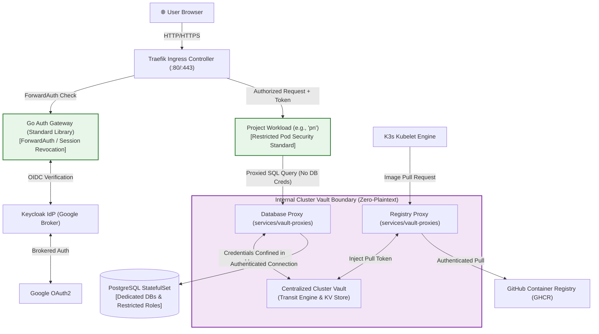

# nacfson_pipeline: Personal Project Platform

[](file:///Users/hyungjuyu/Projects/Brain/nacfson_pipeline/.specify/memory/constitution.md)
[](file:///Users/hyungjuyu/Projects/Brain/nacfson_pipeline/specs/)
[](file:///Users/hyungjuyu/Projects/Brain/nacfson_pipeline/.specify/memory/constitution.md#L21-L23)
[](file:///Users/hyungjuyu/Projects/Brain/nacfson_pipeline/specs/002-internal-cluster-vault/spec.md)

A secure, multi-tenant Kubernetes platform for running personal projects on modest compute resources (single Oracle Cloud Always Free VPS running native K3s, with portability to local Linux K3s, EKS, and GKE). 

The platform guarantees **shared Google-backed Single Sign-On (SSO)**, **strict workload isolation via Kubernetes Restricted Pod Security Standards**, **deterministic 1/n QoS resource budgeting**, **persistent tenant-isolated PostgreSQL**, and a **zero-plaintext self-hosted internal cluster Vault**.

---

## 1. Documentation Architecture & Markdown Structure

To maintain consistency across human engineers and AI coding agents, this repository enforces a **4-tier Markdown Documentation Architecture** based on the Diátaxis framework and Spec-Driven Engineering:

```
nacfson_pipeline/
├── README.md                                    # Tier 2: Master System Portal & Index
├── SPEC.md                                      # Tier 2: Initial Platform Specification Baseline
├── .specify/memory/constitution.md              # Tier 1: Authoritative Invariants & Governance Rules
│
├── specs/                                       # Tier 3: Feature Specifications (SpecKit Packages)
│   ├── 003-minimal-vm-bootstrap/                #   ├── Phase 0: Host OS, Networking & K3s Bootstrap
│   │   ├── spec.md, plan.md, tasks.md           #   │   └── Requirements, implementation plan, task list
│   │   ├── contracts/bootstrap.md               #   │   └── Host configuration contract
│   │   └── validation.md                        #   │   └── Verification acceptance criteria
│   ├── 001-project-platform/                    #   ├── Phase 1: Ingress, Auth Gateway & Workload Sandboxing
│   │   ├── spec.md, plan.md, tasks.md           #   │   └── Requirements, implementation plan, task list
│   │   └── contracts/                           #   │   └── Gateway ForwardAuth & Session Revocation
│   └── 002-internal-cluster-vault/              #   └── Phase 2: Zero-Plaintext Vault & Proxy Architecture
│       ├── spec.md, plan.md, tasks.md           #       └── Requirements, implementation plan, task list
│       ├── contracts/                           #       └── DB, Registry, OAuth & Transit Signing contracts
│       └── validation.md                        #       └── Rotation drills & disaster recovery criteria
│
└── docs/                                        # Tier 4: Operations, Guides & Visual Explanations
    ├── operations-runbook.md                    #   ├── Production deployment sequence & incident triage
    ├── spec002-vault-guide.md                   #   ├── Internal Cluster Vault concepts & rotation lifecycle
    ├── bootstrap-scope.md                       #   ├── Ansible VM bootstrap prerequisites and boundaries
    └── ghcr-token-lifecycle.html                #   └── Interactive visual diagram of GHCR token lifecycle
```

### Documentation Tiers & Governing Rules

| Tier | Category | Scope & Purpose | Precedence & Rules |
| :--- | :--- | :--- | :--- |
| **Tier 1** | **Constitution & Invariants** | Immutable architectural laws, security boundaries, and QoS invariants. | **Supreme Authority**: Any manifest, spec, or code change that contradicts [`.specify/memory/constitution.md`](file:///Users/hyungjuyu/Projects/Brain/nacfson_pipeline/.specify/memory/constitution.md) MUST fail review. |
| **Tier 2** | **System Architecture & Navigation** | Global mental model, macro component topology, and master index. | High-level system orientation ([`README.md`](file:///Users/hyungjuyu/Projects/Brain/nacfson_pipeline/README.md) and [`SPEC.md`](file:///Users/hyungjuyu/Projects/Brain/nacfson_pipeline/SPEC.md)). |
| **Tier 3** | **Feature Specifications (`specs/`)** | SpecKit packages detailing user stories, contracts, and execution tasks. | Formal contract: `spec.md` specifies *what* (requirements), `plan.md` specifies *how* (architecture), `contracts/` specifies *protocols*, `tasks.md` tracks *execution*. |
| **Tier 4** | **Operations & Runbooks (`docs/`)** | Day-2 operations, disaster recovery drills, and procedural runbooks. | Practical guidance for human operators executing deployment scripts and incident triage. |

---

## 2. Constitutional Invariants & Non-Negotiable Constraints

All platform components and project workloads strictly adhere to the 6 principles ratified in [`.specify/memory/constitution.md`](file:///Users/hyungjuyu/Projects/Brain/nacfson_pipeline/.specify/memory/constitution.md):

* **[Principle I: Declarative Phased GitOps](file:///Users/hyungjuyu/Projects/Brain/nacfson_pipeline/.specify/memory/constitution.md#L18-L20)**: Git is the single source of truth. Continuous reconciliation via in-cluster Flux GitOps controller layers with automated drift detection and correction. Images MUST use immutable SHA256 digests or pinned exact tags.
* **[Principle II: Workload Isolation & Restricted Pod Security](file:///Users/hyungjuyu/Projects/Brain/nacfson_pipeline/.specify/memory/constitution.md#L21-L23)**: Project namespaces MUST enforce the Kubernetes `Restricted` Pod Security profile (audit/warn modes strictly prohibited). Containers run non-root, drop all capabilities (allowing at most `NET_BIND_SERVICE`), and use dedicated platform ServiceAccounts with auto-token-mount disabled. Project services are `ClusterIP` only.
* **[Principle III: Defense-in-Depth Identity & Standard-Library Gateway](file:///Users/hyungjuyu/Projects/Brain/nacfson_pipeline/.specify/memory/constitution.md#L24-L26)**: Ingress exposes only public browser-facing login/callback routes and current-session revocation. Keycloak admin, metrics (port 9000), and internal JWKS are strictly private. The Authentication Gateway is written in pure standard-library Go with **zero runtime third-party dependencies** and fails closed (HTTP 503).
* **[Principle IV: Bounded 1/n Resource Budgeting](file:///Users/hyungjuyu/Projects/Brain/nacfson_pipeline/.specify/memory/constitution.md#L27-L29)**: Containers MUST enforce strict `requests == limits`. Compute is sliced equally across projects ($1/n$). Candidate deployments exceeding budgets or lowering existing memory limits during the interim freeze are rejected by the platform-preflight CI gate ([`scripts/platform-preflight.py`](file:///Users/hyungjuyu/Projects/Brain/nacfson_pipeline/scripts/platform-preflight.py)).
* **[Principle V: Zero Plaintext Secrets & Centralized Cluster Vault](file:///Users/hyungjuyu/Projects/Brain/nacfson_pipeline/.specify/memory/constitution.md#L30-L32)**: Plaintext secrets are NEVER committed to Git, embedded in Helm/Kustomize, or delivered to application pods via Kubernetes Secrets or volume mounts. Applications invoke authorized operations via internal Vault Proxies, receiving sanitized results without ever holding backend credentials.
* **[Principle VI: Environmental Portability](file:///Users/hyungjuyu/Projects/Brain/nacfson_pipeline/.specify/memory/constitution.md#L33-L35)**: Zero application code changes across single-VPS K3s, local Linux K3s, AWS EKS, and GCP GKE.

---

## 3. System Architecture & Topology

The platform coordinates ingress traffic, identity negotiation, credential isolation, and persistent storage on a single host node:



---

## 4. Master Specification & Contract Index

All features follow the SpecKit methodology, ordered by implementation phase:

### Phase 0: Infrastructure & Host Provisioning
* **Feature Package**: [`specs/003-minimal-vm-bootstrap/`](file:///Users/hyungjuyu/Projects/Brain/nacfson_pipeline/specs/003-minimal-vm-bootstrap/)
* **Specification**: [`specs/003/spec.md`](file:///Users/hyungjuyu/Projects/Brain/nacfson_pipeline/specs/003-minimal-vm-bootstrap/spec.md) | **Plan**: [`specs/003/plan.md`](file:///Users/hyungjuyu/Projects/Brain/nacfson_pipeline/specs/003-minimal-vm-bootstrap/plan.md) | **Tasks**: [`specs/003/tasks.md`](file:///Users/hyungjuyu/Projects/Brain/nacfson_pipeline/specs/003-minimal-vm-bootstrap/tasks.md)
* **Contracts**:
  * [`contracts/bootstrap.md`](file:///Users/hyungjuyu/Projects/Brain/nacfson_pipeline/specs/003-minimal-vm-bootstrap/contracts/bootstrap.md) — Ansible playbook specification for VM preparation and K3s installation.
* **Scope Guide**: [`docs/bootstrap-scope.md`](file:///Users/hyungjuyu/Projects/Brain/nacfson_pipeline/docs/bootstrap-scope.md)

### Phase 1: Core Platform & Workload Sandboxing
* **Feature Package**: [`specs/001-project-platform/`](file:///Users/hyungjuyu/Projects/Brain/nacfson_pipeline/specs/001-project-platform/)
* **Specification**: [`specs/001/spec.md`](file:///Users/hyungjuyu/Projects/Brain/nacfson_pipeline/specs/001-project-platform/spec.md) | **Plan**: [`specs/001/plan.md`](file:///Users/hyungjuyu/Projects/Brain/nacfson_pipeline/specs/001-project-platform/plan.md) | **Tasks**: [`specs/001/tasks.md`](file:///Users/hyungjuyu/Projects/Brain/nacfson_pipeline/specs/001-project-platform/tasks.md)
* **Contracts**:
  * [`contracts/gateway-forwardauth.md`](file:///Users/hyungjuyu/Projects/Brain/nacfson_pipeline/specs/001-project-platform/contracts/gateway-forwardauth.md) — ForwardAuth protocol between Traefik and Go Gateway.
  * [`contracts/session-revocation.md`](file:///Users/hyungjuyu/Projects/Brain/nacfson_pipeline/specs/001-project-platform/contracts/session-revocation.md) — Real-time CSRF-protected session revocation across active projects.
* **Runbook**: [`docs/operations-runbook.md`](file:///Users/hyungjuyu/Projects/Brain/nacfson_pipeline/docs/operations-runbook.md)

### Phase 2: Zero-Plaintext Internal Cluster Vault
* **Feature Package**: [`specs/002-internal-cluster-vault/`](file:///Users/hyungjuyu/Projects/Brain/nacfson_pipeline/specs/002-internal-cluster-vault/)
* **Specification**: [`specs/002/spec.md`](file:///Users/hyungjuyu/Projects/Brain/nacfson_pipeline/specs/002-internal-cluster-vault/spec.md) | **Plan**: [`specs/002/plan.md`](file:///Users/hyungjuyu/Projects/Brain/nacfson_pipeline/specs/002-internal-cluster-vault/plan.md) | **Tasks**: [`specs/002/tasks.md`](file:///Users/hyungjuyu/Projects/Brain/nacfson_pipeline/specs/002-internal-cluster-vault/tasks.md)
* **Contracts**:
  * [`contracts/database-proxy.md`](file:///Users/hyungjuyu/Projects/Brain/nacfson_pipeline/specs/002-internal-cluster-vault/contracts/database-proxy.md) — Query proxy isolating PostgreSQL credentials from applications.
  * [`contracts/registry-proxy.md`](file:///Users/hyungjuyu/Projects/Brain/nacfson_pipeline/specs/002-internal-cluster-vault/contracts/registry-proxy.md) — Image pull proxy isolating GHCR tokens from worker nodes.
  * [`contracts/database-provisioning-backup.md`](file:///Users/hyungjuyu/Projects/Brain/nacfson_pipeline/specs/002-internal-cluster-vault/contracts/database-provisioning-backup.md) — Automated database provisioning and snapshot verification.
  * [`contracts/google-oauth-broker.md`](file:///Users/hyungjuyu/Projects/Brain/nacfson_pipeline/specs/002-internal-cluster-vault/contracts/google-oauth-broker.md) — Keycloak broker client secret injection without plaintext leaks.
  * [`contracts/transit-signing.md`](file:///Users/hyungjuyu/Projects/Brain/nacfson_pipeline/specs/002-internal-cluster-vault/contracts/transit-signing.md) — Asymmetric token signing via Vault Transit Engine.
* **Guide & Visualizer**: [`docs/spec002-vault-guide.md`](file:///Users/hyungjuyu/Projects/Brain/nacfson_pipeline/docs/spec002-vault-guide.md) | [`docs/ghcr-token-lifecycle.html`](file:///Users/hyungjuyu/Projects/Brain/nacfson_pipeline/docs/ghcr-token-lifecycle.html)

---

## 5. End-to-End Traceability Matrix

The table below maps constitutional requirements to contracts, code modules, and automated verification suites:

| Capability | Governing Contract | Implementation Path | Verification Harness | Constitutional Anchor |
| :--- | :--- | :--- | :--- | :--- |
| **Host K3s Bootstrap** | [`contracts/bootstrap.md`](file:///Users/hyungjuyu/Projects/Brain/nacfson_pipeline/specs/003-minimal-vm-bootstrap/contracts/bootstrap.md) | [`bootstrap/`](file:///Users/hyungjuyu/Projects/Brain/nacfson_pipeline/bootstrap/) | [`bootstrap/tasks/verify.yml`](file:///Users/hyungjuyu/Projects/Brain/nacfson_pipeline/bootstrap/tasks/verify.yml) | [Principle VI](file:///Users/hyungjuyu/Projects/Brain/nacfson_pipeline/.specify/memory/constitution.md#L33-L35) |
| **Authentication ForwardAuth** | [`contracts/gateway-forwardauth.md`](file:///Users/hyungjuyu/Projects/Brain/nacfson_pipeline/specs/001-project-platform/contracts/gateway-forwardauth.md) | [`gateway/`](file:///Users/hyungjuyu/Projects/Brain/nacfson_pipeline/gateway/) | [`gateway/tests/contract_test.go`](file:///Users/hyungjuyu/Projects/Brain/nacfson_pipeline/gateway/tests/contract_test.go) | [Principle III](file:///Users/hyungjuyu/Projects/Brain/nacfson_pipeline/.specify/memory/constitution.md#L24-L26) |
| **Online Session Revocation** | [`contracts/session-revocation.md`](file:///Users/hyungjuyu/Projects/Brain/nacfson_pipeline/specs/001-project-platform/contracts/session-revocation.md) | [`gateway/internal/auth/`](file:///Users/hyungjuyu/Projects/Brain/nacfson_pipeline/gateway/internal/auth/) | [`scripts/verify-revocation.sh`](file:///Users/hyungjuyu/Projects/Brain/nacfson_pipeline/scripts/verify-revocation.sh) | [Principle III](file:///Users/hyungjuyu/Projects/Brain/nacfson_pipeline/.specify/memory/constitution.md#L24-L26) |
| **Restricted Workload Sandboxing** | [`specs/001/spec.md`](file:///Users/hyungjuyu/Projects/Brain/nacfson_pipeline/specs/001-project-platform/spec.md) | [`deploy/platform/governance/`](file:///Users/hyungjuyu/Projects/Brain/nacfson_pipeline/deploy/platform/governance/) | [`scripts/verify-isolation.sh`](file:///Users/hyungjuyu/Projects/Brain/nacfson_pipeline/scripts/verify-isolation.sh) | [Principle II](file:///Users/hyungjuyu/Projects/Brain/nacfson_pipeline/.specify/memory/constitution.md#L21-L23) |
| **1/n Resource Budget Gating** | [`contracts/platform-preflight.md`](file:///Users/hyungjuyu/Projects/Brain/nacfson_pipeline/specs/004-flux-gitops-reconciliation/contracts/platform-preflight.md) | [`clusters/`](file:///Users/hyungjuyu/Projects/Brain/nacfson_pipeline/clusters/) | [`scripts/platform-preflight.py`](file:///Users/hyungjuyu/Projects/Brain/nacfson_pipeline/scripts/platform-preflight.py) | [Principle IV](file:///Users/hyungjuyu/Projects/Brain/nacfson_pipeline/.specify/memory/constitution.md#L27-L29) |
| **Zero-Plaintext DB Proxy** | [`contracts/database-proxy.md`](file:///Users/hyungjuyu/Projects/Brain/nacfson_pipeline/specs/002-internal-cluster-vault/contracts/database-proxy.md) | [`services/vault-proxies/`](file:///Users/hyungjuyu/Projects/Brain/nacfson_pipeline/services/vault-proxies/) | [`tests/vault/test_db_proxy.sh`](file:///Users/hyungjuyu/Projects/Brain/nacfson_pipeline/tests/vault/test_db_proxy.sh) | [Principle V](file:///Users/hyungjuyu/Projects/Brain/nacfson_pipeline/.specify/memory/constitution.md#L30-L32) |
| **Zero-Plaintext Registry Proxy** | [`contracts/registry-proxy.md`](file:///Users/hyungjuyu/Projects/Brain/nacfson_pipeline/specs/002-internal-cluster-vault/contracts/registry-proxy.md) | [`services/vault-proxies/`](file:///Users/hyungjuyu/Projects/Brain/nacfson_pipeline/services/vault-proxies/) | [`tests/vault/test_registry_proxy.sh`](file:///Users/hyungjuyu/Projects/Brain/nacfson_pipeline/tests/vault/test_registry_proxy.sh) | [Principle V](file:///Users/hyungjuyu/Projects/Brain/nacfson_pipeline/.specify/memory/constitution.md#L30-L32) |
| **Zero-Downtime Credential Rotation** | [`specs/002/spec.md`](file:///Users/hyungjuyu/Projects/Brain/nacfson_pipeline/specs/002-internal-cluster-vault/spec.md) | [`scripts/vault-rotate.sh`](file:///Users/hyungjuyu/Projects/Brain/nacfson_pipeline/scripts/vault-rotate.sh) | [`tests/vault/test_rotation_drill.sh`](file:///Users/hyungjuyu/Projects/Brain/nacfson_pipeline/tests/vault/test_rotation_drill.sh) | [Principle V](file:///Users/hyungjuyu/Projects/Brain/nacfson_pipeline/.specify/memory/constitution.md#L30-L32) |
| **Disaster Recovery & Backup Restore** | [`contracts/database-provisioning-backup.md`](file:///Users/hyungjuyu/Projects/Brain/nacfson_pipeline/specs/002-internal-cluster-vault/contracts/database-provisioning-backup.md) | [`scripts/verify-backup.sh`](file:///Users/hyungjuyu/Projects/Brain/nacfson_pipeline/scripts/verify-backup.sh) | [`tests/vault/test_disaster_recovery.sh`](file:///Users/hyungjuyu/Projects/Brain/nacfson_pipeline/tests/vault/test_disaster_recovery.sh) | [Quality Gates](file:///Users/hyungjuyu/Projects/Brain/nacfson_pipeline/.specify/memory/constitution.md#L49-L50) |

---

## 6. Repository Layout

```text
.
├── .specify/                  # SpecKit memory, constitution, templates & workflows
├── .agents/                   # Specialized agent skills and comprehension rules
├── bootstrap/                 # Ansible automation for Linux VM, K3s installation, and Flux reconciler
├── clusters/                  # Flux GitOps entrypoints and layer declarations (local-k3s, vps-k3s)
├── deploy/                    # Base platform and project workload manifests
│   ├── platform/              #   ├── database, governance, identity, ingress, vault, vault-proxies
│   └── projects/              #   └── tenant projects (boundary and workloads)
├── docs/                      # Operations runbooks, conceptual guides & diagrams
├── gateway/                   # Go standard-library authentication gateway service
├── services/                  # Cluster auxiliary services
│   └── vault-proxies/         #   └── Zero-plaintext DB, Registry, and OAuth proxies
├── scripts/                   # Operator release, rotation, and validation scripts
├── specs/                     # Formal SpecKit specifications (001, 002, 003, 004)
└── tests/                     # Integration test suites and failure drills
```

---

## 7. Operational Quickstart

Follow this deployment progression when bootstrapping a fresh environment:

### Step 1: Bootstrap the Host VM & Install Flux Reconciler (Spec 003 & 004)
Prepare the host, install pinned K3s, and deploy Flux GitOps controllers via Ansible:
```bash
ansible-playbook -i "<target-ip>," bootstrap/bootstrap.yml \
  -e ansible_user="ubuntu" \
  -e k3s_version="v1.35.9+k3s1" \
  -e gitops_environment="vps-k3s"
```

### Step 2: Automated GitOps Reconciliation & Vault Initialization (Spec 004 & 002)
Flux reconciles platform layers continuously. Unseal OpenBao once the `vault` layer is ready:
```bash
# 1. Inspect Flux reconciliation layers
flux get kustomizations -A

# 2. Initialize or unseal OpenBao
./scripts/vault-init.sh
./scripts/vault-seed-inventory.sh
./scripts/vault-reconcile.sh
```

### Step 3: Initialize Internal Vault & Proxies (Spec 002)
Initialize Vault storage, populate dummy/initial credentials, and reconcile policies:
```bash
./scripts/vault-init.sh
./scripts/vault-seed-inventory.sh
./scripts/vault-reconcile.sh
```

### Step 4: Execute Verification Drills
Run the end-to-end acceptance tests to ensure compliance with the Constitution:
```bash
# Verify Restricted Pod Security & NetworkPolicy isolation
./scripts/verify-isolation.sh

# Verify online session revocation
./scripts/verify-revocation.sh

# Execute zero-downtime secret rotation drills
./tests/vault/test_rotation_drill.sh

# Run full Vault integration matrix
./tests/vault/test_matrix_verification.sh
```
