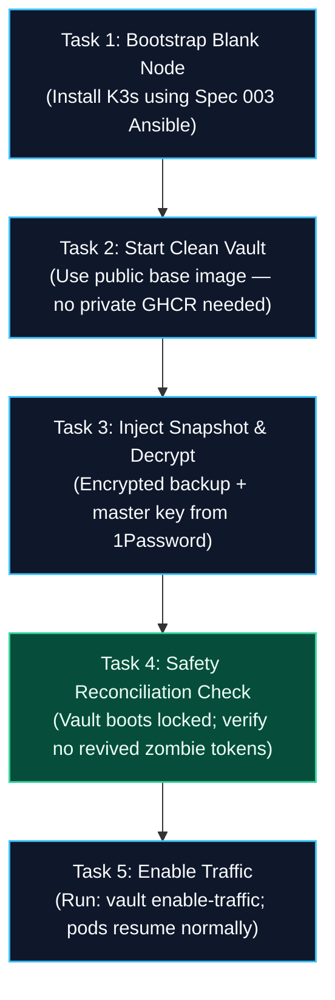

# Spec 002: Internal Cluster Vault — Practical Guide & Concepts

**Reference**: Corresponds to [specs/002-internal-cluster-vault/spec.md](file:///Users/hyungjuyu/Projects/Brain/nacfson_pipeline/specs/002-internal-cluster-vault/spec.md)  
**Visual Interactive Diagram**: [docs/ghcr-token-lifecycle.html](file:///Users/hyungjuyu/Projects/Brain/nacfson_pipeline/docs/ghcr-token-lifecycle.html)  
**Created**: 2026-10-03  
**Status**: Architecture Reference & Operational Knowledge Base

---

## 1. Why Spec 002 Is Written Abstractly

In specification-driven architecture, `spec.md` intentionally omits vendor-specific tools (HashiCorp Vault vs. OpenBao, specific database drivers, or exact secret strings) to focus on **security invariants, state guarantees, and verifiable boundaries**:

1. **Zero Plaintext Secrets**: Under [Constitution Principle V](file:///Users/hyungjuyu/Projects/Brain/nacfson_pipeline/.specify/memory/constitution.md#L30-L32), secret values are never committed to Git or specs. All test scenarios use synthetic dummy values.
2. **Operations Over Credential Delivery**: Traditional Kubernetes delivers secrets to pods via `k8s Secrets`. Spec 002 shifts to an **Operation Execution Model** where worker nodes and pods never receive credentials, even in memory. Pods only receive authorized operation results (e.g., image layer blobs or database query rows).

---

## 2. User Story 3: Credential Roll-Out (Rotation) & Revocation

### 2.1 Definitions in Plain Engineering Terms

* **Rotate (정기 교체 / 갱신)**:
  * Scheduled replacement of an existing valid credential with a fresh one without cluster downtime.
  * *Example*: Replacing `ghcr-pull-token` `v1` with `v2` every 90 days.
* **Revoke (즉시 폐기 / 긴급 차단)**:
  * Immediate permanent cancellation of a credential or access right due to compromise or permission removal.
  * *Example*: A token was logged or leaked; it is blocked in Vault and deleted on GitHub within seconds.

---

### 2.2 The 5-Step Safe Roll-Out Flow (User Story 3.1–3.4)

Updating a secret in a vault does **not** mean running services actually adopted it or that the new secret works. Spec 002 mandates a staged, pre-flight adoption gate:

```mermaid
sequenceDiagram
    autonumber
    actor Operator
    participant GitHub as GitHub (Issuer)
    participant Vault as Cluster Vault (Proxy)
    participant Node as K3s Node (containerd)

    Operator->>GitHub: 1. Generate new PAT (v2) with read:packages
    Operator->>Vault: 2. Stage new credential (v2, status: staged)
    Note over Vault: v1 remains active; no production impact
    Vault->>GitHub: 3. Pre-flight adoption probe (HEAD /v2/... using v2)
    alt Adoption Probe Succeeded (200 OK)
        Vault->>Vault: 4. Promote v2 to Verified-Active
        Operator->>GitHub: 5. Delete old PAT v1 on GitHub
    else Adoption Probe Failed (401 Unauthorized / Bad Secret)
        Vault->>Operator: Halt rollout & alert operator
        Note over Vault: v1 remains active! Production never drops
    end
    Node->>Vault: GET /v2/.../blobs (NO AUTH HEADER)
    Vault->>GitHub: Fetch using Active v2 (Authorization: Bearer v2)
    Vault-->>Node: Stream pure OCI image layers
```

#### Step Walkthrough:
1. **Issue at Issuer**: Operator creates a new Personal Access Token (`v2`) on GitHub with `read:packages` scope.
2. **Stage in Vault**: Operator posts `v2` to Vault. Vault marks `v2` as `STAGED`. `v1` continues handling live cluster image pulls.
3. **Pre-flight Adoption Probe**: The Vault registry service executes a test `HEAD` request to `ghcr.io` with `v2`.
   * *If probe fails*: Vault halts rollout and raises an alert. `v1` stays active with zero downtime.
4. **Promote to Active**: Vault updates its internal pointer to `v2`. From that microsecond onward, all incoming image pull requests are authenticated with `v2`.
5. **Issuer Invalidation**: Operator deletes `v1` on GitHub. Old credentials are dead at the source.

---

### 2.3 Token Permissions: Why the Pull Token Cannot Self-Rotate

The GHCR token itself **never** has permissions to create or revoke tokens on GitHub:
* **Principle of Least Privilege**: The token only needs `read:packages`.
* **Privilege Escalation Prevention**: If an image-pull token had token-creation rights, compromising the pull proxy would grant full control over your GitHub account.
* **Separation of Custody**: Token creation/deletion is an operator administrative action, strictly separated from internal cluster usage ([FR-015](file:///Users/hyungjuyu/Projects/Brain/nacfson_pipeline/specs/002-internal-cluster-vault/spec.md#L139), [Line 190](file:///Users/hyungjuyu/Projects/Brain/nacfson_pipeline/specs/002-internal-cluster-vault/spec.md#L190)).

---

### 2.4 Deprecation of the Initial / Bootstrap Token

* **Question**: Does the Vault take over the first injected token, and is it deprecated afterward?
* **Answer**: **Yes, absolutely.**
* **Why**:
  1. The initial bootstrap token was handled outside the Vault (in shell scripts, Ansible, or temporary Kubernetes manifests) and is considered potentially tainted.
  2. Under [FR-016](file:///Users/hyungjuyu/Projects/Brain/nacfson_pipeline/specs/002-internal-cluster-vault/spec.md#L140) and [SC-003](file:///Users/hyungjuyu/Projects/Brain/nacfson_pipeline/specs/002-internal-cluster-vault/spec.md#L169), cutover requires removing all legacy caller-side copies (e.g. deleting old `imagePullSecrets`) and invalidating exposed credentials at the issuer.
  3. Once the Vault is healthy, you rotate to `v2` and delete `v1` on GitHub, ensuring only the Vault possesses valid credentials.

---

### 2.5 Tracking Token Usage on GitHub

You can observe and audit token activity directly on the GitHub website:
1. **Token "Last Used" Timestamp**: `GitHub Settings ➔ Developer settings ➔ Personal access tokens`. Displays the exact date or *"Last used within the last hour"*.
2. **Organization Audit Log**: `Organization Settings ➔ Logs ➔ Audit log`. Filter by:
   * `action:package.download` (lists image pulls with IP address, timestamp, and package name)
   * `actor:<token_owner>`
3. **Package Download Counters**: `Organization / Profile ➔ Packages ➔ [Package Name]`.

---

## 3. User Story 4: Audit & Disaster Recovery

When credentials are centralized into a single service, two requirements become paramount: **Auditing** and **Disaster Recovery**.

### 3.1 Value-Free Forensic Auditing (Scenario 4.1 & 4.2)

Every request (allowed or denied) must log **Who, What, When, and Outcome**, but **must never record credentials or sensitive payloads**:

```json
{
  "timestamp": "2026-10-03T14:45:00Z",
  "request_id": "req-98765-abc",
  "actor": "pod:pn-namespace/backend-687f-9b",
  "operation": "db.query",
  "target": "database:pn_production, table:orders",
  "outcome": "ALLOWED"
}
```

* **Fail-Closed Audit Rule**: If the audit storage disk is full or cannot write the audit log, the Vault **refuses to execute external operations**. No secret operations may take place "in the dark."

---

### 3.2 Disaster Recovery Tasks (The Recovery Runbook)

If the server crashes and its SSD is destroyed, the operator follows 5 concrete recovery tasks:



#### Task Breakdown:
1. **Task 1 (Bootstrap Fresh VM)**: Provision a replacement VM and run [Spec 003 minimal-vm-bootstrap](file:///Users/hyungjuyu/Projects/Brain/nacfson_pipeline/specs/003-minimal-vm-bootstrap/spec.md) to install K3s.
2. **Task 2 (Deploy Vault without Circular Dependency)**: The Vault container is pulled from a public registry or local archive, avoiding a circular dependency on the private GHCR pull proxy ([FR-015](file:///Users/hyungjuyu/Projects/Brain/nacfson_pipeline/specs/002-internal-cluster-vault/spec.md#L139)).
3. **Task 3 (Restore Snapshot)**: Download the daily encrypted snapshot from Object Storage and decrypt it using the master key held separately in the operator's password manager.
4. **Task 4 (The Anti-Zombie Reconciliation Gate)**:
   * *The Problem*: The backup was taken at 00:00 UTC. What if a token was compromised and revoked at 10:00 AM? Restoring the midnight backup would restore the revoked token as valid.
   * *The Guarantee ([FR-014](file:///Users/hyungjuyu/Projects/Brain/nacfson_pipeline/specs/002-internal-cluster-vault/spec.md#L138))*: The Vault boots with **execution disabled**. The operator verifies that no revoked secrets were reintroduced before unlocking traffic.
5. **Task 5 (Resume Traffic)**: Operator runs `vault enable-traffic`. Applications reconnect and resume normal operations.

---

### 3.3 What Values Are Explicitly Restored?

According to [Spec 002 (Scenario 4.3, FR-006, FR-013)](file:///Users/hyungjuyu/Projects/Brain/nacfson_pipeline/specs/002-internal-cluster-vault/spec.md#L101), the backup restores the **Triad of State**:

| Restored Category | Contents | Concrete Example |
| :--- | :--- | :--- |
| **1. Credential Versions** | Encrypted secret strings, version numbers, creation timestamps, and lifecycle flags (`ACTIVE`, `STAGED`, `REVOKED`). | Encrypted GHCR PAT, PostgreSQL application passwords, Gateway session-signing keys. |
| **2. Access Grants** | Policies mapping authenticated caller identities to permitted operations and targets. | Rule authorizing `spiffe://.../pn-backend` to query `postgres-pn` under role `pn_app_user`. |
| **3. Operation Definitions** | Upstream protocol configurations, service endpoints, and input/output contracts. | GHCR registry proxy configuration (`ghcr.io`), digest verification rules, layer streaming policy. |

#### What Is Explicitly NOT Restored:
1. **In-Flight Connections**: Active TCP streams or queries in progress at crash time are dropped; clients must reconnect.
2. **Caller Identity Tokens**: Short-lived pod tokens are not restored; pods request fresh tokens from the platform identity provider.
3. **Post-Backup State Changes**: Any revocation or rotation that occurred after the backup timestamp must be manually reconciled by the operator during Task 4.
