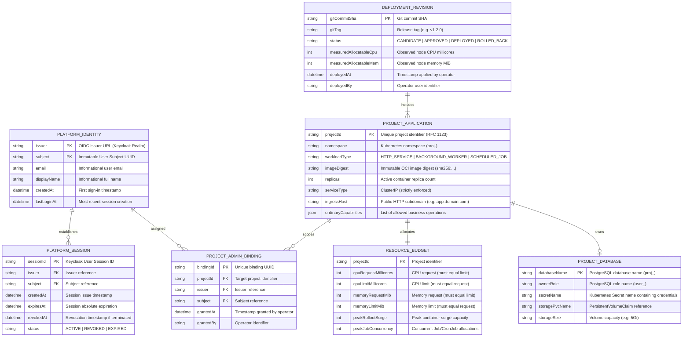
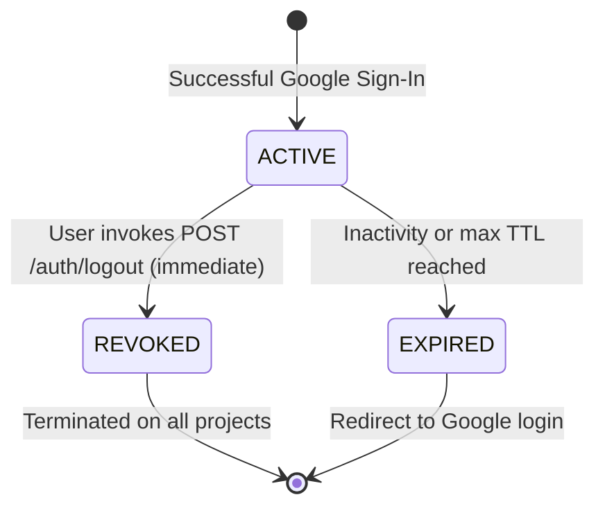

# Phase 1 Data Model: Personal Project Platform

**Feature**: `001-project-platform`  
**Date**: 2026-10-01  
**Status**: Completed  

This document formalizes the entities, schema definitions, validation rules, and state transitions governing the Personal Project Platform.

---

## 1. Entity Relationship Diagram

---

## 2. Entity Specifications & Validation Rules

### 2.1 Platform Identity

Represents a unique user registered in Keycloak via Google identity brokering.

| Field | Type | Constraint | Description |
|-------|------|------------|-------------|
| `issuer` | `string` | Required, Valid URL | The Keycloak realm issuer URL (e.g. `https://auth.example.com/realms/platform`). |
| `subject` | `string` | Required, UUID/String | The immutable user subject identifier generated by Keycloak. |
| `email` | `string` | Informational | Email address provided by Google. **MUST NOT** be used as a primary key or for account linking. |
| `displayName` | `string` | Informational | User's full name from Google profile. |
| `createdAt` | `datetime` | ISO-8601 | Timestamp of automatic registration upon first successful sign-in. |

**Validation Rules:**
- Identity is uniquely and permanently defined strictly by the composite key `(issuer, subject)`.
- No account registration approval or email allowlisting is required (`FR-001`).

---

### 2.2 Platform Session

Represents an active authenticated browser state tracked in Keycloak.

| Field | Type | Constraint | Description |
|-------|------|------------|-------------|
| `sessionId` | `string` | Primary Key, UUID | Keycloak user session UUID (`sid` claim in tokens). |
| `issuer` | `string` | Foreign Key | References `Platform Identity.issuer`. |
| `subject` | `string` | Foreign Key | References `Platform Identity.subject`. |
| `status` | `enum` | `ACTIVE`, `REVOKED`, `EXPIRED` | Current validity state. |
| `createdAt` | `datetime` | ISO-8601 | Timestamp session was established. |
| `expiresAt` | `datetime` | ISO-8601 | Maximum session lifespan. |
| `revokedAt` | `datetime` | Nullable, ISO-8601 | Timestamp user explicitly invoked sign-out. |

**State Transitions:**

**Validation Rules:**
- On every protected request, the Go gateway validates `status == ACTIVE` synchronously via Keycloak.
- If `status == REVOKED`, the request is rejected immediately with HTTP 401/302, even if access tokens remain unexpired (`FR-007`, `SC-003`).
- Revocation of `sessionId` affects only that specific session; concurrent sessions on other devices remain `ACTIVE`.

---

### 2.3 Project Application

Represents a deployed tenant workload within a dedicated Kubernetes namespace.

| Field | Type | Constraint | Description |
|-------|------|------------|-------------|
| `projectId` | `string` | `[a-z0-9]([-a-z0-9]*[a-z0-9])?` | Unique project identifier (max 32 chars). |
| `namespace` | `string` | `proj-<projectId>` | Platform-owned Kubernetes namespace. |
| `workloadType` | `enum` | `HTTP_SERVICE`, `BACKGROUND_WORKER`, `SCHEDULED_JOB` | Nature of application workload. |
| `imageDigest` | `string` | `sha256:[a-f0-9]{64}` | Immutable OCI image digest from GHCR. |
| `serviceType` | `enum` | `ClusterIP` strictly | Kubernetes Service type. NodePort/LoadBalancer are rejected. |
| `ordinaryCapabilities`| `string[]` | Required, non-empty | Explicitly allowed actions for registered ordinary users. |

**Validation Rules:**
- Manifest MUST be rejected if `ordinaryCapabilities` is missing or empty (`FR-005`).
- Pods MUST run under dedicated platform-owned ServiceAccount with `automountServiceAccountToken: false` (`FR-009`).
- Pod security label `pod-security.kubernetes.io/enforce` MUST equal `restricted`.

---

### 2.4 Resource Budget

Defines the mathematical 1/n allocation slice assigned to a project.

| Field | Type | Constraint | Description |
|-------|------|------------|-------------|
| `projectId` | `string` | Foreign Key | References `Project Application.projectId`. |
| `cpuRequest` | `int` | Millicores | CPU request (`m`). Strictly equal to `cpuLimit`. |
| `cpuLimit` | `int` | Millicores | CPU limit (`m`). Strictly equal to `cpuRequest`. |
| `memoryRequest`| `int` | MiB | Memory request (`Mi`). Strictly equal to `memoryLimit`. |
| `memoryLimit` | `int` | MiB | Memory limit (`Mi`). Strictly equal to `memoryRequest`. |
| `peakConcurrency` | `int` | Calculated | Aggregate sum of container limits + rollout surge + Job parallelism. |

**Formula & Invariant:**
$$\text{Per-Project Limit} = \frac{\text{Node Allocatable} - \text{Platform Overhead}}{n}$$
$$\text{Peak Project Footprint} \le \text{Per-Project Limit}$$
$$\text{requests} == \text{limits} \quad (\text{Guaranteed QoS})$$

---

### 2.5 Project Database

Defines the PostgreSQL schema and credentials provisioned for stateful projects.

| Field | Type | Constraint | Description |
|-------|------|------------|-------------|
| `databaseName` | `string` | `proj_<projectId>` | Isolated PostgreSQL database catalog. |
| `ownerRole` | `string` | `user_<projectId>` | Restricted role with ownership only of `databaseName`. |
| `secretName` | `string` | Valid K8s name | Secret containing `POSTGRES_DB`, `POSTGRES_USER`, `POSTGRES_PASSWORD`. |
| `storagePvcName`| `string` | Valid K8s name | PersistentVolumeClaim backing database files. |

**Validation Rules:**
- Project role MUST NOT possess `SUPERUSER`, `CREATEDB`, `CREATEROLE`, or `REPLICATION` attributes.
- Connection permissions MUST be explicitly revoked on `keycloak` database and peer `proj_*` databases (`FR-015`).
