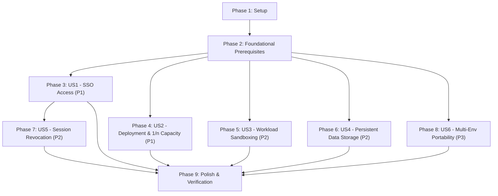

# Tasks: Personal Project Platform

**Feature**: `001-project-platform` | **Date**: 2026-10-01 | **Spec**: [spec.md](file:///home/nacfson/Projects/nacfson_pipeline/specs/001-project-platform/spec.md) | **Plan**: [plan.md](file:///home/nacfson/Projects/nacfson_pipeline/specs/001-project-platform/plan.md)

---

## Phase 1: Setup (Shared Infrastructure)

**Purpose**: Project initialization, directory structure creation, and shared automation tooling.

- [x] T001 Create platform directory structure for deployments, gateway microservice, and operational scripts in `deploy/platform/`, `deploy/environments/`, `deploy/projects/`, `gateway/`, and `scripts/`
- [x] T002 Initialize custom Go authentication gateway module using Go 1.22+ standard library with zero external runtime dependencies in `gateway/go.mod`
- [x] T003 [P] Configure manifest linting and schema validation tools with GitHub Actions workflow in `.github/workflows/lint.yaml`
- [x] T004 [P] Create operator configuration environment template for Kubernetes secret references in `deploy/platform/secrets.env.example`

---

## Phase 2: Foundational (Blocking Prerequisites)

**Purpose**: Core platform governance, database storage, and identity infrastructure that MUST be established before deploying application workloads.

**⚠️ CRITICAL**: No user story work can begin until this phase is complete.

- [x] T005 Create base Kubernetes namespaces with Restricted Pod Security Admission labels `pod-security.kubernetes.io/enforce: restricted` in `deploy/platform/governance/namespaces.yaml`
- [x] T006 [P] Create platform-owned ServiceAccount base template enforcing `automountServiceAccountToken: false` in `deploy/platform/governance/service-account-template.yaml`
- [x] T007 [P] Create baseline default-deny NetworkPolicy template blocking all ingress and egress except cluster DNS on UDP/TCP port 53 in `deploy/platform/governance/base-network-policy.yaml`
- [x] T008 Deploy standard PostgreSQL StatefulSet backed by disk PersistentVolumeClaim (`local-path` storage on K3s) in `deploy/platform/database/postgres-statefulset.yaml`
- [x] T009 Create PostgreSQL Headless and ClusterIP Service on port 5432 in `deploy/platform/database/postgres-service.yaml`
- [x] T010 Implement idempotent PostgreSQL database and role provisioning Job creating `keycloak` catalog and dedicated project catalogs with isolated roles in `deploy/platform/database/postgres-init-job.yaml`
- [x] T011 Deploy Keycloak 24+ deployment and Service connected to PostgreSQL in `deploy/platform/identity/keycloak-deployment.yaml`
- [x] T012 Configure Keycloak platform realm with Google identity brokering, client scopes, and audience mappers in `deploy/platform/identity/keycloak-realm-config.yaml`
- [x] T013 Create Traefik ForwardAuth middleware resource referencing the internal gateway service `http://gateway.identity.svc:8080/auth` in `deploy/platform/ingress/traefik-middleware.yaml`

**Checkpoint**: Foundation ready - database, identity provider, and security admission controls are active. User story implementation can now begin.

---

## Phase 3: User Story 1 - Seamless Single Sign-On Access Across Projects (Priority: P1) 🎯 MVP

**Goal**: Deliver shared Google-backed single sign-on via the Go authentication gateway and Traefik ForwardAuth, allowing users to authenticate once and access protected projects under a stable `(issuer, subject)` identity.

**Independent Test**: An unauthenticated request to `pn.example.com` redirects to Google login; after authenticating, the visitor is recognized under a stable platform identity and granted ordinary landing page access. Navigating to a second project recognizes the identical session without a secondary login prompt (`SC-001`, `SC-002`).

### Tests for User Story 1

- [x] T014 [P] [US1] Unit test ForwardAuth handler verifying inbound header sanitization (stripping `X-User-Subject`, `X-User-Issuer`, and forged `Authorization`) in `gateway/tests/handler_test.go`
- [x] T015 [P] [US1] Contract test for ForwardAuth HTTP interface validating HTTP 200 with injected project-scoped token, HTTP 302 redirect on unauthenticated, and HTTP 503 fail-closed responses per `contracts/gateway-forwardauth.md` in `gateway/tests/contract_test.go`

### Implementation for User Story 1

- [x] T016 [US1] Implement gateway configuration loader reading port, Keycloak issuer URL, and cookie parameters from environment in `gateway/internal/config/config.go`
- [x] T017 [US1] Implement Traefik ForwardAuth `/auth` handler parsing `X-Forwarded-*` headers, validating cookies, and injecting `Authorization: Bearer <token>` with `aud` matching the target project in `gateway/internal/auth/handler.go`
- [x] T018 [US1] Implement Keycloak OIDC client in Go standard library executing Authorization Code flow with PKCE in `gateway/internal/keycloak/oidc.go`
- [x] T019 [US1] Implement gateway HTTP server entrypoint with graceful shutdown in `gateway/cmd/gateway/main.go`
- [x] T020 [US1] Build multi-architecture scratch/distroless Dockerfile for Go gateway in `gateway/Dockerfile`
- [x] T021 [US1] Deploy Go gateway Deployment and ClusterIP Service on port 8080 in `deploy/platform/identity/gateway-deployment.yaml`
- [x] T022 [US1] Configure public Traefik IngressRoute exposing only browser OIDC routes and gateway routes while strictly blocking `/admin/`, master realm, metrics port 9000, and health endpoints in `deploy/platform/ingress/ingress-allowlist.yaml`
- [x] T023 [US1] Deploy Project PN Traefik IngressRoute with ForwardAuth middleware integration in `deploy/projects/pn/ingress-route.yaml`

**Checkpoint**: User Story 1 is complete. Users can authenticate through Google and access protected projects via SSO.

---

## Phase 4: User Story 2 - Declarative Version-Controlled Deployment with Capacity Verification (Priority: P1)

**Goal**: Establish deterministic 1/n project budgeting and manual release verification, ensuring candidate revisions cannot exhaust node resources, with Git commit SHA baseline tracking and atomic rollback on partial deployment failure.

**Independent Test**: Run preflight checks against observed node capacity to verify that over-budget revisions are rejected, zero-project deployments succeed without division by zero, and multi-manifest partial failures roll back to the prior Git baseline commit (`SC-004`).

### Implementation for User Story 2

- [x] T024 [P] [US2] Implement capacity discovery and 1/n budget validation script calculating `(Node Allocatable - Platform Overhead) / n` and enforcing strict `requests == limits` per `contracts/preflight-budget.json` in `scripts/preflight-budget.sh`
- [x] T025 [P] [US2] Add zero-project safe handling and division-by-zero prevention logic in `scripts/preflight-budget.sh`
- [x] T026 [P] [US2] Add memory freeze verification to `scripts/preflight-budget.sh` rejecting revisions that reduce existing workloads' memory limits or force existing project slices below deployed peak memory envelopes
- [x] T027 [US2] Create platform-owned ResourceQuota manifest for Project PN enforcing calculated CPU and memory limits as non-bypassable admission backstops in `deploy/projects/pn/resource-quota.yaml`
- [x] T028 [US2] Implement sequential release application script `scripts/apply-release.sh` recording the deployed Git commit SHA baseline in `.deploy-baseline`
- [x] T029 [US2] Implement atomic rollback script `scripts/rollback-release.sh` reverting all applied manifests to the previously recorded Git baseline commit SHA upon partial deployment failure

**Checkpoint**: User Story 2 is complete. Candidate deployments are strictly bounded by hardware capacity and resilient to partial failures.

---

## Phase 5: User Story 3 - Workload Security Sandboxing and Perimeter Defense (Priority: P2)

**Goal**: Enforce strict multi-tenant isolation across all project workloads, preventing compromised containers from escalating privileges, mounting tokens, or accessing private cluster networks.

**Independent Test**: Attempt to deploy a container running as root, mounting service account tokens, declaring NodePort services, or making unauthorized egress calls; verify that 100% of violation attempts fail closed (`SC-005`).

### Implementation for User Story 3

- [x] T030 [P] [US3] Create dedicated Project PN namespace with `pod-security.kubernetes.io/enforce: restricted` in `deploy/projects/pn/namespace.yaml`
- [x] T031 [P] [US3] Create platform-owned Project PN ServiceAccount with `automountServiceAccountToken: false` in `deploy/projects/pn/service-account.yaml`
- [x] T032 [P] [US3] Create Project PN Service manifest strictly configured as `ClusterIP` in `deploy/projects/pn/backend-service.yaml`
- [x] T033 [US3] Create Project PN NetworkPolicy enforcing default-deny ingress and egress, permitting ingress only from Traefik ingress and egress only to internal cluster DNS and PostgreSQL port 5432 in `deploy/projects/pn/network-policy.yaml`
- [x] T034 [US3] Implement automated isolation verification test script `scripts/verify-isolation.sh` testing root pod rejection, token mount rejection, NodePort rejection, and undeclared egress blocking per `quickstart.md` Scenario 2 & 3

**Checkpoint**: User Story 3 is complete. Project workloads execute in strictly bounded, unprivileged sandboxes with zero control plane access.

---

## Phase 6: User Story 4 - Dedicated Persistent Data Storage and Isolation (Priority: P2)

**Goal**: Provide dedicated persistent relational database catalogs and roles per project, backed by disk storage surviving pod replacements, while prohibiting cross-database access.

**Independent Test**: Insert data into `proj_pn`, recreate the PostgreSQL StatefulSet pod, and confirm data survives intact; confirm that `user_pn` credentials cannot query `keycloak` or peer databases (`SC-006`, `FR-015`).

### Implementation for User Story 4

- [x] T035 [P] [US4] Configure PostgreSQL PersistentVolumeClaim with `Retain` or protected reclaim policy to guard against accidental deletion in `deploy/platform/database/postgres-pvc.yaml`
- [x] T036 [US4] Extend database initialization Job to provision `proj_pn` database and `user_pn` role with restricted privileges revoking cross-database CONNECT permissions in `deploy/platform/database/postgres-init-job.yaml`
- [x] T037 [US4] Create Kubernetes Secret reference template for Project PN database credentials in `deploy/projects/pn/database-secret.yaml`
- [x] T038 [US4] Implement database persistence and isolation verification script testing pod recreation, data integrity, and cross-database query denial in `scripts/verify-persistence.sh`

**Checkpoint**: User Story 4 is complete. Project data persists across pod maintenance and database isolation is enforced.

---

## Phase 7: User Story 5 - Instant Cross-Project Session Revocation (Priority: P2)

**Goal**: Enable users to synchronously terminate their active platform session from any project, immediately invalidating access on the next request across all platform projects while preserving other device sessions.

**Independent Test**: Call `POST /auth/logout` with an active session cookie; verify that the immediate subsequent request to any platform project is rejected (HTTP 401/302), even if access tokens have not expired (`SC-003`).

### Tests for User Story 5

- [x] T039 [P] [US5] Unit test session revocation handler validating CSRF token verification and Keycloak session deletion call in `gateway/tests/logout_test.go`
- [x] T040 [P] [US5] Contract test for `POST /auth/logout` API verifying HTTP 302 redirect, cookie clearing, and CSRF protection per `contracts/session-revocation.md` in `gateway/tests/revocation_contract_test.go`

### Implementation for User Story 5

- [x] T041 [US5] Implement Keycloak REST client for terminating user sessions via `DELETE /admin/realms/platform/sessions/{sessionId}` using dedicated session-revocation credentials in `gateway/internal/keycloak/session.go`
- [x] T042 [US5] Implement CSRF-protected `POST /auth/logout` endpoint in Go gateway clearing session cookie and redirecting to project logout URL in `gateway/internal/auth/logout.go`
- [x] T043 [US5] Implement synchronous online session status validation in `/auth` handler checking active session state on every request in `gateway/internal/auth/session_validator.go`
- [x] T044 [US5] Implement fail-closed error handling returning HTTP 503 Service Unavailable when Keycloak is unreachable in `gateway/internal/auth/handler.go`
- [x] T045 [US5] Implement automated session revocation verification script testing immediate next-request rejection across multiple projects in `scripts/verify-revocation.sh`

**Checkpoint**: User Story 5 is complete. Sessions can be immediately revoked across all projects.

---

## Phase 8: User Story 6 - Multi-Environment Portability and Expansion (Priority: P3)

**Goal**: Ensure platform declarations run identically across local development K3s, standalone VPS K3s, and cloud environments (EKS/GKE) without modifying application code, delivering multi-arch OCI images via immutable GHCR digests.

**Independent Test**: Deploy the platform using local K3s and VPS K3s overlays; verify identical application behavior, private GHCR image pull, and optional scheduled daily backup execution (`SC-007`, `SC-008`).

### Implementation for User Story 6

- [x] T046 [P] [US6] Create Project PN backend deployment manifest referencing immutable digest `ghcr.io/nacfson/project-pn-backend@sha256:d3ab8644467bbbb2a49b0afc6631b2600ce344908ce15ddf99e8478c11ecaf21` in `deploy/projects/pn/backend-deployment.yaml`
- [x] T047 [P] [US6] Create Project PN frontend deployment manifest referencing immutable digest `ghcr.io/nacfson/project-pn-frontend@sha256:bc70cb06625c439d911a05d97febb7275b642ab7386022625302f1e224a696ce` in `deploy/projects/pn/frontend-deployment.yaml`
- [x] T048 [P] [US6] Create namespace-scoped `imagePullSecrets` manifest for private GHCR package authentication in `deploy/projects/pn/image-pull-secret.yaml`
- [x] T049 [US6] Create Kustomize environment overlay for local K3s development in `deploy/environments/local-k3s/kustomization.yaml`
- [x] T050 [US6] Create Kustomize environment overlay for single VPS production K3s in `deploy/environments/vps-k3s/kustomization.yaml`
- [x] T051 [US6] Implement optional scheduled backup CronJob running daily at 00:00 UTC with 7-day retention in `deploy/platform/database/backup-cronjob.yaml`
- [x] T052 [US6] Implement backup archive restore verification script in `scripts/verify-backup.sh`

**Checkpoint**: User Story 6 is complete. Platform manifests are fully portable and disaster recovery is verifiable.

---

## Phase 9: Polish & Cross-Cutting Concerns

**Purpose**: End-to-end integration verification, security hardening, and operational documentation.

- [x] T053 [P] Implement master platform verification script `scripts/verify-platform.sh` executing all scenarios in `specs/001-project-platform/quickstart.md`
- [x] T054 [P] Update platform operations runbook with manifest deployment sequence, secret rotation, and rollback procedures in `docs/operations-runbook.md`
- [x] T055 Run full end-to-end verification suite across all user stories and validate 100% success criteria passing

---

## Dependencies & Execution Order

### Phase Dependencies

### User Story Dependencies

- **US1 (SSO Access, P1)**: Depends on Foundational (Phase 2).
- **US2 (Deployment & Capacity, P1)**: Depends on Foundational (Phase 2). Can execute in parallel with US1.
- **US3 (Workload Sandboxing, P2)**: Depends on Foundational (Phase 2).
- **US4 (Persistent Storage, P2)**: Depends on Foundational (Phase 2).
- **US5 (Session Revocation, P2)**: Depends on US1 (Gateway and Keycloak session infrastructure).
- **US6 (Multi-Env Portability, P3)**: Depends on US2, US3, US4 (packages workloads and overlays).

---

## Parallel Opportunities

- **Setup & Foundational**: Tasks marked `[P]` (T003, T004, T006, T007) can execute concurrently.
- **User Story 1 & User Story 2**: Can be developed concurrently once Foundational (Phase 2) is complete.
- **Within User Stories**:
  - US1: T014, T015 (tests) and T016, T018 can proceed in parallel.
  - US2: T024, T025, T026 (preflight checks) can proceed in parallel.
  - US3: T030, T031, T032 (namespace, SA, service) can proceed in parallel.
  - US5: T039, T040 (tests) can proceed in parallel.
  - US6: T046, T047, T048 (deployment manifests and pull secrets) can proceed in parallel.

---

## Implementation Strategy (MVP First)

1. **Phase 1 & Phase 2**: Bootstrap repository structure, base namespaces, PostgreSQL StatefulSet, Keycloak, and Traefik ForwardAuth middleware.
2. **Phase 3 (MVP)**: Implement custom Go gateway and deploy Project PN with Google SSO. Validate that users can sign in and access Project PN.
3. **Phase 4 & 5**: Implement capacity preflight (`preflight-budget.sh`), baseline rollback automation, and enforce Restricted PSA + default-deny NetworkPolicies.
4. **Phase 6 & 7**: Provision dedicated PostgreSQL databases and implement CSRF-protected immediate session revocation.
5. **Phase 8 & 9**: Finalize multi-arch deployment manifests, Kustomize overlays, optional daily backup CronJob, and run end-to-end verification.
