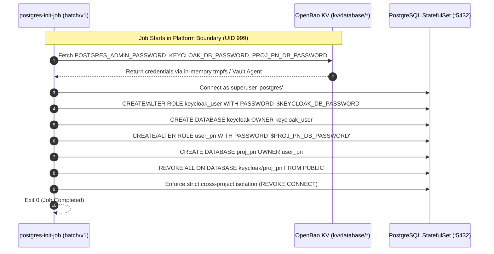

# Contract: Database Provisioning & Backup Operations

**Feature**: `002-internal-cluster-vault`  
**Consumers**: `postgres-init-job` & `postgres-daily-backup` CronJob  
**Upstream Target**: PostgreSQL StatefulSet (`postgres-service.identity.svc:5432`)  
**Engines**: OpenBao KV v2 (`kv/database/`)  

---

## 1. Overview & Purpose

Database lifecycle duties require elevated or specialized database privileges that must remain confined within the trusted platform boundary:
1. **Database Provisioning Job** (`postgres-init-job`): Initializes roles, creates isolated project databases, and configures database-level network/user access control.
2. **Database Backup Job** (`postgres-daily-backup`): Performs nightly logical cluster dumps (`pg_dumpall`) and manages archive retention.

Under the Vault Architecture ([FR-005](file:///Users/hyungjuyu/Projects/Brain/nacfson_pipeline/specs/002-internal-cluster-vault/spec.md#L129), [FR-016](file:///Users/hyungjuyu/Projects/Brain/nacfson_pipeline/specs/002-internal-cluster-vault/spec.md#L140), [FR-020](file:///Users/hyungjuyu/Projects/Brain/nacfson_pipeline/specs/002-internal-cluster-vault/spec.md#L145), [FR-021](file:///Users/hyungjuyu/Projects/Brain/nacfson_pipeline/specs/002-internal-cluster-vault/spec.md#L146)), plaintext passwords in Kubernetes Secret objects are abolished.

---

## 2. Database Provisioning Contract (`postgres-init-job`)



### 2.1 Credential Mappings
* `kv/data/database/postgres-admin`: Superuser `postgres` password.
* `kv/data/database/keycloak-user`: Password for `keycloak_user`.
* `kv/data/database/pn-user`: Password for `user_pn`.

### 2.2 Security Invariants
* Superuser access is strictly limited to this single provisioning job and forbidden for application workloads.
* Execution is fully idempotent (`IF NOT EXISTS` / `ALTER ROLE`).
* Cross-database connection is revoked (`REVOKE CONNECT ON DATABASE keycloak FROM user_pn`).
* `postgres-credentials` Kubernetes Secret is decommissioned upon migration.

---

## 3. Database Backup Contract (`postgres-daily-backup` CronJob)

### 3.1 Least-Privilege Role Migration
* **Legacy State**: Ran as superuser `postgres` with full read/write/DDL privileges.
* **Vault Target State**: Dedicated `backup_role` with read-only dump privileges:
  ```sql
  CREATE ROLE backup_role WITH LOGIN PASSWORD '$BACKUP_ROLE_PASSWORD';
  GRANT pg_read_all_data TO backup_role;
  REVOKE CREATE, TEMPORARY ON DATABASE keycloak, proj_pn FROM backup_role;
  ```

### 3.2 Backup Execution Contract
* **Schedule**: Daily at `00:00 UTC` (`0 0 * * *`).
* **Storage Path in Vault**: `kv/data/database/backup-user`.
* **Execution Flow**:
  1. Pod boots with `automountServiceAccountToken: false` under UID `999`.
  2. Fetches `BACKUP_ROLE_PASSWORD` from Vault via ephemeral in-memory tmpfs or workload token.
  3. Executes streaming pipeline: `pg_dumpall -h postgres-service -U backup_role | gzip > /backups/pg_dumpall_${TIMESTAMP}.sql.gz`.
  4. Enforces retention: `find /backups -name "pg_dumpall_*.sql.gz" -type f -mtime +7 -delete`.
  5. Clears password from memory on completion.

### 3.3 Acceptance & Failure Contract
* **Failure Handling**: If database is unavailable or password fails, job exits non-zero and notifies platform monitoring without leaking the password into logs.
* **Verification**: PVC `/backups` contains valid non-empty gzipped archive.
