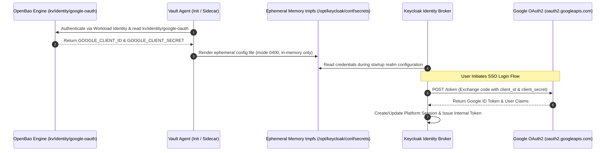

# Contract: Google OAuth Identity Broker Integration

**Feature**: `002-internal-cluster-vault`  
**Consumer**: Keycloak Identity Provider Broker (`identity/keycloak`)  
**Upstream Endpoint**: `https://oauth2.googleapis.com/token` & `https://www.googleapis.com/oauth2/v3/userinfo`  
**Internal Credential**: `google-oauth-broker-secret` (OpenBao KV: `kv/identity/google-oauth`)  

---

## 1. Context & Purpose

The platform relies on Google OAuth 2.0 as the authoritative external upstream identity provider. Keycloak acts as an identity broker, redirecting unauthenticated users to Google, receiving the authorization code, and exchanging it directly with Google's OAuth2 endpoints for verified identity tokens (`email`, `sub`, `profile`).

Under the Zero-Plaintext / Vault Architecture ([FR-005](file:///Users/hyungjuyu/Projects/Brain/nacfson_pipeline/specs/002-internal-cluster-vault/spec.md#L129), [FR-016](file:///Users/hyungjuyu/Projects/Brain/nacfson_pipeline/specs/002-internal-cluster-vault/spec.md#L140), [FR-021](file:///Users/hyungjuyu/Projects/Brain/nacfson_pipeline/specs/002-internal-cluster-vault/spec.md#L146)), `GOOGLE_CLIENT_SECRET` MUST NOT be stored in Kubernetes Secret objects, environment variables, or persistent container filesystems.

---

## 2. Credential Confinement & Delivery Interface



1. **Storage in Vault**:
   - Stored in OpenBao KV v2 under path `kv/data/identity/google-oauth`.
   - Keys: `client_id`, `client_secret`.
2. **Ephemeral In-Memory Delivery**:
   - Delivered to Keycloak container using an in-memory `tmpfs` volume mounted at `/opt/keycloak/conf/secrets`.
   - Populated at container startup by Vault Agent using a Kubernetes ServiceAccount or Vault AppRole token.
   - Filesystem permissions: `0400`, owned by Keycloak UID `1000`.
   - **Prohibited**: The secret MUST NOT be committed to git, written to persistent storage, or mounted from a Kubernetes Secret.
3. **Keycloak Realm Provider Configuration**:
   - `platform-realm.json` loads the client secret via environment variable substitution or Keycloak Vault SPI (`kc.sh start --vault=...`):
     ```json
     {
       "alias": "google",
       "providerId": "google",
       "enabled": true,
       "config": {
         "clientId": "${VAULT:identity/google-oauth:client_id}",
         "clientSecret": "${VAULT:identity/google-oauth:client_secret}",
         "defaultScope": "openid profile email"
       }
     }
     ```

---

## 3. Upstream Protocol & Security Invariants

### 3.1 Network Egress Policy
* Keycloak pod network policy allows egress ONLY to:
  * In-cluster DNS (`kube-dns:53`)
  * In-cluster PostgreSQL (`postgres-service.identity.svc:5432`)
  * In-cluster OpenBao (`openbao.vault.svc:8200`)
  * External Google OAuth endpoints (`oauth2.googleapis.com:443`, `www.googleapis.com:443`)
* All other outbound internet egress is strictly blocked.

### 3.2 Failure Handling & Sanitization
* If Google OAuth returns HTTP `400` or `401` (invalid client credentials or expired authorization code), Keycloak MUST:
  * Abort authentication immediately and present a sanitized user error: `"Authentication with external provider failed"`.
  * Log the HTTP status code and request ID.
  * **Strict Invariant**: The log MUST NOT contain `GOOGLE_CLIENT_SECRET`, client response headers, or sensitive query parameters.

---

## 4. Acceptance & Rotation Criteria

1. **Functional Acceptance**:
   - An unauthenticated user accessing any project domain is redirected through Gateway -> Keycloak -> Google Login -> Gateway Callback -> Target Project.
   - Keycloak successfully authenticates with Google and maps email claims.
2. **Confinement Acceptance**:
   - `kubectl get secrets -n identity` confirms zero Kubernetes Secret objects contain Google client secrets.
   - Inspecting Keycloak environment variables (`kubectl exec -n identity deploy/keycloak -- env`) confirms zero Google credentials exist in environment variables.
3. **Rotation Drill**:
   - Operator creates a new Google client secret in Google Cloud Console.
   - Operator stages the new secret in OpenBao: `bao kv put kv/identity/google-oauth client_secret="<new-secret>"`.
   - Operator reloads Keycloak realm secrets; test user performs Google SSO successfully.
   - Operator deletes the old secret from Google Cloud Console.
