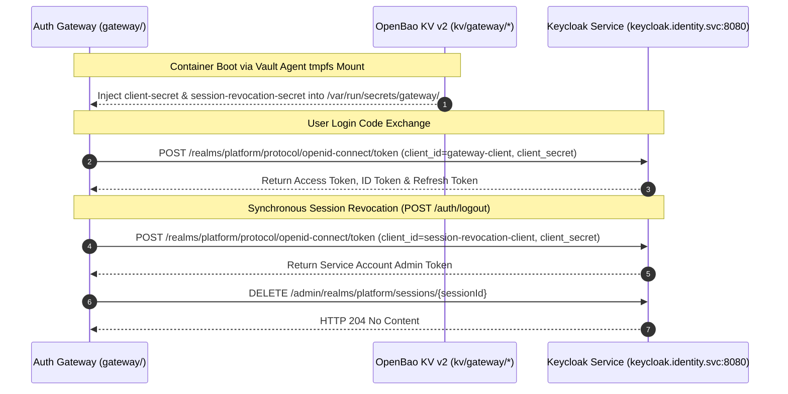

# Contract: Gateway Cryptographic Operations & Transit Integration

**Feature**: `002-internal-cluster-vault`  
**Consumer**: Platform Authentication Gateway (Go service: `gateway/`)  
**Engines**: OpenBao KV v2 (`kv/gateway/`) & OpenBao Transit Secrets Engine (`transit/`)  

---

## 1. Overview & Purpose

The Platform Authentication Gateway performs security-sensitive operations requiring credentials and cryptographic material:
1. **Gateway Client Authentication** (`GATEWAY_CLIENT_SECRET`): Authenticates the Gateway to Keycloak during OIDC authorization code exchange.
2. **Session Revocation Client** (`SESSION_REVOCATION_CLIENT_SECRET`): Authenticates the Gateway to Keycloak Admin API for synchronous session deletion.
3. **Gateway HMAC Operations** (`GATEWAY_HMAC_SECRET`): Signs and verifies session cookies, OIDC state parameters with PKCE bindings, and deterministic CSRF tokens.
4. **OpenBao Transit Integration**: Optional zero-export signing engine (`/v1/transit/sign` or `/v1/transit/hmac`).

---

## 2. Gateway Client & Session Revocation Authentication Contract



* **Storage Paths**:
  * `kv/data/gateway/client-secret`: Stores `GATEWAY_CLIENT_SECRET`.
  * `kv/data/gateway/session-revocation-secret`: Stores `SESSION_REVOCATION_CLIENT_SECRET`.
* **Delivery Mechanism**: Ephemeral memory-only `tmpfs` volume (`/var/run/secrets/gateway/`) populated by Vault Agent. Zero plaintext Kubernetes Secrets.
* **Security Invariant**: Gateway client credentials and session revocation credentials MUST NOT be logged, returned in HTTP error responses, or exposed to project pods.

---

## 3. Gateway HMAC Operations Contract ([FR-021](file:///Users/hyungjuyu/Projects/Brain/nacfson_pipeline/specs/002-internal-cluster-vault/spec.md#L146))

The Gateway performs three distinct cryptographic operations using `GATEWAY_HMAC_SECRET`:

### 3.1 Session Cookie Signing & Verification (`PLATFORM_SESSION`)
* **Operation**: Authenticated session persistence.
* **Algorithm**: HMAC-SHA256.
* **Payload**: `SessionCookieData{sid, sub, iss, tokens, rt, iat}`.
* **Format**: `<base64url(payload)>.<base64url(signature)>`.
* **Verification Contract**:
  * Gateway splits cookie at `.`.
  * Computes expected HMAC over payload using active secret.
  * Validates signature using constant-time comparison `hmac.Equal(sig, expected)`.
  * On failure: rejects request and redirects to login (fail closed).

### 3.2 OIDC State Parameter & PKCE Verifier Binding
* **Operation**: Tamper-proof login initiation.
* **Algorithm**: HMAC-SHA256.
* **Payload**: `StatePayload{target_url, nonce, ts, vd}` where `vd = base64url(sha256(code_verifier))`.
* **Format**: `<base64url(payload)>.<base64url(signature)>`.
* **Verification Contract**:
  * On `/oauth/callback`, Gateway asserts HMAC signature validity.
  * Asserts `time.Now().Unix() - ts <= 300` (5-minute maximum lifetime).
  * Computes `sha256(OIDC_AUTH_STATE cookie)` and asserts exact match with `state.vd`.
  * On mismatch or expiration: returns HTTP `400 Bad Request` with reason `"invalid state or expired"`.

### 3.3 Session-Bound CSRF Token Generation & Validation
* **Operation**: User logout protection (`POST /auth/logout`).
* **Algorithm**: HMAC-SHA256.
* **Generation Contract**:
  * `CSRFToken = hex(HMAC-SHA256("csrf:" + sessionID))`.
* **Validation Contract**:
  * Gateway verifies `X-CSRF-Token` header matches `GenerateCSRFToken(sessionID)` via `hmac.Equal`.
  * Alternatively validates `Origin` or `Referer` matches authorized platform domain.
  * On failure: returns HTTP `403 Forbidden` (`{"error": "invalid_csrf_token"}`).

---

## 4. Transit Secrets Engine Integration (Zero-Export Signing Option)

Where out-of-process asymmetric signing is configured, the Gateway invokes OpenBao Transit:

### 4.1 Sign Operation Contract (Gateway ➔ OpenBao)
* **Method**: `POST /v1/transit/sign/gateway-session-key`
* **Headers**:
  * `X-Vault-Token: {gateway_service_token}`
  * `Content-Type: application/json`
* **Request Payload**:
  ```json
  {
    "input": "{base64_encoded_session_claims}",
    "signature_algorithm": "ed25519"
  }
  ```
* **Response**:
  ```json
  {
    "data": {
      "signature": "vault:v1:MEQCID...base64..."
    }
  }
  ```

### 4.2 Verify Operation Contract
* **Method**: `POST /v1/transit/verify/gateway-session-key`
* **Request Payload**:
  ```json
  {
    "input": "{base64_encoded_session_claims}",
    "signature": "vault:v1:MEQCID...base64..."
  }
  ```
* **Response**:
  ```json
  {
    "data": {
      "valid": true
    }
  }
  ```

---

## 5. Dual-Key Rotation Invariant

To ensure zero user downtime during HMAC secret rotation:
1. Gateway configuration accepts `GATEWAY_HMAC_SECRET` (active) and `GATEWAY_HMAC_SECRET_PREVIOUS` (grace-period).
2. New cookies and state payloads are signed with `GATEWAY_HMAC_SECRET`.
3. Verification checks `GATEWAY_HMAC_SECRET` first; if invalid, falls back to `GATEWAY_HMAC_SECRET_PREVIOUS`.
4. After session expiry window (8 hours), `GATEWAY_HMAC_SECRET_PREVIOUS` is purged.
