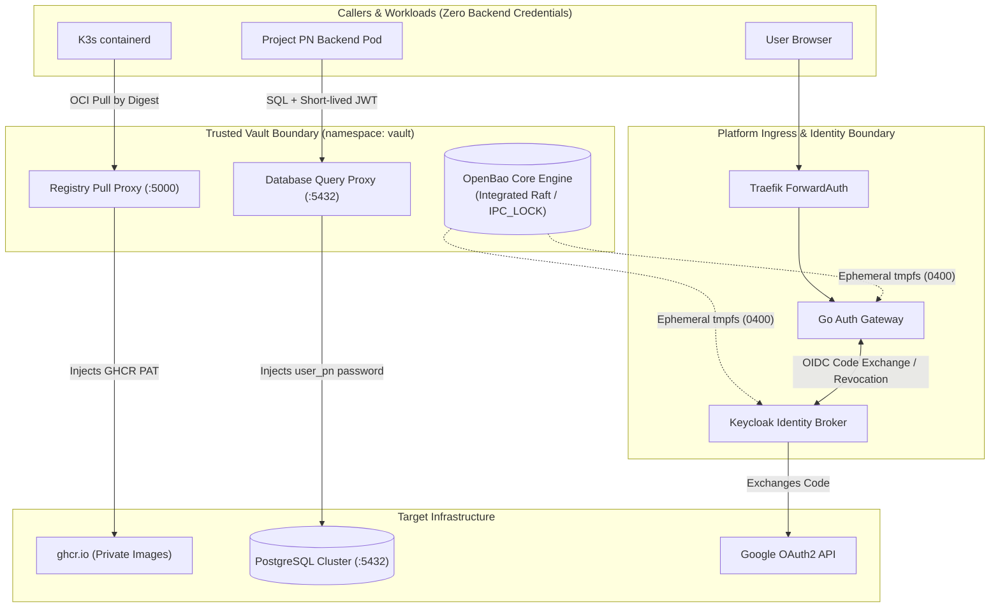

# Implementation Plan: Internal Cluster Vault

**Branch**: `main` | **Date**: 2026-10-03 | **Spec**: [specs/002-internal-cluster-vault/spec.md](file:///Users/hyungjuyu/Projects/Brain/nacfson_pipeline/specs/002-internal-cluster-vault/spec.md)  
**Governance Baseline**: Constitution v1.3.0 (Ratified with Centralized Vault Operation Model)

---

## Summary

Build an internal, self-hosted cluster Vault system using **OpenBao** (Linux Foundation Apache 2.0 open-source engine) with Integrated Raft storage, accompanied by dedicated in-cluster operation proxies (**Registry Pull Proxy** and **Database Query Proxy**), ephemeral in-memory `tmpfs` secret injection, and least-privilege operational task bindings. 

Workloads, K3s nodes, and persistent filesystems never receive or store plaintext backend credentials. Instead, callers present short-lived identity tokens or interact through trusted platform intermediaries, achieving 100% migration of all 11 platform and workload secrets mandated by **Constitution Principle V** ([`.specify/memory/constitution.md`](file:///Users/hyungjuyu/Projects/Brain/nacfson_pipeline/.specify/memory/constitution.md#L30-L32)).

---

## Technical Architecture & The 3 Confinement Patterns



1. **Pattern 1: Wire-Protocol Operation Proxies (Zero-Secret Pod Delivery)**:
   - **Registry Pull Proxy (`:5000`)**: Intercepts K3s `containerd` OCI requests via loopback mirror; injects `ghcr-pull-token`; streams manifests and blobs by immutable SHA-256 digest; strips all upstream authorization headers ([contracts/registry-proxy.md](contracts/registry-proxy.md)).
   - **Database Query Proxy (`:5432`)**: Intercepts PostgreSQL v3 wire-protocol traffic from application workloads; authenticates caller JWT; binds caller to restricted project role (`user_pn`); injects internal database credentials; terminates pool or denies queries immediately upon grant revocation ([contracts/database-proxy.md](contracts/database-proxy.md)).
2. **Pattern 2: Ephemeral In-Memory `tmpfs` Injection (High-Throughput Services)**:
   - **Go Auth Gateway**: Ingests secrets into an ephemeral, memory-only `tmpfs` volume (`0400`, non-root) populated by Vault Agent at boot—eliminating Traefik ForwardAuth network roundtrip latency while preventing persistence on disk or in Kubernetes Secrets.
     - `GATEWAY_HMAC_SECRET`: Executes 3 distinct cryptographic operations—(1) Session cookie (`PLATFORM_SESSION`) integrity signing/verification, (2) OIDC state parameter & PKCE verifier binding, (3) Session-bound CSRF token validation (`csrf:{sid}`) on `POST /auth/logout`. Supports dual-key rotation (`HMAC_SECRET` + `HMAC_SECRET_PREVIOUS`) ([contracts/transit-signing.md](contracts/transit-signing.md)).
     - `GATEWAY_CLIENT_SECRET` & `SESSION_REVOCATION_CLIENT_SECRET`: Authenticates Gateway to Keycloak for OIDC code exchange and synchronous Admin API session termination.
   - **Keycloak Identity Broker**: Mounts `GOOGLE_CLIENT_SECRET` into ephemeral `tmpfs` for outbound Google OAuth brokering; egress restricted via NetworkPolicy to `oauth2.googleapis.com:443` ([contracts/google-oauth-broker.md](contracts/google-oauth-broker.md)).
3. **Pattern 3: Least-Privilege Operational Task Bindings**:
   - **Database Provisioning (`postgres-init-job`)**: Idempotent superuser job running in platform boundary; reads admin credentials directly from Vault KV to configure roles, databases, and cross-database isolation ([contracts/database-provisioning-backup.md](contracts/database-provisioning-backup.md)).
   - **Database Daily Backup (`postgres-daily-backup`)**: Migrated from superuser to a dedicated read-only role (`backup_role` with `pg_read_all_data`); fetches credential from Vault KV; streams compressed dump to PVC at 00:00 UTC.

---

## The 11 Mandatory Managed Credentials & Migration Targets

| # | Credential Name | Storage Path | Consumer | Confinement Pattern | Legacy Object Decommissioned |
|---|---|---|---|---|---|
| 1 | `ghcr-pull-token` | `kv/platform/ghcr-pull-token` | K3s containerd | Registry Pull Proxy | `ghcr-creds` / `imagePullSecrets` |
| 2 | `gateway-client-secret` | `kv/gateway/client-secret` | Go Auth Gateway | Ephemeral `tmpfs` Mount | `gateway-credentials` |
| 3 | `session-revocation-client-secret` | `kv/gateway/session-revocation-secret` | Go Auth Gateway | Ephemeral `tmpfs` Mount | `gateway-credentials` |
| 4 | `gateway-hmac-secret` | `kv/gateway/hmac-secret` | Go Auth Gateway | Ephemeral `tmpfs` (Dual-Key) | `gateway-credentials` |
| 5 | `keycloak-admin-credentials` | `kv/platform/keycloak-admin` | Keycloak StatefulSet | Bootstrap Job / tmpfs | `keycloak-admin-credentials` |
| 6 | `postgres-admin-provisioning` | `kv/database/postgres-admin` | `postgres-init-job` | Operational Task Binding | `postgres-credentials` |
| 7 | `postgres-keycloak-db-password` | `kv/database/keycloak-user` | Keycloak StatefulSet | DB Proxy OR tmpfs | `postgres-credentials` |
| 8 | `postgres-pn-db-password` | `kv/database/pn-user` | Project PN Backend | Database Query Proxy | `pn-database-credentials` |
| 9 | `postgres-backup-credential` | `kv/database/backup-user` | `postgres-daily-backup` | Dedicated `backup_role` | `postgres-credentials` |
| 10 | `google-oauth-broker-secret` | `kv/identity/google-oauth` | Keycloak Broker | Keycloak Vault / tmpfs | `keycloak-secrets` |
| 11 | `project-pn-client-secret` | `kv/projects/pn/client-secret` | Keycloak / Backend | OpenBao KV v2 | Legacy PN Secret |

---

## Technical Context

* **Engine & Language**:
  * Core Vault Engine: **OpenBao v2.0+** (containerized Linux ARM64 binary).
  * Helper Proxies (Registry & DB): **Go 1.22+** compiled statically with zero CGO dependencies.
* **Primary Dependencies**:
  * OpenBao (Integrated Raft storage, KV v2 engine, Transit secrets engine).
  * Go standard library `net/http`, `crypto`, and PostgreSQL wire protocol handler.
* **Storage**:
  * K3s Local PersistentVolume (`/var/lib/openbao/data`) via standard `StatefulSet`.
* **Target Platform**:
  * Ubuntu 24.04 LTS ARM64 (Oracle Cloud Always Free VPS running native K3s) + local Linux K3s.
* **Resource Budget & Limits**:
  * OpenBao: Request 50m CPU / 64MiB RAM; Limit 200m CPU / 128MiB RAM.
  * Registry Proxy: Request 25m CPU / 32MiB RAM; Limit 100m CPU / 64MiB RAM.
  * Total platform memory envelope: < 200 MiB RAM (fits strictly within VPS resource slices, satisfying Constitution IV).
* **Security & Isolation Constraints**:
  * Restricted Pod Security Profile: Run as non-root (UID 10001), drop all capabilities (`drop: [ALL]`), read-only root filesystem where feasible, automatic service-account token mounting disabled (`automountServiceAccountToken: false`).
  * Private ClusterIP only: No public Ingress exposure for Vault management or internal proxy ports.

---

## Constitution Check (Post-Reconciliation v1.3.0)

| Principle | Compliance Analysis | Status |
|---|---|---|
| **I. Declarative GitOps** | All Vault StatefulSets, ConfigMaps, and proxy manifests reside in `deploy/platform/vault/`. Image references use immutable SHA256 digests. | **PASS** |
| **II. Strict Workload Isolation** | Deployed under dedicated `vault` namespace enforcing Restricted Pod Security profile. No service-account tokens mounted; zero Kubernetes API access granted to pods. | **PASS** |
| **III. Defense-in-Depth Identity** | Public ingress exposes zero Vault endpoints. Management access requires private operator cluster access. Gateway session signing uses Vault Transit without exporting keys. | **PASS** |
| **IV. Bounded Resource Budgeting** | Explicit CPU and memory requests and limits defined for all containers (< 200 MiB aggregate). Preserves the interim memory freeze. | **PASS** |
| **V. Zero Plaintext Secrets (Vault Model)** | Mandate satisfied: All secrets stored immutably in OpenBao. No raw secrets delivered to pods or nodes via Kubernetes Secrets, environment variables, or files. Workloads execute operations via proxies. | **PASS** |
| **VI. Environmental Portability** | Runs identically across local K3s, VPS K3s, and cloud Kubernetes using standard StatefulSets and Local PVs. | **PASS** |

### Explicit Architectural Exception: Prototype Co-located Host (Single-VPS Profile)

* **Exception Identifier**: `EXC-001-SINGLE-VPS-COLOCATION`
* **Status**: Active (Prototype Phase Only)
* **Context & Conflict**: Spec 002 ([Line 182](file:///Users/hyungjuyu/Projects/Brain/nacfson_pipeline/specs/002-internal-cluster-vault/spec.md#L182)) mandates that credential-handling execution components must not be placed on application nodes. In the current single Oracle Cloud VPS prototype target, there is only one node; platform services and application workloads physically share the same host machine and Linux kernel.
* **Accepted Interim Trust Boundary**: For this prototype, the trust boundary is enforced using strict Linux OS and Kubernetes container defense-in-depth:
  1. **Restricted Pod Security Profile**: All application containers enforce non-root UID (`runAsNonRoot: true`), drop all capabilities (`drop: [ALL]`), and prohibit privilege escalation (`allowPrivilegeEscalation: false`).
  2. **Seccomp Protection**: Linux seccomp default profile is active, restricting dangerous syscalls (e.g. `bpf`, `ptrace`, `kexec`).
  3. **Cluster Network Isolation**: Calico/K3s NetworkPolicies block direct network access between application pods and the Vault's internal administrative and storage listeners.
  4. **Memory Locking**: OpenBao runs with `IPC_LOCK` (`mlock`) to ensure secret material in process memory is never paged out to host swap.
* **Sunset & Expansion Condition**: This exception applies strictly to the initial single-VPS prototype. When the platform expands to multiple nodes or cloud-managed clusters (EKS/GKE), this exception expires, and physical node isolation (dedicated platform node pool, node taints `node-role.kubernetes.io/infra:NoSchedule`, and NodeAffinity) MUST be enforced per Spec 002.

---

## Project Structure

### Documentation & Specifications (This Feature)
```text
specs/002-internal-cluster-vault/
├── spec.md                         # Requirements & acceptance criteria
├── plan.md                         # Implementation architecture plan (this file)
├── research.md                     # Product selection, complete 11-credential inventory & matrix
├── data-model.md                   # Entity schemas (Versions, Grants, Bindings)
├── quickstart.md                   # Operator bootstrap & drill instructions
├── checklists/
│   └── requirements.md             # Specification quality checklist
└── contracts/
    ├── registry-proxy.md           # OCI image pull contract (containerd ➔ Proxy ➔ GHCR)
    ├── database-proxy.md           # SQL execution contract (Pod ➔ DB Proxy ➔ Postgres)
    ├── transit-signing.md          # Gateway crypto & transit contract (Gateway ➔ HMAC / Transit)
    ├── google-oauth-broker.md      # Google OAuth broker contract (Keycloak ➔ Google OAuth)
    └── database-provisioning-backup.md # DB provisioning & backup contract (init-job & backup-cronjob)
```

### Source Code & Manifest Layout (Repository Root)
```text
deploy/platform/vault/
├── kustomization.yaml              # Vault platform overlay
├── openbao-statefulset.yaml        # OpenBao core engine (Raft storage)
├── openbao-config.yaml             # Raft and listener configuration
├── registry-proxy-deploy.yaml      # Registry pull proxy deployment
├── db-proxy-deploy.yaml            # Database query proxy deployment
└── rbac-and-networkpolicy.yaml     # Restricted security policy & private ClusterIP

gateway/
└── internal/ (configured for zero-secret ephemeral tmpfs & dual-key HMAC rotation)

deploy/platform/identity/
└── keycloak-deployment.yaml        # Keycloak with Vault file provider / tmpfs secret injection

deploy/platform/database/
├── postgres-init-job.yaml          # Provisioning job integrating with Vault credentials
└── backup-cronjob.yaml             # Daily backup job using dedicated backup_role via Vault
```

---

## Implementation Phases & Deliverables

### Phase 0: Research & Inventory (Completed)
* Selected OpenBao with integrated Raft storage ([research.md](research.md)).
* Compiled complete 11-item Credential-Use Inventory across GHCR, Gateway (HMAC, client, revocation), Keycloak (bootstrap, DB, Google OAuth), and PostgreSQL (provisioning, backup, project user) ([research.md](research.md)).
* Formulated comprehensive Migration and Acceptance Matrix covering each credential use.

### Phase 1: Design & Contracts (Completed)
* Defined entities for Credential Versions, Caller Tokens, Grants, Bindings, and Recovery Sets ([data-model.md](data-model.md)).
* Established formal contracts across all credential use cases ([contracts/](contracts/)):
  1. Registry Pull Proxy ([contracts/registry-proxy.md](contracts/registry-proxy.md))
  2. Database Query Proxy ([contracts/database-proxy.md](contracts/database-proxy.md))
  3. Gateway Cryptographic Operations & Transit ([contracts/transit-signing.md](contracts/transit-signing.md))
  4. Google OAuth Identity Broker Integration ([contracts/google-oauth-broker.md](contracts/google-oauth-broker.md))
  5. Database Provisioning & Backup Operations ([contracts/database-provisioning-backup.md](contracts/database-provisioning-backup.md))
* Documented operator bootstrap, rotation, and disaster recovery drills ([quickstart.md](quickstart.md)).

### Phase 2: Implementation Tasks (Next Step via `/speckit-tasks`)
1. Create `deploy/platform/vault/` manifests for OpenBao with Raft storage.
2. Implement the Go Registry Pull Proxy for GHCR immutable digest streaming.
3. Configure the K3s containerd registry mirror for zero-secret private image pulls.
4. Implement the Database Proxy for project-scoped SQL query execution.
5. Implement Google OAuth Identity Broker deliverable: configure Keycloak Vault file provider / tmpfs secret ingestion and update realm configuration.
6. Implement Gateway Cryptographic Integration: configure ephemeral tmpfs secret loader with dual-key HMAC rotation (cookies, OIDC state, CSRF) and client credentials.
7. Migrate Database Provisioning (`postgres-init-job`) and Backup (`postgres-daily-backup`) to use Vault credentials and least-privilege `backup_role`.
8. Migrate Keycloak bootstrap admin credentials and decommission all legacy Kubernetes Secrets.
9. Execute and verify the Staged Rotation drill and Disaster Recovery drill.

