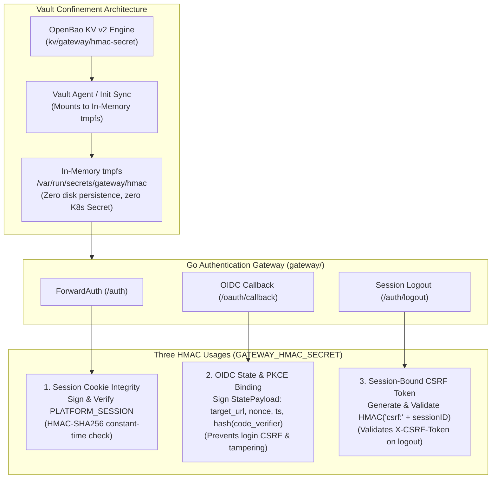

# Research & Technical Decisions: Internal Cluster Vault

**Feature**: `specs/002-internal-cluster-vault`  
**Date**: 2026-10-03  
**Status**: Completed Phase 0 Research

---

## 1. Vault Product Selection

### Context & Constraints
* **Spec Clarification**: Must be a self-hosted, established vault product under organizational ownership. Developing a custom cryptographic security engine is explicitly out of scope.
* **Constitution IV (Resource Limits)**: Single Oracle Cloud VPS running K3s (ARM64, 4 vCPU, 24GB RAM total, but platform reservations must remain small; memory envelope frozen).
* **Constitution V (Centralized Vault)**: Must store credentials immutably, support versioning, staging, rotation, and audit logs.

### Evaluation of Candidates

| Candidate | License | Resource Footprint | Storage Backend | Architecture Suitability | Decision |
|---|---|---|---|---|---|
| **OpenBao** (Linux Foundation) | Apache 2.0 | ~70–120 MiB RAM, < 0.1 vCPU idle | Integrated Raft (disk-backed) | Open-source fork of HashiCorp Vault. Native Transit engine, KV v2 engine (immutable versions), audit device, robust API. Zero vendor lock-in. | **SELECTED (Primary Engine)** |
| **HashiCorp Vault Community** | BSL 1.1 | ~80–130 MiB RAM | Integrated Raft | Established product, but restrictive BSL license creates long-term compliance friction. | Rejected in favor of OpenBao |
| **Custom Go Vault Engine** | N/A | Variable | Custom | Forbidden by Spec clarification ("custom engine is out of scope"). | Disqualified |

### Decision
Deploy **OpenBao** in single-server mode with **Integrated Raft Storage** persisted to a K3s Local PersistentVolume (`/var/lib/openbao/data`).

---

## 2. Operation Execution Architecture (Zero Secret Delivery)

Spec 002 mandates that callers **never receive credentials**. Callers invoke authorized operations through the Vault boundary:

```text
[ K3s Node / containerd ] ──(1. OCI Pull)──> [ Vault Registry Proxy ] ──(2. Bearer Auth)──> [ ghcr.io ]
[ Project PN Backend Pod ] ──(1. SQL Query)──> [ Vault Database Proxy ] ──(2. DB Conn)───> [ PostgreSQL ]
[ Go Authentication Gateway ] ──(1. Sign Claim)──> [ OpenBao Transit Engine ] ──(2. Ed25519)──> (Internal Key)
```

### A. Private GHCR Image Pulling Integration ([FR-018](file:///Users/hyungjuyu/Projects/Brain/nacfson_pipeline/specs/002-internal-cluster-vault/spec.md#L142))
1. **Containerd Integration**: K3s container runtime configuration (`/etc/rancher/k3s/registries.yaml`) configures a registry mirror for `ghcr.io/nacfson/*` pointing to `http://vault-registry-proxy.vault.svc:5000`.
2. **Registry Proxy Service**: A lightweight Go proxy operating inside the Vault's trusted namespace.
   * Intercepts `GET /v2/<repo>/manifests/<digest>` and `/blobs/<digest>`.
   * Retrieves the active `ghcr-pull-token` from OpenBao KV v2.
   * Injects `Authorization: Bearer <active_token>` upstream to `ghcr.io`.
   * Streams pure binary layer blobs back to containerd. Strips all upstream authentication headers.

### B. Project Database Access Integration ([FR-020](file:///Users/hyungjuyu/Projects/Brain/nacfson_pipeline/specs/002-internal-cluster-vault/spec.md#L145))
1. **Project-Scoped Query Model**: Application pods do not receive database passwords.
2. **Database Execution Service**: A connection-pooling SQL proxy deployed inside the trusted namespace.
   * Pod authenticates using its short-lived **Caller Identity Token**.
   * Proxy verifies caller identity and enforces mapping to the permitted project database role (e.g. `pn_app_user` on `pn_db`).
   * Proxy opens connections to PostgreSQL using the backend password held in OpenBao.
   * Projects submit queries and receive rows/resultsets. Raw database credentials never reach caller pods.

### C. Gateway Session Signing Integration ([FR-021](file:///Users/hyungjuyu/Projects/Brain/nacfson_pipeline/specs/002-internal-cluster-vault/spec.md#L146))
1. **Transit Engine**: Uses OpenBao's native **Transit Secrets Engine**.
2. **Key Confinement**: The private signing key (`gateway-session-signing-key`, Ed25519) is generated and stored exclusively inside OpenBao.
3. **Signing Operation**: When the Auth Gateway terminates or issues a platform session, it calls `POST /v1/transit/sign/gateway-session-key` with the session payload. OpenBao returns the signature. The private key is never exportable.

---

## 3. Caller Workload Identity Design (Zero Keycloak Dependency)

### Separation of Concerns: Human Identity vs. Workload Identity
* **Human User Identity (Keycloak)**: Dedicated solely to browser-facing user authentication (`auth.example.com`) and Google OAuth identity brokering. Keycloak has **zero** role in machine-to-machine internal pod authentication.
* **Workload Identity (Internal Pods)**: Handled directly within the cluster infrastructure without depending on Keycloak, preventing any bootstrap deadlock.

### Constraints
* **Constitution Principle II**: Project pods MUST NOT mount Kubernetes ServiceAccount tokens or access the Kubernetes API.
* **Spec FR-003**: Callers hold short-lived caller identity tokens with finite expiry, trusted issuer, intended service audience, and explicit scope.

### Workload Identity Mechanisms by Integration

1. **Registry Pull Proxy (Node Containment)**:
   * **Authentication**: Bound to host loopback (`127.0.0.1:5000`).
   * **Enforcement**: Under Kubernetes Restricted Pod Security, application pods are forbidden from using `hostNetwork: true`. Only the node's host `containerd` process can route requests to `127.0.0.1:5000`. No caller tokens are required on the node.
2. **Database Proxy (Project Pods)**:
   * **Namespace Isolation**: Kubernetes `NetworkPolicy` allows only pods from namespace `project-pn` to connect to `vault-db-proxy` port 5432.
   * **Workload Token**: Issued directly by the Vault or Node-Local Identity Agent via Unix Domain Socket using Linux kernel process verification (`SO_PEERCRED`), completely independent of Keycloak.
   * **Role Mapping**: The proxy maps verified connections directly to restricted database role `pn_app_user` on `pn_db`.
3. **Keycloak Database Connection (Platform Bootstrap Binding)**:
   * Keycloak connects to PostgreSQL via a dedicated **Platform Bootstrap Binding** using static credentials managed in OpenBao KV.
   * **Non-Circular Guarantee**: OpenBao and PostgreSQL boot first; Keycloak simply consumes the database connection at startup. Keycloak never issues tokens to itself.

---

## 4. Complete Credential-Use Inventory ([FR-016](file:///Users/hyungjuyu/Projects/Brain/nacfson_pipeline/specs/002-internal-cluster-vault/spec.md#L140), [FR-021](file:///Users/hyungjuyu/Projects/Brain/nacfson_pipeline/specs/002-internal-cluster-vault/spec.md#L146))

Every existing credential across the platform and application workloads is cataloged below without secret values:

| # | Credential Identifier | Owner | Consumer | Required Operations & Targets | Approved Integration Pattern | Migration / Cutover Action |
|---|---|---|---|---|---|---|
| 1 | `ghcr-pull-token` | Platform | K3s Node (`containerd`) | Fetch OCI container manifests and layer blobs for `ghcr.io/nacfson/*` by immutable SHA-256 digest | Vault Registry Proxy (`http://127.0.0.1:5000`) | Configure K3s containerd registry mirror; delete legacy `imagePullSecrets` and `ghcr-creds` Secret; revoke legacy GitHub PAT. |
| 2 | `gateway-client-secret` | Platform Identity | Go Auth Gateway | OAuth2 authorization code exchange (`POST /realms/platform/protocol/openid-connect/token` as `gateway-client`) | OpenBao KV v2 (`kv/gateway/client-secret`) via Vault Agent tmpfs mount | Mount secret into Gateway process memory via tmpfs; remove `GATEWAY_CLIENT_SECRET` from `gateway-credentials` K8s Secret; verify code exchange; delete legacy Secret. |
| 3 | `session-revocation-client-secret` | Platform Identity | Go Auth Gateway / Session Revoker | Authenticate as `session-revocation-client` via Client Credentials grant; call Keycloak Admin API `DELETE /admin/realms/platform/sessions/{id}` | OpenBao KV v2 (`kv/gateway/session-revocation-secret`) via Vault Agent tmpfs mount | Store secret in Vault; configure Gateway to read via tmpfs; verify synchronous session termination on `POST /auth/logout`; remove legacy Secret. |
| 4 | `gateway-hmac-secret` | Platform Identity | Go Auth Gateway | 1) Sign & verify session cookie (`PLATFORM_SESSION`)<br>2) Sign & verify OIDC `state` payload & PKCE verifier digest<br>3) Generate & validate session-bound CSRF token (`csrf:{sid}`) | OpenBao KV v2 (`kv/gateway/hmac-secret`) via Vault Agent tmpfs mount (with dual-key rotation: current & previous) | Store 32-byte secret in Vault; inject into memory-only tmpfs `/var/run/secrets/gateway/hmac`; update Gateway config loader; verify cookies, OIDC state, and CSRF logout; decommission `gateway-credentials`. |
| 5 | `keycloak-admin-credentials` | Platform | Keycloak StatefulSet | Bootstrap Keycloak master realm admin user (`KEYCLOAK_ADMIN`, `KEYCLOAK_ADMIN_PASSWORD`) on initial database creation | OpenBao KV v2 (`kv/platform/keycloak-admin`) via bootstrap init-job | Provision initial admin account via Vault; remove static `KEYCLOAK_ADMIN_*` env vars and `keycloak-admin-credentials` K8s Secret after initial realm setup; manage post-bootstrap admin via ephemeral tokens. |
| 6 | `postgres-admin-provisioning` | Platform Database | `postgres-init-job` & PostgreSQL StatefulSet | PostgreSQL superuser (`postgres`) authentication for database init, role creation (`keycloak_user`, `user_pn`), and database creation (`keycloak`, `proj_pn`) | OpenBao KV v2 (`kv/database/postgres-admin`) via authorized platform provisioning job | Store admin password in Vault; execute idempotent `postgres-init-job` fetching credentials directly from Vault; remove `POSTGRES_ADMIN_PASSWORD` from `postgres-credentials` Secret. |
| 7 | `postgres-keycloak-db-password` | Platform | Keycloak StatefulSet & `postgres-init-job` | PostgreSQL connection authentication for `keycloak_user` on `keycloak` database (schema migrations, user store) | Vault Database Proxy (Admin Binding) OR OpenBao KV v2 (`kv/database/keycloak-user`) via Vault Agent tmpfs | Store role password in Vault; provision role via init-job; inject into Keycloak via tmpfs or proxy; eliminate `KEYCLOAK_DB_PASSWORD` from `postgres-credentials` Secret. |
| 8 | `postgres-pn-db-password` | Project PN | PN Backend Pod | SQL CRUD queries and transaction execution on `proj_pn` database | Vault Database Proxy (`tcp://vault-db-proxy.vault.svc:5432`) | Route DB connections through Vault DB Proxy; pass short-lived caller identity token; proxy binds restricted role `user_pn`; remove `pn-database-credentials` Secret; rotate DB user password in PostgreSQL. |
| 9 | `postgres-backup-credential` | Platform Database | `postgres-daily-backup` CronJob | Nightly logical database backup execution via `pg_dumpall` at 00:00 UTC | OpenBao KV v2 (`kv/database/backup-user`) with restricted `backup_role` (least privilege: `pg_read_all_data`) | Provision dedicated read-only backup role in PostgreSQL; store credential in Vault; update CronJob to fetch credential via Vault Agent / workload token; eliminate `POSTGRES_PASSWORD` from Secret. |
| 10 | `google-oauth-broker-secret` | Platform Identity | Keycloak Identity Provider | Outbound HTTPS authorization code exchange with `oauth2.googleapis.com/token` during user Google SSO | OpenBao KV v2 (`kv/identity/google-oauth`) delivered via Keycloak Vault file provider / tmpfs mount | Seed Google OAuth credentials in Vault; configure Keycloak realm template or Vault SPI to read from protected tmpfs; verify Google authentication flow; decommission legacy Secret. |
| 11 | `project-pn-client-secret` | Project PN | Keycloak Realm & PN Backend | Project client authentication and audience-restricted token verification | OpenBao KV v2 (`kv/projects/pn/client-secret`) | Ingest into Vault; inject into PN backend via Vault Agent tmpfs if needed; decommission legacy Secret. |

---

### 4.1 Gateway Cryptographic Operations: HMAC Architecture

The Go Authentication Gateway relies on cryptographic secrets for three distinct functions:



1. **Session Cookie Signing & Verification**:
   - `encodeSessionCookie(sess SessionCookieData)` marshals session claims and computes `HMAC-SHA256(data)`.
   - `decodeSessionCookie(raw)` decodes claims and asserts signature validity using constant-time `hmac.Equal`.
2. **OIDC State Parameter & PKCE Verifier Binding**:
   - `initiateLogin()` constructs `StatePayload{target_url, nonce, timestamp, verifier_digest}` where `verifier_digest = Base64(SHA256(code_verifier))`.
   - The payload is signed with HMAC-SHA256 and passed to Keycloak as the `state` parameter.
   - On `/oauth/callback`, `HandleCallback()` validates the HMAC signature, asserts `now - timestamp <= 300` seconds, and verifies that `SHA256(OIDC_AUTH_STATE cookie) == state.verifier_digest`, strictly preventing cross-site login CSRF and authorization code interception.
3. **Session-Bound CSRF Protection**:
   - `GenerateCSRFToken(sessionID)` derives a deterministic HMAC token `HMAC-SHA256("csrf:" + sessionID)`.
   - `ValidateCSRF(r, sessionID)` asserts that inbound `X-CSRF-Token` matches the derived token or verifies authorized project origin before permitting session deletion on `POST /auth/logout`.

**Integration Mechanism Decision (KV + Ephemeral tmpfs vs Transit API)**:
- *ForwardAuth Latency Invariant*: Traefik calls `/auth` on **every single inbound HTTP request** across all projects. An out-of-process HTTP roundtrip to OpenBao Transit for every ForwardAuth check would add 1–3 ms latency and create a severe throughput bottleneck on the single VPS prototype.
- *Decision*: Store `gateway-hmac-secret` in OpenBao KV v2. Inject the secret into Gateway process memory via an ephemeral, memory-only `tmpfs` volume (`/var/run/secrets/gateway/hmac`) populated by Vault Agent. The secret is never written to disk, never stored in a Kubernetes Secret object, and survives container restarts safely.
- *Dual-Key Rotation Support*: Gateway configuration supports `HMAC_SECRET` (active) and `HMAC_SECRET_PREVIOUS` (grace-period) so in-flight user sessions and temporary login states remain valid during key rotation windows.

---

### 4.2 Migration and Acceptance Matrix ([FR-016](file:///Users/hyungjuyu/Projects/Brain/nacfson_pipeline/specs/002-internal-cluster-vault/spec.md#L140), [FR-021](file:///Users/hyungjuyu/Projects/Brain/nacfson_pipeline/specs/002-internal-cluster-vault/spec.md#L146))

| Credential Name | Existing Location | Target Vault Path | Confinement Mechanism | Functional Acceptance Criteria | Security & Denial Acceptance Criteria | Rotation & Revocation Drill |
|---|---|---|---|---|---|---|
| `ghcr-pull-token` | `deploy/projects/pn/backend-deployment.yaml` (`ghcr-creds`), `secrets.env.example:24` | `kv/platform/ghcr-pull-token` | Vault Registry Proxy (`http://127.0.0.1:5000`) | K3s node pulls private images by immutable digest without local credentials ([SC-005](file:///Users/hyungjuyu/Projects/Brain/nacfson_pipeline/specs/002-internal-cluster-vault/spec.md#L171)) | Node requests containing `Authorization` headers or invalid digests are rejected; zero tokens in `crictl` | Staged v2 token probed upstream via HEAD request; promoted on success; old PAT revoked at GitHub ([SC-004](file:///Users/hyungjuyu/Projects/Brain/nacfson_pipeline/specs/002-internal-cluster-vault/spec.md#L170)) |
| `gateway-client-secret` | `deploy/platform/identity/gateway-deployment.yaml:49`, `secrets.env.example:18` | `kv/gateway/client-secret` | Vault Agent ephemeral tmpfs mount | Gateway successfully exchanges OIDC auth code with Keycloak for tokens | Failed token exchange returns HTTP 502 without exposing secret; zero secrets in env vars | Rotate secret in Keycloak; stage in Vault; verify login flow; revoke previous secret |
| `session-revocation-client-secret` | `secrets.env.example:17`, `gateway/internal/keycloak/session.go:26` | `kv/gateway/session-revocation-secret` | Vault Agent ephemeral tmpfs mount | Calling `POST /auth/logout` revokes session in Keycloak Admin API; next request to `/auth` returns 401 | Unauthenticated or invalid CSRF requests reject without calling Keycloak; zero secrets in env vars | Rotate in Keycloak and Vault; test user logout; verify next-operation denial |
| `gateway-hmac-secret` | `deploy/platform/identity/gateway-deployment.yaml:54`, `secrets.env.example:21` | `kv/gateway/hmac-secret` | Vault Agent ephemeral tmpfs mount (dual-key support) | 1) Session cookie signed/verified<br>2) OIDC state & PKCE verified<br>3) Logout CSRF token verified | Tampered cookies or state signatures fail closed (HTTP 401 / 400); zero secrets in env vars | Rotate HMAC secret; verify dual-key verification permits existing sessions while signing new with v2 |
| `keycloak-admin-credentials` | `deploy/platform/identity/keycloak-deployment.yaml:41-50`, `secrets.env.example:15-16` | `kv/platform/keycloak-admin` | Ephemeral bootstrap job / tmpfs mount | Keycloak initializes master admin account on first boot | Env vars removed from Deployment post-bootstrap; master password inaccessible to workloads | Rotate admin password via Keycloak API; update Vault; verify login with new password |
| `postgres-admin-provisioning` | `deploy/platform/database/postgres-init-job.yaml:29`, `secrets.env.example:10` | `kv/database/postgres-admin` | Platform Provisioning Job via Vault KV | Idempotent DB role & database creation for Keycloak and Project PN | DB superuser access strictly restricted to platform provisioning job; workloads denied superuser access | Rotate `POSTGRES_ADMIN_PASSWORD` in Postgres and Vault; verify init-job re-execution succeeds |
| `postgres-keycloak-db-password` | `deploy/platform/identity/keycloak-deployment.yaml:37`, `secrets.env.example:11` | `kv/database/keycloak-user` | Vault DB Proxy OR Vault Agent tmpfs | Keycloak connects to `keycloak` database; executes migrations and session persistence | Keycloak user cannot access `proj_pn` database; direct superuser commands rejected | Rotate password in DB and Vault; restart Keycloak; verify connection restoration |
| `postgres-pn-db-password` | `deploy/projects/pn/backend-deployment.yaml:40`, `secrets.env.example:12` | `kv/database/pn-user` | Vault Database Proxy (`tcp://vault-db-proxy.vault.svc:5432`) | PN backend executes SQL CRUD and transactions via short-lived caller identity token | Access to `keycloak` DB or administrative SQL (`DROP DATABASE`) rejected with SQLSTATE 28000 | Rotate internal password in PostgreSQL and Vault; verify proxy re-establishes pool without pod restarts |
| `postgres-backup-credential` | `deploy/platform/database/backup-cronjob.yaml:59`, `secrets.env.example:10` | `kv/database/backup-user` | Dedicated `backup_role` via Vault Agent / workload token | Daily `pg_dumpall` produces valid gzip archive in PVC without superuser privileges | Backup role granted read-only data access (`pg_read_all_data`); denied write/DDL privileges | Rotate backup role password; verify subsequent nightly CronJob completes successfully |
| `google-oauth-broker-secret` | `deploy/platform/identity/keycloak-realm-config.yaml:33-38`, `secrets.env.example:6-7` | `kv/identity/google-oauth` | Keycloak Vault file provider / tmpfs mount | Users authenticate via Google SSO; Keycloak exchanges code for Google identity claims | Egress restricted to `oauth2.googleapis.com:443`; zero Google secrets in K8s Secret objects | Generate new client secret in Google Console; stage in Vault; verify login flow; revoke old secret |
| `project-pn-client-secret` | `deploy/platform/secrets.env.example:18`, `keycloak-realm-config.yaml:81-88` | `kv/projects/pn/client-secret` | OpenBao KV v2 | PN Backend validates project tokens or introspects service accounts | Workloads in peer namespaces cannot read `project-pn` client secret; fail closed on mismatch | Rotate secret in Keycloak and Vault; verify backend continues authenticating |

---

## 5. Non-Circular Bootstrap & Disaster Recovery ([FR-015](file:///Users/hyungjuyu/Projects/Brain/nacfson_pipeline/specs/002-internal-cluster-vault/spec.md#L139))

### The Bootstrap Dependency Problem
If K3s needs the Vault to pull private images, how does K3s pull the Vault image?

### Solution
1. **Public/Pinned Base Images**: OpenBao and its helper proxies use public, verified base images (or are pre-loaded into containerd's local image store during VM bootstrap by [Spec 003 minimal-vm-bootstrap](file:///Users/hyungjuyu/Projects/Brain/nacfson_pipeline/specs/003-minimal-vm-bootstrap/spec.md)).
2. **Initial Initialization**:
   * Operator initializes OpenBao: `bao operator init -key-shares=1 -key-threshold=1`.
   * Unseal key and Root Token are generated and displayed **only to the operator**.
   * Root token is used to configure initial policies and is revoked immediately after initialization ([FR-015](file:///Users/hyungjuyu/Projects/Brain/nacfson_pipeline/specs/002-internal-cluster-vault/spec.md#L139)).
3. **Disaster Recovery Set**:
   * Automated snapshot job: `bao operator raft snapshot save /backups/vault-$(date +%F).snap`.
   * Encrypted and pushed to Oracle Cloud Object Storage daily at 00:00 UTC.
   * Recovery key stored separately in operator password manager.

---

## 6. Architectural Exception: Prototype Co-located Placement

* **Exception Identifier**: `EXC-001-SINGLE-VPS-COLOCATION`
* **Analysis**: Spec 002 Line 182 defines application nodes as untrusted and outside the trusted execution boundary. On the single Oracle Cloud Always Free VPS prototype, platform infrastructure and application workloads physically share one Linux host and kernel.
* **Interim Isolation Guarantees**: For this prototype, the security boundary relies on OS-level container isolation primitives:
  * Kubernetes Restricted Pod Security Standards (`runAsNonRoot: true`, drop `ALL` capabilities, `allowPrivilegeEscalation: false`).
  * Seccomp default profile blocking high-risk syscalls (`bpf`, `ptrace`, `kexec`).
  * Dedicated `vault` namespace with explicit Calico/K3s NetworkPolicies blocking ungranted ingress.
  * Memory locking (`IPC_LOCK`) for OpenBao to prevent key swapping to disk.
* **Expansion Rule**: When the platform scales to multi-node clusters or production managed Kubernetes (EKS/GKE), this prototype exception expires. Dedicated node pools tainted with `node-role.kubernetes.io/infra:NoSchedule` will physically segregate the Vault from application nodes.
