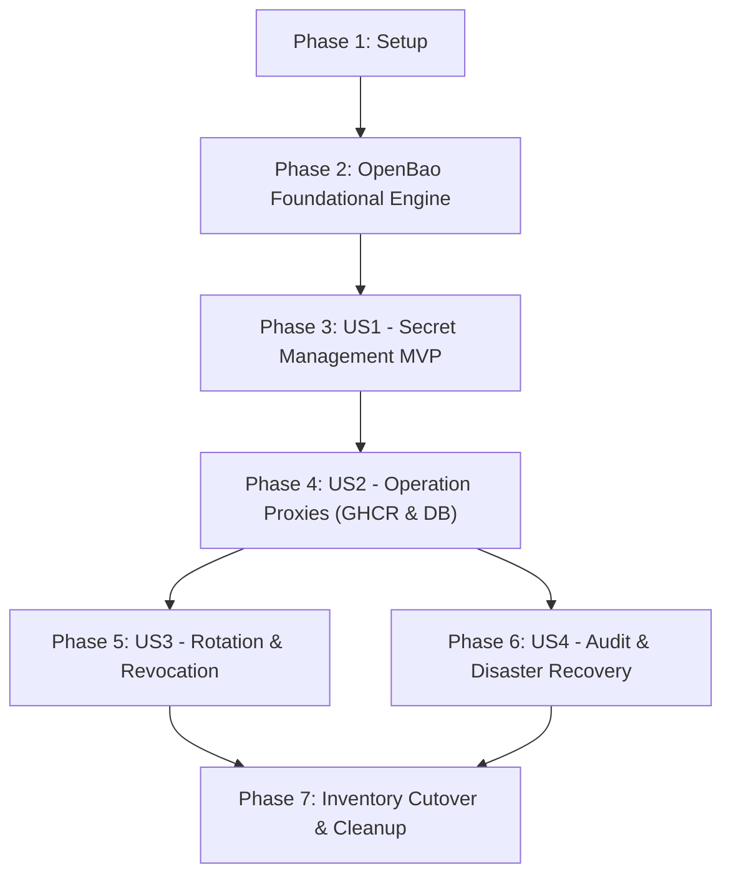

# Tasks: Internal Cluster Vault

**Input**: Design documents in `specs/002-internal-cluster-vault/` (`spec.md`, `plan.md`, `research.md`, `data-model.md`, `contracts/`, `quickstart.md`).  
**Prerequisites**: Constitution v1.3.0 (Ratified Centralized Vault Model). Active prototype exception `EXC-001-SINGLE-VPS-COLOCATION`.

---

## Phase 1: Setup (Shared Infrastructure & Repositories)

**Purpose**: Project layout, manifests, and helper service scaffolding.

- [X] T001 [P] Create `deploy/platform/vault/` directory with `kustomization.yaml`, namespace definition (`namespace: vault`), and Restricted Pod Security standard labels (`pod-security.kubernetes.io/enforce: restricted`).
- [X] T002 [P] Create `deploy/platform/vault/network-policy.yaml` enforcing private ClusterIP isolation; deny all cross-namespace ingress except explicit proxy ports.
- [X] T003 Initialize Go module for Vault operation helper proxies in `services/vault-proxies/` with dependencies for PostgreSQL wire protocol and HTTP streaming.

---

## Phase 2: Foundational (OpenBao Core Engine & Storage)

**Purpose**: Deploy and stabilize the primary cryptographic vault engine before user story integrations.

**⚠️ CRITICAL**: Must be healthy before any secret management or operation execution can begin.

- [X] T004 [P] Create OpenBao configuration ConfigMap in `deploy/platform/vault/openbao-config.yaml` specifying Integrated Raft storage at `/var/lib/openbao/data`, private TCP listener (`:8200`), and `disable_mlock = false`.
- [X] T005 Create OpenBao `StatefulSet` manifest in `deploy/platform/vault/openbao-statefulset.yaml` with PersistentVolumeClaim (10Gi local-path), security context (`runAsNonRoot: true`, `runAsUser: 10001`, `drop: [ALL]`, `add: [IPC_LOCK]`), and explicit resource boundaries (Limit: 200m CPU / 128MiB RAM).
- [X] T006 [P] Create headless Service and ClusterIP Service in `deploy/platform/vault/openbao-service.yaml` exposing port 8200 internally without public Ingress.

**Checkpoint**: OpenBao pod starts and listens on `:8200`.

---

## Phase 3: User Story 1 — Manage Secrets Privately (Priority: P1) 🎯 MVP

**Goal**: Operator can initialize Vault, register named credentials, manage immutable versions, and enforce strict project isolation without exposing secrets.

**Independent Test**: Operator registers a synthetic credential via OpenBao API, updates value to `v2`, confirms immutable version history, and verifies that project-scoped tokens cannot access peer credentials ([SC-001](file:///Users/hyungjuyu/Projects/Brain/nacfson_pipeline/specs/002-internal-cluster-vault/spec.md#L167)).

- [X] T007 [US1] Create automated initialization and unseal script in `scripts/vault-init.sh` using single-share Raft parameters; print unseal key and root token to operator, then securely unseal.
- [X] T008 [US1] Enable OpenBao KV v2 engine (`kv/`) for immutable versioned credential storage and Transit engine (`transit/`) for cryptographic signing.
- [X] T009 [P] [US1] Create OpenBao RBAC policy definitions in `deploy/platform/vault/policies/`:
  - `operator-admin.hcl` (full management access)
  - `registry-proxy.hcl` (read-only access to `kv/data/ghcr-pull-token`)
  - `db-proxy.hcl` (read-only access to project DB credentials)
  - `gateway-transit.hcl` (sign/verify only on `transit/keys/gateway-session-key`)
- [X] T010 [US1] Revoke the initial root token after policy setup and verify management access requires authenticated operator AppRole or client tokens ([FR-015](file:///Users/hyungjuyu/Projects/Brain/nacfson_pipeline/specs/002-internal-cluster-vault/spec.md#L139)).
- [X] T011 [US1] Write integration test in `tests/vault/test_secret_versioning.sh` validating immutable version retention, active version flag, and peer-project access denial.

**Checkpoint**: Core secret storage is operational, versioned, and policy-restricted.

---

## Phase 4: User Story 2 — Execute Operations Without Delivering Credentials (Priority: P1)

**Goal**: Applications and K3s nodes perform operations (image pulls, database queries, session signing) via trusted execution; zero credentials delivered to caller memory or storage.

**Independent Test**: Pull private GHCR image via K3s containerd; execute query against PostgreSQL via DB proxy. Verify zero backend tokens/passwords exist in caller process memory, files, or environment variables ([SC-005](file:///Users/hyungjuyu/Projects/Brain/nacfson_pipeline/specs/002-internal-cluster-vault/spec.md#L171), [SC-008](file:///Users/hyungjuyu/Projects/Brain/nacfson_pipeline/specs/002-internal-cluster-vault/spec.md#L174), [SC-009](file:///Users/hyungjuyu/Projects/Brain/nacfson_pipeline/specs/002-internal-cluster-vault/spec.md#L176)).

### Registry Proxy (GHCR Image Pulls)
- [X] T012 [P] [US2] Implement Registry Pull Proxy in `services/vault-proxies/cmd/registry-proxy/main.go` per [contracts/registry-proxy.md](contracts/registry-proxy.md): intercept `/v2/` manifest and blob pulls, inject active GHCR token, stream binary layers, and strip auth headers.
- [X] T013 [P] [US2] Create Deployment and Service for Registry Proxy in `deploy/platform/vault/registry-proxy.yaml` (resource limit: 100m CPU / 64MiB RAM; Restricted Pod Security).
- [X] T014 [US2] Add host configuration template for `/etc/rancher/k3s/registries.yaml` directing `ghcr.io/nacfson` pulls to `http://127.0.0.1:5000` via node loopback proxy.
- [X] T015 [US2] Verify private GHCR image pull by digest; inspect `crictl` and node memory to prove zero GitHub tokens exist on node.

### Database Query Proxy (PostgreSQL Access)
- [X] T016 [P] [US2] Implement Database Query Proxy in `services/vault-proxies/cmd/db-proxy/main.go` per [contracts/database-proxy.md](contracts/database-proxy.md): validate caller JWT token, enforce restricted database role mapping (`pn_app_user` on `pn_db`), authenticate to PostgreSQL using internal Vault password, and execute queries.
- [X] T017 [P] [US2] Create Deployment and Service for Database Proxy in `deploy/platform/vault/db-proxy.yaml`.
- [X] T018 [US2] Update `deploy/projects/pn/backend-deployment.yaml`: change PostgreSQL connection target to DB proxy and remove `POSTGRES_PASSWORD` environment variable and Secret volume mount.
- [X] T019 [US2] Verify `pn-backend` CRUD queries and transaction rollback; verify that peer-project or administrative queries are rejected.

### Gateway Cryptographic & Client Authentication
- [X] T020 [US2] Update Auth Gateway in `gateway/internal/config/config.go` and `gateway-deployment.yaml` per [contracts/transit-signing.md](contracts/transit-signing.md):
  - Load `GATEWAY_HMAC_SECRET` from ephemeral in-memory tmpfs mount with dual-key rotation (`HMAC_SECRET` + `HMAC_SECRET_PREVIOUS`)
  - Verify session cookie signing/validation, OIDC state & PKCE verifier binding, and session-bound CSRF token validation on `POST /auth/logout`
  - Load `GATEWAY_CLIENT_SECRET` and `SESSION_REVOCATION_CLIENT_SECRET` from tmpfs volume
  - Remove all secret references from `gateway-credentials` Kubernetes Secret

### Google OAuth Identity Broker Integration (Deliverable)
- [X] T021 [P] [US2] Implement Keycloak Google OAuth Broker secret delivery per [contracts/google-oauth-broker.md](contracts/google-oauth-broker.md):
  - Seed `client_id` and `client_secret` in OpenBao `kv/identity/google-oauth`
  - Configure Keycloak Deployment in `deploy/platform/identity/keycloak-deployment.yaml` to mount secrets via in-memory tmpfs volume populated by Vault Agent
  - Update `keycloak-realm-config.yaml` to resolve Google OAuth credentials from protected tmpfs mount
  - Verify outbound authorization code exchange against `oauth2.googleapis.com` succeeds without plaintext Kubernetes Secrets

### Database Provisioning & Daily Backup Operations
- [X] T022 [P] [US2] Update Database Provisioning Job in `deploy/platform/database/postgres-init-job.yaml` per [contracts/database-provisioning-backup.md](contracts/database-provisioning-backup.md):
  - Fetch `POSTGRES_ADMIN_PASSWORD`, `KEYCLOAK_DB_PASSWORD`, and `PROJ_PN_DB_PASSWORD` directly from Vault KV
  - Execute idempotent provisioning of roles `keycloak_user` and `user_pn`, databases `keycloak` and `proj_pn`, and cross-database isolation rules
- [X] T023 [US2] Update Database Backup CronJob in `deploy/platform/database/backup-cronjob.yaml` per [contracts/database-provisioning-backup.md](contracts/database-provisioning-backup.md):
  - Migrate backup user from superuser `postgres` to dedicated least-privilege `backup_role` (`pg_read_all_data`)
  - Fetch `backup_role` credentials from Vault KV (`kv/database/backup-user`)
  - Verify automated nightly `pg_dumpall` execution and archive generation in PVC

**Checkpoint**: All runtime operational integrations (GHCR, DB Query, Gateway HMAC & Client, Google OAuth, DB Provisioning, and DB Backup) function without delivering raw backend credentials to callers.

---

## Phase 5: User Story 3 — Rotate and Revoke Credentials Deliberately (Priority: P2)

**Goal**: Enable safe staged rotation with pre-flight adoption testing and immediate fail-closed revocation.

**Independent Test**: Stage synthetic `v2` token; simulate adoption failure (verify `v1` stays active without outage); simulate adoption success (verify switchover); invalidate old token at issuer ([SC-004](file:///Users/hyungjuyu/Projects/Brain/nacfson_pipeline/specs/002-internal-cluster-vault/spec.md#L170)).

- [X] T024 [US3] Implement pre-flight adoption checker in Registry Proxy: on detecting staged credential version, issue test `HEAD /v2/{repo}/manifests/{digest}` request upstream before promoting.
- [X] T025 [US3] Implement per-operation revocation check in Database Proxy: immediately terminate client connection or deny next query if caller access grant is revoked ([FR-020](file:///Users/hyungjuyu/Projects/Brain/nacfson_pipeline/specs/002-internal-cluster-vault/spec.md#L145)).
- [X] T026 [US3] Create CLI helper `scripts/vault-rotate.sh` for operators to stage replacements, inspect adoption status, promote active versions, and trigger issuer-invalidation checklists.
- [X] T027 [US3] Write automated rotation and revocation integration test in `tests/vault/test_rotation_drill.sh`.

**Checkpoint**: Staged rotation and emergency revocation verified with zero application downtime.

---

## Phase 6: User Story 4 — Audit and Recover the Vault (Priority: P2)

**Goal**: Provide attributable value-free forensic logs and proven disaster recovery procedures.

**Independent Test**: Exercise allowed and denied requests, verify audit logs contain actor and outcome with zero secret payloads; execute wipeout and restore snapshot into clean environment using master key ([SC-006](file:///Users/hyungjuyu/Projects/Brain/nacfson_pipeline/specs/002-internal-cluster-vault/spec.md#L172)).

- [X] T028 [US4] Enable OpenBao file audit device logging to `/var/log/openbao/audit.log` with JSON formatting, raw payload hashing, and fail-closed operational blocking.
- [X] T029 [US4] Create automated daily snapshot CronJob in `deploy/platform/vault/backup-cronjob.yaml` running `bao operator raft snapshot save` at 00:00 UTC with 7-day retention.
- [X] T030 [US4] Implement post-restore reconciliation safety gate: configure restored Vault instances to boot in read-only / disabled execution mode until operator reconciliation command is executed ([FR-014](file:///Users/hyungjuyu/Projects/Brain/nacfson_pipeline/specs/002-internal-cluster-vault/spec.md#L138)).
- [X] T031 [US4] Document and execute clean-environment disaster recovery drill per [quickstart.md](quickstart.md) Section 5; record restore duration and verification evidence in `specs/002-internal-cluster-vault/validation.md`.

---

## Phase 7: Polish, Inventory Cutover & Migration Matrix Execution

**Purpose**: Complete migration of all 11 inventoried platform and project credentials and decommission legacy Kubernetes Secrets ([FR-016](file:///Users/hyungjuyu/Projects/Brain/nacfson_pipeline/specs/002-internal-cluster-vault/spec.md#L140), [FR-021](file:///Users/hyungjuyu/Projects/Brain/nacfson_pipeline/specs/002-internal-cluster-vault/spec.md#L146)).

- [X] T032 [P] Seed all 11 inventoried credentials into OpenBao KV per Migration and Acceptance Matrix ([research.md Section 4.2](research.md#42-migration-and-acceptance-matrix)).
- [X] T033 Decommission Keycloak bootstrap administration credentials: remove `KEYCLOAK_ADMIN` and `KEYCLOAK_ADMIN_PASSWORD` from `deploy/platform/identity/keycloak-deployment.yaml` and delete `keycloak-admin-credentials` Secret post-bootstrap.
- [X] T034 Invalidate and delete legacy Kubernetes Secret manifests in `deploy/`:
  - Delete `deploy/projects/pn/image-pull-secret.yaml` and `ghcr-creds`
  - Delete `deploy/platform/identity/gateway-credentials`
  - Delete `deploy/platform/database/postgres-credentials`
  - Delete `deploy/projects/pn/pn-database-credentials`
- [X] T035 Execute verification of every credential against the Migration and Acceptance Matrix ([research.md Section 4.2](research.md#42-migration-and-acceptance-matrix)) and confirm all Success Criteria ([SC-001](file:///Users/hyungjuyu/Projects/Brain/nacfson_pipeline/specs/002-internal-cluster-vault/spec.md#L167) through [SC-009](file:///Users/hyungjuyu/Projects/Brain/nacfson_pipeline/specs/002-internal-cluster-vault/spec.md#L176)).

---

## Dependencies & Execution Order

