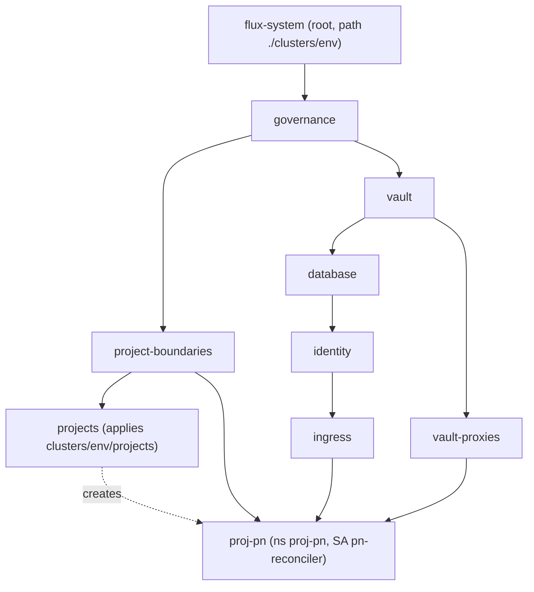

# Contract: Reconciliation Layers

**Feature**: [spec.md](../spec.md) | **Decisions**: [research.md](../research.md) R3–R8, R10–R11, R15–R16, R18

This is the binding shape of `clusters/<env>/` and the `deploy/` bases that Flux reconciles. CI ([platform-preflight.md](platform-preflight.md)) enforces every MUST below.

## 1. Layer graph (identical in every environment)



| Layer | Namespace of the Flux object | Declared in | `spec.path` | `dependsOn` | Impersonates |
|---|---|---|---|---|---|
| `governance` | flux-system | `layers.yaml` | `./deploy/platform/governance` | none | controller |
| `vault` | flux-system | `layers.yaml` | `./deploy/platform/vault` | governance | controller |
| `vault-proxies` | flux-system | `layers.yaml` | `./deploy/platform/vault-proxies` | vault | controller |
| `database` | flux-system | `layers.yaml` | `./deploy/platform/database` | vault | controller |
| `identity` | flux-system | `layers.yaml` | `./deploy/platform/identity` | database | controller |
| `ingress` | flux-system | `layers.yaml` | `./deploy/platform/ingress` | identity | controller |
| `project-boundaries` | flux-system | `layers.yaml` | `./deploy/projects/pn/boundary` | governance | controller |
| `projects` | flux-system | `layers.yaml` | `./clusters/<env>/projects` | project-boundaries | controller |
| `proj-pn` | proj-pn | `projects/proj-pn.yaml` | `./deploy/projects/pn/workloads` | flux-system/project-boundaries, flux-system/ingress, flux-system/vault-proxies | `pn-reconciler` |

**Common spec (MUST)**:

```yaml
spec:
  interval: 5m
  retryInterval: 1m
  timeout: 5m
  prune: true
  wait: true               # projects: false (R18)
  sourceRef:
    kind: GitRepository
    name: flux-system
    namespace: flux-system   # explicit on project layers
  # postBuild: FORBIDDEN (R3)
  # targetNamespace: FORBIDDEN on project layers (R8)
```

Project layer objects MUST NOT be in `layers.yaml` ([R18](../research.md#r18-first-install-ordering-for-project-layers)). Each one lives in its project namespace, which `project-boundaries` creates, so it is declared under `clusters/<env>/projects/` and applied by the `projects` layer after that namespace and its `pn-reconciler` exist. `clusters/<env>/projects/kustomization.yaml` lists one file per project.

## 2. Source and root (per environment)

`clusters/<env>/flux-system/gotk-sync.yaml`:

| Object | Required fields |
|---|---|
| `GitRepository flux-system/flux-system` | `url: https://github.com/nacfson/nacfson_pipeline`, `ref.branch: main`, `interval: 1m`, `ignore` that excludes everything but `/clusters/` and `/deploy/`, **no `secretRef`** |
| `Kustomization flux-system/flux-system` | `path: ./clusters/<env>`, `prune: true`, `interval: 10m`, `sourceRef` → the GitRepository above |

`clusters/<env>/kustomization.yaml` MUST list exactly `flux-system` and `layers.yaml`.

`clusters/<env>/flux-system/kustomization.yaml` MUST list `gotk-components.yaml` and `gotk-sync.yaml`, and MUST patch the controller resources:

| Deployment | CPU req / lim | Memory req / lim |
|---|---|---|
| `source-controller` | 50m / 500m | 64Mi / 128Mi |
| `kustomize-controller` | 100m / 500m | 64Mi / 128Mi |

## 3. Object annotations required in `deploy/`

| Object | Annotation |
|---|---|
| `Namespace` identity, platform, governance (`governance/namespaces.yaml`) | `kustomize.toolkit.fluxcd.io/prune: disabled` |
| `Namespace` vault (`vault/namespace.yaml`) | `kustomize.toolkit.fluxcd.io/prune: disabled` |
| `Namespace` proj-pn (`projects/pn/boundary/namespace.yaml`) | `kustomize.toolkit.fluxcd.io/prune: disabled` |
| `PersistentVolumeClaim` identity/postgres-data-postgres-0 | `kustomize.toolkit.fluxcd.io/prune: disabled` |
| `PersistentVolumeClaim` identity/postgres-backup-pvc | `kustomize.toolkit.fluxcd.io/prune: disabled` |
| `PersistentVolumeClaim` vault/openbao-backup-pvc | `kustomize.toolkit.fluxcd.io/prune: disabled` |
| `Job` identity/postgres-init-job | `kustomize.toolkit.fluxcd.io/force: enabled` |

Other required edits to `deploy/` content (no other content changes are allowed in this feature):

| File | Change |
|---|---|
| `governance/base-network-policy.yaml`, `governance/service-account-template.yaml` | Add `metadata.namespace: governance` (R12) |
| `vault/openbao-statefulset.yaml` | Readiness → `/v1/sys/health?standbyok=true`; liveness → `/v1/sys/health?standbyok=true&sealedcode=204&uninitcode=204` (R5) |
| `vault/kustomization.yaml` | Remove `registry-proxy.yaml` and `db-proxy.yaml` (moved to `vault-proxies/`) |
| `database/postgres-init-job.yaml` | Add `resources` requests = limits `100m` / `128Mi` to container `init-db`. A render audit found this is the only container with no bounds; the constitution (Principle IV) requires bounds, and the gate (rule 4) would otherwise block every PR. |
| `database/postgres-statefulset.yaml`, `database/postgres-init-job.yaml`, `database/backup-cronjob.yaml`, `identity/keycloak-deployment.yaml` | Replace the floating tags `postgres:16-alpine` and `keycloak:24.0` with the exact version each resolves to at implementation time (constitution v1.4.1 Principle I). The three `ghcr.io/nacfson/*:latest` images stay as they are (recorded exception in the plan). |
| `projects/pn/boundary/reconciler-rbac.yaml` | NEW: SA, Role and RoleBinding per the [data model](../data-model.md#project-reconciliation-identity) |
| `governance/manual-change-policy.yaml` | NEW: two ValidatingAdmissionPolicies and their bindings per the [manual-change policy contract](manual-change-policy.md) |
| `governance/break-glass-rbac.yaml` | NEW: ClusterRoleBinding `platform-break-glass` |
| `governance/operator-access.yaml` | NEW: ServiceAccount `operator-readonly` and its `view` ClusterRoleBinding |
| `governance/kustomization.yaml` | Lists the three new files with the existing ones |

## 4. Environment patches

Environment values are inline `spec.patches` on the owning layer (in `layers.yaml`, or in `projects/<project>.yaml` for project layers). Today both environments use the same `example.com` values; the mechanism MUST be present and proven on these targets:

| Layer | Target | Field |
|---|---|---|
| `identity` | `Deployment identity/gateway` | env `COOKIE_DOMAIN` |
| `ingress` | `IngressRoute platform/public-auth-allowlist` | `spec.routes[0..2].match` host |
| `proj-pn` | `IngressRoute proj-pn/project-pn-ingress` | `spec.routes[0..1].match` host |
| `proj-pn` | `Deployment proj-pn/pn-backend` | env `CENTRAL_AUTH_URL` |

Example shape (illustrative; values come from the environment):

```yaml
  patches:
    - target:
        kind: IngressRoute
        name: project-pn-ingress
      patch: |
        - op: replace
          path: /spec/routes/0/match
          value: Host(`pn.<env-domain>`)
```

`keycloak-realm-config` hostnames are out of scope ([R3 limitation](../research.md#r3-environment-differences-without-variable-substitution)).

## 5. Invariants checked by CI

1. No Flux `Kustomization` has `spec.postBuild`.
2. No `GitRepository` has `spec.secretRef`, and every URL starts with `https://`.
3. Every rendered namespaced object has an explicit `metadata.namespace`.
4. Every layer path builds with `flux build kustomization --dry-run` (CLI 2.9.5) and passes kubeconform.
5. Every annotation in §3 is present in the rendered output.
6. A project layer is declared under `clusters/<env>/projects/` (never in `layers.yaml`), has `serviceAccountName`, no `targetNamespace`, and its rendered objects are only of kinds Deployment, Service, ConfigMap or IngressRoute in its own namespace.
7. The rendered count of `${` equals the source count for every layer (no hidden substitution).
8. The manual-change policy invariants in [manual-change-policy §5](manual-change-policy.md#5-invariants-checked-by-ci-render-validate) hold.
