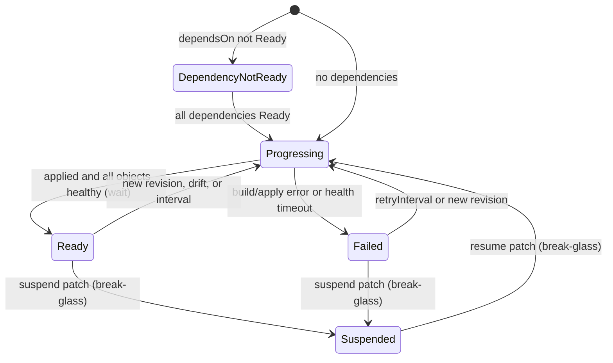
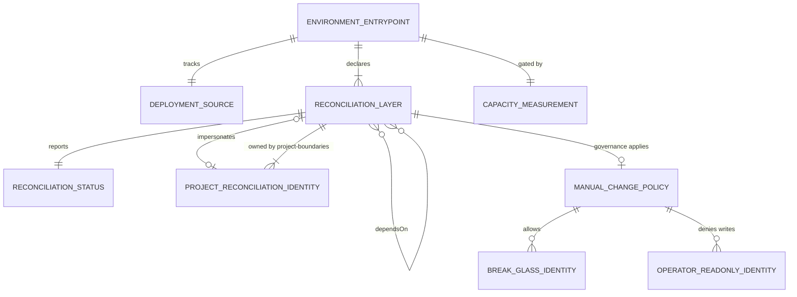

# Data Model: Flux GitOps Reconciliation

**Feature**: [spec.md](spec.md) | **Plan**: [plan.md](plan.md)

This maps the spec's Key Entities to concrete objects and files. No database is involved; all "data" is declarative configuration in Git plus status that Flux writes to the cluster.

## Entities

### Deployment Source

| Field | Value / Rule |
|---|---|
| Object | `GitRepository` `flux-system/flux-system` (`source.toolkit.fluxcd.io/v1`) |
| File | `clusters/<env>/flux-system/gotk-sync.yaml` |
| `url` | `https://github.com/nacfson/nacfson_pipeline`. MUST be HTTPS to the public repository. |
| `ref.branch` | `main` (protected; see [platform-preflight](contracts/platform-preflight.md)) |
| `interval` | `1m` |
| `secretRef` | MUST be absent (FR-012) |
| `ignore` | Excludes everything except `/clusters/` and `/deploy/` |

**Validation**: CI rejects any `GitRepository` with `secretRef` or a non-HTTPS URL.

### Environment Entrypoint

| Field | Value / Rule |
|---|---|
| Directory | `clusters/<env>/`, where `<env>` ∈ {`local-k3s`, `vps-k3s`} |
| `kustomization.yaml` | `resources: [flux-system, layers.yaml]` only |
| `layers.yaml` | The 8 platform Reconciliation Layers (including `projects`), with inline environment `patches` |
| `projects/` | One file per project layer (today `proj-pn.yaml`) with its environment `patches`, plus a `kustomization.yaml`. Applied by the `projects` layer, never listed in the entrypoint's `kustomization.yaml` ([R18](research.md#r18-first-install-ordering-for-project-layers)) |
| `capacity.yaml` | The Capacity Measurement (preflight input only, never applied) |
| Root object | `Kustomization` `flux-system/flux-system`, `path: ./clusters/<env>`, `prune: true`, `interval: 10m` |

**Validation**: CI fails if any Flux Kustomization has `spec.postBuild`, or if `capacity.yaml` is reachable from the entrypoint's `kustomization.yaml`.

### Reconciliation Layer

| Field | Rule |
|---|---|
| Object | `Kustomization` (`kustomize.toolkit.fluxcd.io/v1`) |
| `metadata.namespace` | `flux-system` for platform layers; the project namespace for project workload layers |
| `spec.path` | A `deploy/…` directory containing a `kustomization.yaml`; for the `projects` layer, `./clusters/<env>/projects` |
| `spec.dependsOn` | Per the [layer contract](contracts/reconciliation-layers.md) |
| `spec.wait` | `true`; `false` only on `projects` (R18) |
| `spec.prune` | `true` (data protection is per object; see Prune Protection) |
| `spec.interval` / `retryInterval` / `timeout` | `5m` / `1m` / `5m` |
| `spec.serviceAccountName` | Only on project workload layers (the Project Reconciliation Identity) |
| `spec.targetNamespace` | MUST be absent on project layers |
| `spec.patches` | Environment-specific values only |
| `spec.postBuild` | MUST be absent |

**State transitions** (Flux `Ready` condition, per layer):

### Reconciliation Status

This is read-only and written by Flux. For each layer: `status.lastAppliedRevision`, the `Ready` condition (`True`/`False`/`Unknown`) with its reason and message (including `DependencyNotReady` and the name of the dependency), `spec.suspend`, and `status.inventory`. Source status: `GitRepository.status.artifact.revision`. It must never contain secret values; Flux reports object references, not object contents.

### Project Reconciliation Identity

| Object | Rule |
|---|---|
| `ServiceAccount` `proj-pn/pn-reconciler` | `automountServiceAccountToken: false`; used only through Flux impersonation |
| `Role` `proj-pn/pn-reconciler` | Verbs `get, list, watch, create, update, patch, delete` on `apps/deployments`, `services`, `configmaps`, `traefik.io/ingressroutes`. MUST NOT include `namespaces`, `resourcequotas`, `networkpolicies`, `serviceaccounts`, or any `rbac.authorization.k8s.io` resource. |
| `RoleBinding` `proj-pn/pn-reconciler` | Binds the Role to the SA |
| Owner | The `project-boundaries` platform layer (file `deploy/projects/pn/boundary/reconciler-rbac.yaml`) |

### Prune Protection (object-level attribute)

| Target | Annotation |
|---|---|
| PVCs in Git: `identity/postgres-data-postgres-0`, database backup PVC, vault backup PVC | `kustomize.toolkit.fluxcd.io/prune: disabled` |
| Namespaces: `identity`, `vault`, `proj-pn`, `platform`, `governance` | `kustomize.toolkit.fluxcd.io/prune: disabled` |
| Job `identity/postgres-init-job` (immutable) | `kustomize.toolkit.fluxcd.io/force: enabled` |

### Break-glass Identity

| Field | Rule |
|---|---|
| Group | `platform:break-glass`, reached only by impersonation from the node's K3s admin credential |
| RBAC | `ClusterRoleBinding` `platform-break-glass` → `cluster-admin` (file `deploy/platform/governance/break-glass-rbac.yaml`) |
| Policy | Allowed by rule 5 of the [manual-change policy](contracts/manual-change-policy.md#3-allow-rule-identical-in-both-policies) |

### Operator Read-only Identity

| Field | Rule |
|---|---|
| Object | `ServiceAccount` `governance/operator-readonly`, `automountServiceAccountToken: false` |
| RBAC | `ClusterRoleBinding` `operator-readonly-view` → `view` (includes Flux resources, excludes Secrets) |
| Credential | Token of at most 24 h from `scripts/operator-kubeconfig.sh`; never stored in Git or as a Secret |

### Manual-Change Policy

Two `ValidatingAdmissionPolicy` objects and their bindings (`admissionregistration.k8s.io/v1`) in `deploy/platform/governance/manual-change-policy.yaml`. Scope, allow rule and invariants: [contract](contracts/manual-change-policy.md).

### Bootstrap Result (extended, spec 003)

| Field | Change |
|---|---|
| `completed_stages` | Adds `reconciler` |
| `readiness_outcomes.reconciler_ready` | NEW, boolean |
| `reconciler_preexisting` | NEW, boolean: `true` when stage 4 skipped the apply |
| Input `gitops_environment` | NEW, allowlist [`local-k3s`, `vps-k3s`] |

### Capacity Measurement (preflight input; new)

File `clusters/<env>/capacity.yaml`. This is not a Kubernetes object, so no `apiVersion`/`kind` is applied.

| Field | Type | Rule |
|---|---|---|
| `environment` | string | MUST equal the directory name |
| `nodeName` | string | The observed node |
| `observedAt` | RFC 3339 timestamp | When the observation was made |
| `allocatable.cpuMillicores` | integer | From `kubectl get node <n> -o jsonpath='{.status.allocatable}'` |
| `allocatable.memoryMib` | integer | Same source |
| `systemReserved.cpuMillicores` / `memoryMib` | integer | K3s bundled components not rendered from Git (CoreDNS, Traefik, metrics-server, local-path), taken from their live requests |

**Validation**: preflight fails closed if the file is missing, malformed, or has zero or negative values ([contract](contracts/platform-preflight.md)).

## Relationships

