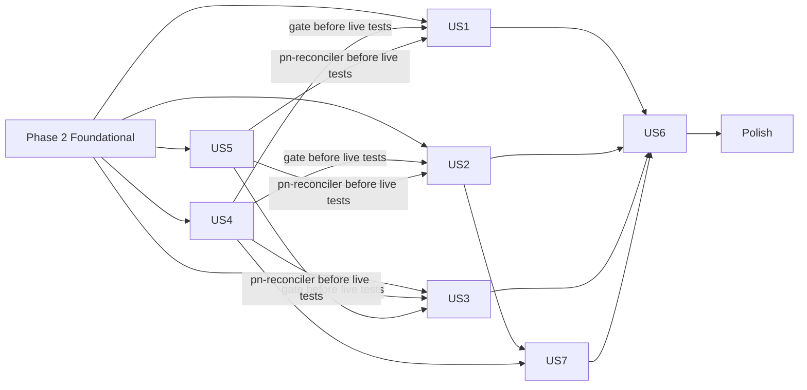

# Tasks: Flux GitOps Reconciliation

**Input**: Design documents from `specs/004-flux-gitops-reconciliation/`
**Prerequisites**: [plan.md](plan.md), [spec.md](spec.md), [research.md](research.md), [data-model.md](data-model.md), [contracts/](contracts/), [quickstart.md](quickstart.md)

**Tests**: The spec and the [platform-preflight contract §6](contracts/platform-preflight.md#6-required-fixtures-testspreflight) require fixture tests for the preflight script, and every story is accepted through a live [quickstart](quickstart.md) step. Those test and validation tasks are included; no other unit tests are generated.

**Live validation** runs on the operator's local VM (the test VM: disposable, K3s v1.35, environment `local-k3s`); the VPS gets only smoke steps (T079). Record every result in `specs/004-flux-gitops-reconciliation/validation.md`.

## Format: `[ID] [P?] [Story] Description`

- **[P]**: Can run in parallel (different files, no dependency on an incomplete task)
- **[Story]**: User story label (US1–US7)

---

## Phase 1: Setup

**Purpose**: Branch, generated Flux manifests, pinned tool versions, and the SPEC.md sync that the spec requires before building

- [X] T001 Create the first short-lived branch from `main` and merge `specs/004-flux-gitops-reconciliation/`, `.specify/memory/constitution.md` (v1.4.1) and `.specify/feature.json` through a pull request; every later task or small task group follows the same branch-and-PR flow
- [X] T002 [P] Generate `clusters/local-k3s/flux-system/gotk-components.yaml` with `flux install --version=v2.9.5 --components=source-controller,kustomize-controller --export`, and copy it unchanged to `clusters/vps-k3s/flux-system/gotk-components.yaml`
- [X] T003 [P] Create `scripts/requirements-preflight.txt` pinning one exact PyYAML version
- [X] T004 [P] Create `.github/workflows/gitops.yaml` with triggers `pull_request` and `push` on `main`, and an `env` block pinning Flux CLI `2.9.5`, one exact kubeconform version, and the Traefik CRD schema source (jobs are added in US4)
- [X] T005 [P] Sync `SPEC.md` per R13: §2 "Deployment reconciliation" row and following paragraph, DEPLOY-01, DEPLOY-04, the availability line "MUST NOT require … FluxCD", and the §2 "Secrets" row; mention that manual changes are rejected by the cluster (spec Assumption "Governance prerequisite": done before building)

---

## Phase 2: Foundational (Blocking Prerequisites)

**Purpose**: Publication precondition, `deploy/` layer structure, and the per-environment Flux entrypoints that every story depends on

**⚠️ CRITICAL**: No user story work can begin until this phase is complete

### Publication precondition (operator; [operations §1](contracts/operations.md#1-publication-precondition-one-time))

- [ ] T006 Rotate the Google OAuth client secret (Google Cloud Console) and the Keycloak bootstrap admin password that appear SOPS-encrypted in commit `be85073`; create `specs/004-flux-gitops-reconciliation/validation.md` and record the rotation date (no secret values)
- [ ] T007 Run `gitleaks git . --log-opts="--all"` and resolve to zero findings; put justified false positives in `.gitleaksignore` with a comment each
- [ ] T008 Make the GitHub repository public after T006 and T007; confirm `git ls-remote https://github.com/nacfson/nacfson_pipeline main` works without credentials and record it in `specs/004-flux-gitops-reconciliation/validation.md`

### `deploy/` layer structure ([reconciliation-layers §1, §3](contracts/reconciliation-layers.md))

- [X] T009 [P] Create `deploy/platform/governance/kustomization.yaml` listing `namespaces.yaml`, `base-network-policy.yaml`, `service-account-template.yaml`
- [X] T010 [P] Add `metadata.namespace: governance` to `default-deny-all` in `deploy/platform/governance/base-network-policy.yaml` and to `project-sa-template` in `deploy/platform/governance/service-account-template.yaml` (R12)
- [X] T011 [P] Create `deploy/platform/vault-proxies/` by `git mv` of `registry-proxy.yaml` and `db-proxy.yaml` from `deploy/platform/vault/`, add `deploy/platform/vault-proxies/kustomization.yaml` with `namespace: vault`, and remove both files from `deploy/platform/vault/kustomization.yaml`
- [X] T012 [P] Create `deploy/platform/database/kustomization.yaml` listing `postgres-pvc.yaml`, `postgres-service.yaml`, `postgres-statefulset.yaml`, `postgres-init-job.yaml`, `backup-cronjob.yaml`
- [X] T013 [P] Add `resources` with requests = limits `cpu: 100m`, `memory: 128Mi` to container `init-db` in `deploy/platform/database/postgres-init-job.yaml`
- [X] T014 [P] Create `deploy/platform/identity/kustomization.yaml` listing `keycloak-realm-config.yaml`, `keycloak-deployment.yaml`, `gateway-deployment.yaml` (no content change)
- [X] T015 [P] Create `deploy/platform/ingress/kustomization.yaml` listing `traefik-middleware.yaml`, `ingress-allowlist.yaml` (no content change)
- [X] T016 [P] Split `deploy/projects/pn/` with `git mv`: `namespace.yaml`, `service-account.yaml`, `resource-quota.yaml`, `network-policy.yaml` → `deploy/projects/pn/boundary/`; `backend-deployment.yaml`, `backend-service.yaml`, `frontend-deployment.yaml`, `ingress-route.yaml` → `deploy/projects/pn/workloads/`; add a `kustomization.yaml` to each
- [X] T017 Pin the third-party images to exact upstream version tags (constitution v1.4.1 Principle I): `postgres:16-alpine` in `deploy/platform/database/postgres-statefulset.yaml`, `deploy/platform/database/postgres-init-job.yaml` and `deploy/platform/database/backup-cronjob.yaml`, and `quay.io/keycloak/keycloak:24.0` in `deploy/platform/identity/keycloak-deployment.yaml`. Use the exact version each floating tag resolves to at implementation time, the same value in every file (after T013). Leave the three `ghcr.io/nacfson/*:latest` images unchanged (exception in the plan's Complexity Tracking)

### Flux entrypoints ([reconciliation-layers §1–2](contracts/reconciliation-layers.md#2-source-and-root-per-environment), [data model](data-model.md#deployment-source))

- [X] T018 Create `clusters/local-k3s/flux-system/gotk-sync.yaml`: `GitRepository` `flux-system/flux-system` with `url: https://github.com/nacfson/nacfson_pipeline` ("MUST be HTTPS to the public repository"), `ref.branch: main`, `interval: 1m`, `ignore` excluding everything except `/clusters/` and `/deploy/`, and "`secretRef` MUST be absent"; plus root `Kustomization` `flux-system/flux-system` with `path: ./clusters/local-k3s`, `prune: true`, `interval: 10m`
- [X] T019 Create `clusters/local-k3s/flux-system/kustomization.yaml` listing `gotk-components.yaml` and `gotk-sync.yaml`, with patches: `source-controller` CPU 50m/500m, memory 64Mi/128Mi; `kustomize-controller` CPU 100m/500m, memory 64Mi/128Mi (R11)
- [X] T020 Create `clusters/local-k3s/layers.yaml` with the 8 platform Flux `Kustomization`s from [reconciliation-layers §1](contracts/reconciliation-layers.md#1-layer-graph-identical-in-every-environment), all in namespace `flux-system` (paths, `dependsOn`), each with `interval: 5m`, `retryInterval: 1m`, `timeout: 5m`, `prune: true`, `wait: true`, `sourceRef` `GitRepository flux-system/flux-system`; layer `projects` has `path: ./clusters/local-k3s/projects`, `dependsOn: project-boundaries` and `wait: false` (R18); no layer has `postBuild`; no project layer object is in this file
- [X] T021 Create `clusters/local-k3s/projects/kustomization.yaml` listing `proj-pn.yaml`, and `clusters/local-k3s/projects/proj-pn.yaml` with the Flux `Kustomization` `proj-pn/proj-pn`: `path: ./deploy/projects/pn/workloads`, `serviceAccountName: pn-reconciler`, explicit `sourceRef.namespace: flux-system`, `dependsOn` `flux-system/project-boundaries`, `flux-system/ingress`, `flux-system/vault-proxies`, the common spec, no `targetNamespace`, no `postBuild` (R8, R18)
- [X] T022 Create `clusters/local-k3s/kustomization.yaml` with `resources: [flux-system, layers.yaml]` only (`capacity.yaml` and `projects/` are never listed)
- [X] T023 Create `clusters/vps-k3s/` with the same files as T018–T022, with root `path: ./clusters/vps-k3s` and `projects` layer `path: ./clusters/vps-k3s/projects`
- [X] T024 For both environments, run `flux build kustomization <layer> --path <path> --kustomization-file <declaring file> --dry-run` for all 9 layers (`clusters/<env>/layers.yaml` for 8, `clusters/<env>/projects/proj-pn.yaml` for `proj-pn`), and confirm every build succeeds and the `${` count per layer equals the source count (database 17; Keycloak placeholder intact)

**Checkpoint**: The repository is public and both entrypoints render. User stories can begin.

---

## Phase 3: User Story 1 - Deliver Changes Through Git Only (Priority: P1) 🎯 MVP

**Goal**: A merged change reaches the cluster automatically, with per-layer status and environment values from inline patches.

**Independent Test**: On the test VM, install Flux temporarily with `kubectl apply --server-side -k clusters/local-k3s/flux-system` (US2 replaces this with the bootstrap stage). Merge a label change; the cluster reflects it within 5 min with no cluster command, and `flux get kustomizations -A` shows the new revision.

**Precondition for the live task T030**: the local-k3s gate is active (US4: T045–T053), so no unchecked revision reaches the test VM, and `pn-reconciler` exists in Git (US5: T055), so the `proj-pn` layer can run.

- [X] T025 [US1] Add an inline `spec.patches` entry to the `identity` layer in `clusters/local-k3s/layers.yaml` that sets env `COOKIE_DOMAIN` on `Deployment identity/gateway` ([reconciliation-layers §4](contracts/reconciliation-layers.md#4-environment-patches))
- [X] T026 [US1] Add patches to the `ingress` layer in `clusters/local-k3s/layers.yaml` for the `spec.routes[0..2].match` hosts of `IngressRoute platform/public-auth-allowlist`
- [X] T027 [US1] Add patches to `clusters/local-k3s/projects/proj-pn.yaml` for the `spec.routes[0..1].match` hosts of `IngressRoute proj-pn/project-pn-ingress` and env `CENTRAL_AUTH_URL` of `Deployment proj-pn/pn-backend`
- [X] T028 [US1] Add the same four patch targets to `clusters/vps-k3s/layers.yaml` and `clusters/vps-k3s/projects/proj-pn.yaml` with the vps-k3s values (today both use the `example.com` values)
- [X] T029 [US1] Re-run the T024 builds and confirm the patched fields render with the environment values and `keycloak-realm-config` is unchanged (R3 limitation)
- [ ] T030 [US1] On the test VM, run [quickstart](quickstart.md) C1 ×10 (SC-002) and B6 (SC-010); on a throwaway tracked branch, merge an invalid declaration and confirm the layer reports the cause while the last good state and other layers stay in place (Story 1.3); record in `specs/004-flux-gitops-reconciliation/validation.md`

**Checkpoint**: MVP: Git-driven delivery works on the test VM.

---

## Phase 4: User Story 2 - Bring Up an Empty Cluster in Dependency Order (Priority: P1)

**Goal**: A clean VM reaches the declared state by running the bootstrap plus vault unseal/seed; layers apply in dependency order; a sealed vault reads as not-ready; Flux upgrades itself from Git.

**Independent Test**: [Quickstart](quickstart.md) B1–B5, B7 and B8 on a clean test VM.

- [X] T031 [P] [US2] In `deploy/platform/vault/openbao-statefulset.yaml`, set the readiness probe path to `/v1/sys/health?standbyok=true` and the liveness probe path to `/v1/sys/health?standbyok=true&sealedcode=204&uninitcode=204` (R5)
- [X] T032 [P] [US2] In the controller play of `bootstrap/bootstrap.yml`, add required input `gitops_environment` validated against the allowlist [`local-k3s`, `vps-k3s`], and update the header comment from three to four inputs ([bootstrap stage §1](contracts/bootstrap-reconciler-stage.md#1-inputs))
- [X] T033 [P] [US2] In `bootstrap/tasks/preflight.yml`, assert on the controller that `{{ playbook_dir }}/../clusters/{{ gitops_environment }}/flux-system/` exists
- [X] T034 [US2] Create `bootstrap/tasks/reconciler.yml` implementing [bootstrap stage §2](contracts/bootstrap-reconciler-stage.md#2-steps-bootstraptasksreconcileryml) steps 1–6: set stage and remediation; detect both Flux Deployments → `reconciler_preexisting`; copy to `/var/lib/nacfson-bootstrap/flux-system/` (root, 0700); `k3s kubectl apply --server-side -k` with CRD wait and up to 3 attempts; `rollout status` for both Deployments (300s); record `reconciler_ready` and `completed_stages += ['reconciler']`
- [X] T035 [US2] Wire stage 4 into `bootstrap/bootstrap.yml` after the verify stage: initialize `readiness_outcomes.reconciler_ready: false` and `reconciler_preexisting`, include `tasks/reconciler.yml`, and change the final `next_action` to "Cluster and reconciler ready. Run `scripts/vault-init.sh` to initialize or unseal the vault; Flux applies all other layers."
- [X] T036 [P] [US2] Add `-e gitops_environment=local-k3s` to the syntax-check command in the `bootstrap-syntax` job of `.github/workflows/lint.yaml`
- [X] T037 [P] [US2] Amend `docs/bootstrap-scope.md` per R17: the bootstrap installs the reconciler as its last stage and nothing else; vault installation and all other workloads stay outside it
- [ ] T038 [US2] On a clean test VM, run [quickstart](quickstart.md) B1–B5, B7 and B8 (SC-001, SC-008, Story 2.4, Story 2.5) and record in `specs/004-flux-gitops-reconciliation/validation.md`

**Checkpoint**: Rebuilding from a clean VM is repeatable and ordered.

---

## Phase 5: User Story 3 - Correct Drift, Prune Safely, and Roll Back by Revert (Priority: P1)

**Goal**: Drift is reverted, removed declarations are pruned, persistent data is never deleted, rollback is `git revert`, and the cluster recovers from a reboot or an unreachable source.

**Independent Test**: [Quickstart](quickstart.md) C2–C9 on the test VM with disposable data.

- [X] T039 [P] [US3] Add annotation `kustomize.toolkit.fluxcd.io/prune: disabled` to Namespaces `identity`, `platform`, `governance` in `deploy/platform/governance/namespaces.yaml`
- [X] T040 [P] [US3] Add `kustomize.toolkit.fluxcd.io/prune: disabled` to Namespace `vault` in `deploy/platform/vault/namespace.yaml` and to PVC `openbao-backup-pvc` in `deploy/platform/vault/backup-cronjob.yaml`
- [X] T041 [P] [US3] Add `kustomize.toolkit.fluxcd.io/prune: disabled` to Namespace `proj-pn` in `deploy/projects/pn/boundary/namespace.yaml`
- [X] T042 [P] [US3] Add `kustomize.toolkit.fluxcd.io/prune: disabled` to PVC `postgres-data-postgres-0` in `deploy/platform/database/postgres-pvc.yaml` and PVC `postgres-backup-pvc` in `deploy/platform/database/backup-cronjob.yaml`
- [X] T043 [US3] Add annotation `kustomize.toolkit.fluxcd.io/force: enabled` to `Job identity/postgres-init-job` in `deploy/platform/database/postgres-init-job.yaml` (after T013 and T017)
- [ ] T044 [US3] On the test VM, run [quickstart](quickstart.md) C2–C9 (SC-003, SC-004, SC-005, Story 3.5, edge cases "Restarts" and "Repository unreachable") and record in `specs/004-flux-gitops-reconciliation/validation.md`. Until US7 lands, C2, C7 and C9 can run without the break-glass prefix.

**Checkpoint**: All P1 stories proven; the old scripts may now be retired (US6) once US7 is also in place.

---

## Phase 6: User Story 4 - Gate Revisions Before They Reach the Cluster (Priority: P2)

**Goal**: No revision reaches `main` unless it renders, validates, fits the budget, keeps isolation, and leaks no secrets.

**Independent Test**: [Quickstart](quickstart.md) A1–A8: each failing PR is blocked, a compliant and a zero-project revision pass.

**Order**: T045–T053 run before the first live install (T030), so local-k3s revisions pass the gate before they reach the test VM. The VPS measurement and its required check are in Polish (T077–T078).

### Tests for User Story 4 (required by the contract)

- [X] T045 [P] [US4] Create the 10 fixtures from [platform-preflight §6](contracts/platform-preflight.md#6-required-fixtures-testspreflight) under `tests/preflight/fixtures/` and `tests/preflight/test_platform_preflight.py` (unittest) asserting each expected status and exit code; confirm they fail before T047

### Implementation for User Story 4

- [ ] T046 [P] [US4] Bootstrap K3s on the test VM with the existing spec 003 stages (Flux is not needed), measure the node and commit `clusters/local-k3s/capacity.yaml` with fields `environment` ("MUST equal the directory name"), `nodeName`, `observedAt` (RFC 3339), `allocatable.cpuMillicores`, `allocatable.memoryMib`, `systemReserved.cpuMillicores`, `systemReserved.memoryMib`; values "MUST come from observing the node, never from the desired figure" ([operations §2](contracts/operations.md#2-capacity-measurement-per-environment-whenever-the-node-changes))
- [X] T047 [US4] Implement `scripts/platform-preflight.py` per [platform-preflight §2–5](contracts/platform-preflight.md): CLI `--environment --candidate --baseline --capacity [--json]`; layer classification by `serviceAccountName`; rules 1–6 in order (first failure decides); calculation with memory **limits** for the platform reservation and `projectCount = 0 ⇒ slice = appCapacity`; exit codes 0/1/2; JSON superset of the 001 schema; reads no secret values
- [X] T048 [P] [US4] Implement `scripts/render-invariants.py` checking invariants 1–7 of [reconciliation-layers §5](contracts/reconciliation-layers.md#5-invariants-checked-by-ci) against the rendered output and `clusters/<env>/` (invariant 6 includes "no project layer in `layers.yaml`")
- [X] T049 [US4] Create `scripts/render-validate.sh <env> [<ref>]`: build every Flux Kustomization in `clusters/<env>/layers.yaml` and `clusters/<env>/projects/*.yaml` with the pinned Flux CLI, plus `kustomize build clusters/<env>/flux-system`, concatenate to one render file, run kubeconform (strict, K8s 1.35, Flux 2.9.5 `crd-schemas`, Traefik schemas), then `scripts/render-invariants.py`; with `<ref>`, render that revision via `git worktree` (used for the merge-base baseline)
- [X] T050 [US4] Add jobs `render-validate` and `platform-preflight` to `.github/workflows/gitops.yaml` as a matrix over `env ∈ {local-k3s, vps-k3s}` (job names `render-validate (<env>)`, `platform-preflight (<env>)`): install pinned tools and `scripts/requirements-preflight.txt`, run `python -m unittest discover tests/preflight`, `scripts/render-validate.sh`, and `scripts/platform-preflight.py` with the merge-base baseline
- [X] T051 [P] [US4] Widen the trigger in `.github/workflows/secret-scan.yaml` to every pull request into `main`
- [X] T052 [P] [US4] Add `clusters/` to the yamllint step in `.github/workflows/lint.yaml`; exclude `gotk-components.yaml` only if the generated Flux output violates the default rules
- [ ] T053 [US4] Configure branch protection on `main` per [platform-preflight §7](contracts/platform-preflight.md#7-branch-protection-operator-configuration-documented-in-the-runbook) (after T008 and T050) with every required check except `platform-preflight (vps-k3s)`, which fails closed until the VPS is measured (added in T078); record in `specs/004-flux-gitops-reconciliation/validation.md`
- [ ] T054 [US4] Run [quickstart](quickstart.md) A1–A8 (SC-006, SC-009) and record the results in `specs/004-flux-gitops-reconciliation/validation.md`

**Checkpoint**: `main` only accepts checked revisions.

---

## Phase 7: User Story 5 - Reconcile Project Workloads With Project-Scoped Authority (Priority: P2)

**Goal**: The `proj-pn` layer applies only workload kinds in `proj-pn`, under `pn-reconciler`.

**Independent Test**: [Quickstart](quickstart.md) D: each forbidden object is rejected for the `proj-pn` layer only.

**Order**: T055 runs before the first live install (T030), because the `proj-pn` layer acts as `pn-reconciler` in every live test (T030, T038, T044). T056 needs a running Flux, so it runs after T030.

- [X] T055 [US5] Create `deploy/projects/pn/boundary/reconciler-rbac.yaml` and add it to `deploy/projects/pn/boundary/kustomization.yaml`: `ServiceAccount proj-pn/pn-reconciler` with `automountServiceAccountToken: false`; `Role proj-pn/pn-reconciler` with verbs `get, list, watch, create, update, patch, delete` on `apps/deployments`, `services`, `configmaps`, `traefik.io/ingressroutes`, which "MUST NOT include `namespaces`, `resourcequotas`, `networkpolicies`, `serviceaccounts`, or any `rbac.authorization.k8s.io` resource"; `RoleBinding proj-pn/pn-reconciler` binding the Role to the SA
- [ ] T056 [US5] On the test VM, run [quickstart](quickstart.md) D (SC-007) and record in `specs/004-flux-gitops-reconciliation/validation.md`

**Checkpoint**: Project changes cannot weaken the platform boundary.

---

## Phase 8: User Story 7 - Reject Manual Changes at the Cluster (Priority: P2)

**Goal**: The cluster denies manual writes in managed scope; break-glass is deliberate; the workstation is read-only.

**Independent Test**: [Quickstart](quickstart.md) F0–F6 on the test VM (SC-011).

- [X] T057 [P] [US7] Create `deploy/platform/governance/manual-change-policy.yaml` per [manual-change-policy §2–3](contracts/manual-change-policy.md#2-match-scope): `ValidatingAdmissionPolicy` `gitops-managed-namespaces` (all namespaced resources; binding `namespaceSelector` on `kubernetes.io/metadata.name` In [`default`, `flux-system`, `governance`, `identity`, `platform`, `vault`, `proj-pn`]) and `gitops-managed-cluster-kinds` (the 8 listed cluster-scoped resources; binding without selector); operations CREATE, UPDATE, DELETE; allow rules 1–3 and 5–8 (rule 4 filled in T064); `failurePolicy: Fail`; `validationActions: [Deny]`; the contract's `messageExpression`
- [X] T058 [P] [US7] Create `deploy/platform/governance/break-glass-rbac.yaml`: `ClusterRoleBinding platform-break-glass` with exactly one subject `Group platform:break-glass` → ClusterRole `cluster-admin`
- [X] T059 [P] [US7] Create `deploy/platform/governance/operator-access.yaml`: `ServiceAccount governance/operator-readonly` with `automountServiceAccountToken: false`, and `ClusterRoleBinding operator-readonly-view` → ClusterRole `view` only
- [X] T060 [US7] Add `manual-change-policy.yaml`, `break-glass-rbac.yaml`, `operator-access.yaml` to `deploy/platform/governance/kustomization.yaml`
- [X] T061 [US7] Extend `scripts/render-invariants.py` with invariant 8 ([manual-change-policy §5](contracts/manual-change-policy.md#5-invariants-checked-by-ci-render-validate) items 1–5), including "the `namespaceSelector` list equals `{default, flux-system}` ∪ every `Namespace` declared under `deploy/`"
- [X] T062 [P] [US7] Create `scripts/operator-kubeconfig.sh <vm>` per [operations §13](contracts/operations.md#13-read-only-workstation-kubeconfig): over SSH run `sudo k3s kubectl -n governance create token operator-readonly --duration=24h` and read the cluster CA; write `~/.kube/nacfson-<env>.yaml` pointing at `https://127.0.0.1:6443`; store nothing in the repository
- [X] T063 [P] [US7] Add a break-glass mode to `scripts/verify-isolation.sh` (environment variable that adds `--as=break-glass:verify --as-group=platform:break-glass` to its `kubectl` calls) so the root-pod test still exercises Pod Security
- [ ] T064 [US7] On the test VM, run [quickstart](quickstart.md) F0–F6 (SC-011); add any denied K3s internal user to allow rule 4 in `deploy/platform/governance/manual-change-policy.yaml` and in [contracts/manual-change-policy.md §3](contracts/manual-change-policy.md#3-allow-rule-identical-in-both-policies), re-run until F0 shows no denials; re-run C2, C7 and C9 with the break-glass prefix; record in `specs/004-flux-gitops-reconciliation/validation.md`
- [X] T065 [US7] In `bootstrap/tasks/reconciler.yml`, when the apply in step 4 is denied by the policy, fail with remediation "Reinstall under break-glass (operations §12)" ([bootstrap stage §5](contracts/bootstrap-reconciler-stage.md#5-known-limit))
- [ ] T066 [US7] Run [quickstart](quickstart.md) A9 and A10 and record in `specs/004-flux-gitops-reconciliation/validation.md`

**Checkpoint**: Git is the only way to change an environment, outside deliberate break-glass.

---

## Phase 9: User Story 6 - Retire the Manual Release Path (Priority: P3)

**Goal**: Exactly one documented way to change an environment.

**Independent Test**: No file outside `specs/` instructs a manual apply of workloads or the reconciler, except break-glass; the retired files are gone.

**Precondition**: US1–US3 validated (T030, T038, T044) and US7 in place (T064).

- [X] T067 [P] [US6] `git rm scripts/apply-release.sh scripts/rollback-release.sh scripts/preflight-budget.sh`
- [X] T068 [P] [US6] `git rm deploy/kustomization.yaml` and `git rm -r deploy/environments/`
- [X] T069 [P] [US6] Remove the `.deploy-baseline` line from `.gitignore`
- [X] T070 [P] [US6] In `scripts/verify-platform.sh`, replace the `preflight-budget.sh` calls (L42–43) with `scripts/platform-preflight.py` and the `deploy/environments/` checks (L76–80) with `scripts/render-validate.sh` for both environments
- [X] T071 [P] [US6] In `tests/vault/test_matrix_verification.sh`, replace the `kubectl kustomize … deploy/environments/*` lines (L75–76) with `scripts/render-validate.sh local-k3s` and `scripts/render-validate.sh vps-k3s`
- [X] T072 [P] [US6] In `scripts/vault-init.sh`, replace the hint "Deploy manifests first: kubectl apply -k deploy/platform/vault/" with "Wait for the Flux layer `vault` to apply (`flux get kustomizations -A`)"
- [X] T073 [US6] Rewrite `docs/operations-runbook.md` around [contracts/operations.md](contracts/operations.md) §1–13, including branch protection, the `kube-system` residual risk (R16), and running verification scripts under break-glass
- [X] T074 [P] [US6] Update `README.md` (currently untracked; pre-existing): replace the `.deploy-baseline`, `preflight-budget.sh` and `apply-release.sh` references at L59, L62, L154, L200–203 with the reconciled model

**Checkpoint**: One deployment path remains.

---

## Phase 10: Polish & Cross-Cutting Concerns

Production per [quickstart E](quickstart.md#e-production-vps-k3s), in order T075 → T076 → T077 → T078 → T079.

- [ ] T075 Before the VPS bootstrap, compare the VPS OCPU and memory with `clusters/local-k3s/capacity.yaml`; stop if the VPS is smaller (accepted gap: the first VPS deployment is checked only against local-k3s, see the plan's Complexity Tracking); record the comparison in `specs/004-flux-gitops-reconciliation/validation.md`
- [ ] T076 Run the bootstrap on the OCI A1 VM with `gitops_environment=vps-k3s` (`status: ready`, `reconciler_ready: true`)
- [ ] T077 Measure the VPS node and commit `clusters/vps-k3s/capacity.yaml` with the same fields and rule as T046; the PR passes `platform-preflight (vps-k3s)`
- [ ] T078 Add `platform-preflight (vps-k3s)` to the required checks on `main` (after T077 is merged); record in `specs/004-flux-gitops-reconciliation/validation.md`
- [ ] T079 On the VPS, run quickstart B2–B7, C1 ×3, C2 ×2, F1 (one object), F3, F5; replace the workstation admin kubeconfig with the read-only one
- [X] T080 Run the Story 6 check: `grep -rn -E "apply-release|rollback-release|preflight-budget|deploy/environments|deploy-baseline" --exclude-dir=.git --exclude-dir=specs .` returns nothing except the constitution's Sync Impact comment
- [ ] T081 Complete `specs/004-flux-gitops-reconciliation/validation.md` with the status and evidence of SC-001 to SC-011

---

## Dependencies & Execution Order

### Phase Dependencies

- **Setup (Phase 1)**: none
- **Foundational (Phase 2)**: depends on T001–T002; T008 depends on T006 and T007; blocks all stories
- **US4 (P2)**: after Phase 2; T053 needs T008 and T050. T045–T053 come **before** the first live install (T030)
- **US1, US2, US3 (P1)**: after Phase 2; their live tasks (T030, T038, T044) after T053 and T055. US2's live test (T038) supersedes US1's temporary install.
- **US5 (P2)**: after Phase 2; T055 **before** the first live install (T030); T056 after T030
- **US7 (P2)**: after US2 (T065 edits `bootstrap/tasks/reconciler.yml` from T034) and US4 (T061 extends T048)
- **US6 (P3)**: after US1–US3 are validated and US7 is in place
- **Polish**: after all stories; T075 → T076 → T077 → T078 → T079

### User Story Dependencies



### Same-file sequences

- `deploy/platform/database/postgres-init-job.yaml`: T013 → T017 → T043
- `deploy/platform/database/backup-cronjob.yaml`: T017 → T042
- `clusters/local-k3s/layers.yaml`: T020 → T025 → T026
- `clusters/local-k3s/projects/proj-pn.yaml`: T021 → T027
- `bootstrap/bootstrap.yml`: T032 → T035
- `bootstrap/tasks/reconciler.yml`: T034 → T065
- `scripts/render-invariants.py`: T048 → T061
- `deploy/platform/governance/kustomization.yaml`: T009 → T060
- `.github/workflows/lint.yaml`: T036 and T052 touch different jobs; run them sequentially to avoid conflicts

---

## Parallel Examples

```text
# Phase 1:
T002, T003, T004, T005   (different files)

# Phase 2, after T001–T002:
T009, T010, T011, T012, T013, T014, T015, T016   (different files)

# US4 (before the first live install):
T045 (fixtures) ‖ T046 (capacity) ‖ T048 (invariants) ‖ T051 ‖ T052

# US3:
T039, T040, T041, T042   (different files), then T043

# US7:
T057 ‖ T058 ‖ T059 ‖ T062 ‖ T063, then T060 → T061

# US6:
T067 ‖ T068 ‖ T069 ‖ T070 ‖ T071 ‖ T072 ‖ T074, then T073
```

---

## Implementation Strategy

### MVP (User Story 1)

1. Phase 1 and Phase 2 (including publication).
2. US4 T045–T053: the local-k3s gate and branch protection.
3. US5 T055: the `pn-reconciler` account the `proj-pn` layer acts as.
4. Phase 3 (US1) with a temporary manual Flux install on the test VM.
5. **Stop and validate** T030.

### Incremental delivery

1. US2 → bootstrap installs Flux; clean-VM rebuild and self-upgrade proven.
2. US3 → drift, prune safety, rollback, reboot and unreachable-source recovery proven. All P1 done.
3. US4 T054 → gate acceptance (A1–A8).
4. US5 T056 → project-scoped reconciliation proven.
5. US7 → cluster rejects manual changes.
6. US6 → retire the old path (only now is there no fallback).
7. Polish → production and `validation.md`.

---

## Notes

- Live tasks T030, T038, T044, T046, T056 and T064 run on the operator's local VM (disposable, `local-k3s`), where destructive steps are allowed. T076–T079 touch the VPS and run only non-destructive smoke steps; destructive steps never run on the VPS.
- T006–T008, T053, T075–T078 are operator actions outside the repository; record their evidence, never secret values.
- No long-lived feature branch: each task or logical group is a short-lived branch from `main`, merged through a pull request; every PR must pass the gate once T053 is in place. Until US6 lands, the old manual path may break on `main`; no environment uses it.
