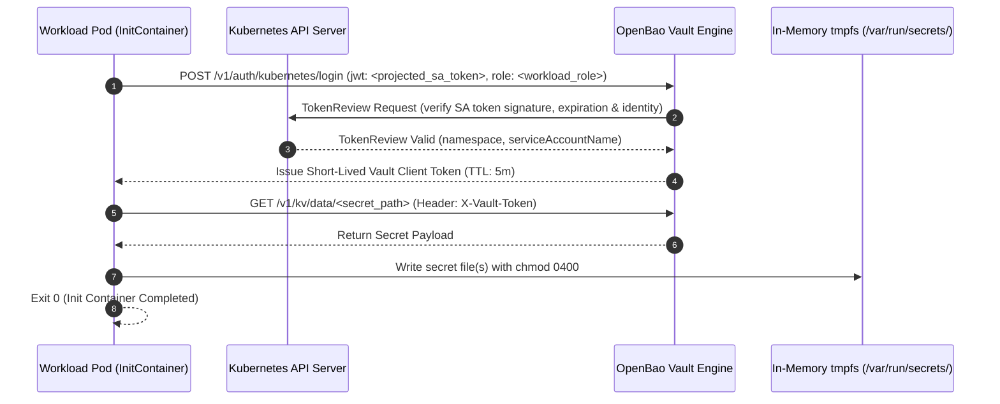

# Contract: Workload Secret Ingestion via Kubernetes ServiceAccount Auth

**Consumers**: PostgreSQL (`postgres-0`), Keycloak (`keycloak`), Go Auth Gateway (`gateway`)  
**Provider**: OpenBao Vault (`http://openbao-service.vault.svc:8200`)  
**Auth Method**: `auth/kubernetes`  

---

## 1. Authentication Flow



## 2. Pod Specification Standards

Every consuming pod must conform to the following declarative template:

1. **ServiceAccount Token Projection**:
   ```yaml
   spec:
     serviceAccountName: <workload-sa>
     automountServiceAccountToken: true # Restricted to platform namespace
   ```

2. **InitContainer Contract**:
   ```yaml
   initContainers:
     - name: secret-fetcher
       image: curlimages/curl:8.10.1 # Pinned, non-root
       securityContext:
         runAsNonRoot: true
         runAsUser: 999
         allowPrivilegeEscalation: false
         readOnlyRootFilesystem: true
         capabilities: { drop: ["ALL"] }
       command: ["/bin/sh", "-c"]
       args:
         - |
           set -euo pipefail
           SA_TOKEN=$(cat /var/run/secrets/kubernetes.io/serviceaccount/token)
           VAULT_TOKEN=$(curl -fsSL -X POST "${VAULT_ADDR}/v1/auth/kubernetes/login" \
             -d "{\"jwt\": \"${SA_TOKEN}\", \"role\": \"${VAULT_ROLE}\"}" | grep -o '"client_token":"[^"]*"' | cut -d'"' -f4)
           SECRET_VAL=$(curl -fsSL -H "X-Vault-Token: ${VAULT_TOKEN}" "${VAULT_ADDR}/v1/kv/data/${SECRET_PATH}" | grep -o "\"${SECRET_KEY}\":\"[^\"]*\"" | cut -d'"' -f4)
           echo -n "${SECRET_VAL}" > "${OUTPUT_FILE}"
           chmod 0400 "${OUTPUT_FILE}"
   ```

3. **In-Memory Volume Contract**:
   ```yaml
   volumes:
     - name: database-secrets
       emptyDir:
         medium: Memory
         sizeLimit: 1Mi
   ```
