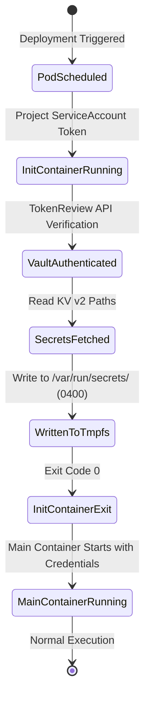

# Data Model: Automated Post-Vault Workload Orchestration

## 1. Entities & Specifications

### Entity 1: WorkloadSecretBinding
Represents the declarative relationship connecting a Kubernetes workload identity to the Vault secrets it is authorized to consume.

| Field | Type | Description | Constraints |
|---|---|---|---|
| `workloadName` | string | Name of the deployment/statefulset | Unique per namespace |
| `namespace` | string | Target Kubernetes namespace | `identity`, `vault`, `proj-pn` |
| `serviceAccount` | string | Bound Kubernetes ServiceAccount | Must match pod `serviceAccountName` |
| `vaultRole` | string | OpenBao Kubernetes auth role name | Configured in OpenBao `auth/kubernetes/role/` |
| `vaultPolicy` | string | ACL policy attached to the role | Defined in `deploy/platform/vault/policies/` |
| `secretPaths` | array[string] | Paths in OpenBao KV v2 to read | E.g., `kv/data/database/postgres-admin` |
| `targetVolume` | string | In-memory `tmpfs` mount point | `emptyDir: { medium: Memory }` |
| `filePermissions`| string | POSIX file mode for generated secrets | Strictly `0400` or `0600` |

### Entity 2: ContainerImageManifest
Represents an OCI container image built by GitHub Actions and consumed by platform workloads.

| Field | Type | Description | Constraints |
|---|---|---|---|
| `serviceName` | string | Name of the in-house Go service | `vault-db-proxy`, `vault-registry-proxy`, `gateway` |
| `registry` | string | Target OCI registry | `ghcr.io/nacfson` |
| `supportedArchs`| array[string] | Multi-architecture targets | `linux/amd64`, `linux/arm64` |
| `tag` | string | Release tag and Git commit SHA | `latest`, `sha-<commit>` |
| `digest` | string | Immutable SHA256 digest | Required for production pinning (Principle I) |

### Entity 3: BackupScheduleRecord
Represents the automated backup execution and retention lifecycle for stateful platform components.

| Field | Type | Description | Constraints |
|---|---|---|---|
| `component` | string | Backed up stateful component | `openbao-raft`, `postgres-catalog` |
| `schedule` | string | Cron schedule expression | `0 0 * * *` (Daily at 00:00 UTC) |
| `targetPVC` | string | Bound PersistentVolumeClaim | `openbao-backup-pvc`, `postgres-backup-pvc` |
| `archiveFormat` | string | Output compression format | `.snap` (OpenBao Raft), `.sql.gz` (PostgreSQL) |
| `retentionDays` | integer | Days before automated pruning | Exactly 7 days (`mtime +7`) |

---

## 2. State Transitions & Lifecycle

### Workload Ingestion Lifecycle

